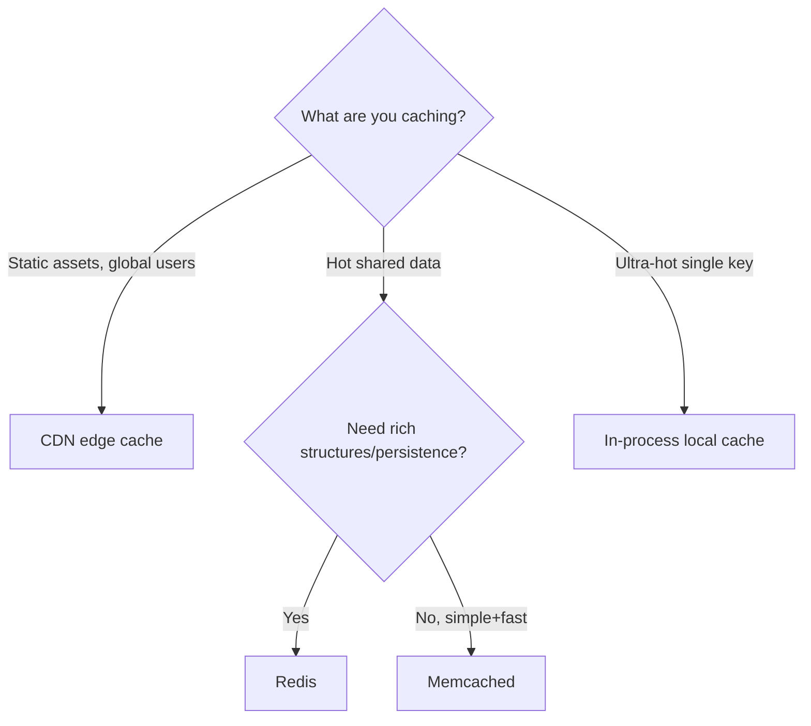

# Choosing the Right Cache (HLD)

## 🧭 Overview
Caching is one of the first optimizations in any read-heavy HLD, but "add a cache" needs specifics: *where* to cache, *what* to cache, *which strategy*, and *how* to keep it consistent. This file is a decision framework for cache choices in design interviews. (For deeper mechanics, see [Caching Fundamentals](../04-caching/01-caching-fundamentals.md) and [Cache Strategies](../04-caching/02-cache-strategies.md).)

---

## 🧠 Technical Explanation

### Where to Cache (layers)
| Layer | What it caches | Example |
|-------|----------------|---------|
| Client/browser | Static assets, API responses | HTTP cache headers |
| CDN (edge) | Static + cacheable dynamic content | Cloudflare, CloudFront |
| In-process (local) | Hot objects in app memory | Caffeine, local LRU |
| Distributed cache | Shared hot data across servers | Redis, Memcached |
| Database cache | Query/buffer caches | Postgres buffer cache |

Layer caches: CDN for assets, distributed cache for hot data, optional local cache for ultra-hot keys.

### Redis vs Memcached
| | Redis | Memcached |
|---|-------|-----------|
| Data structures | Rich (lists, sets, sorted sets, hashes) | Strings only |
| Persistence | Optional (RDB/AOF) | None |
| Replication/cluster | Yes | Limited |
| Pub/sub, Lua, geo | Yes | No |
| Use when | Most cases; need features/persistence | Pure simple caching, multithreaded throughput |

Default to **Redis** unless you specifically want Memcached's simplicity/multithreaded model.

### What to Cache
- Expensive computations, hot read paths, session data, rendered fragments, denormalized views, rate-limit counters.
- **Don't** cache rarely-read or highly-volatile data where staleness is unacceptable without invalidation.

### Strategy (recap)
- **Cache-aside** (default, read-heavy, tolerate slight staleness).
- **Write-through** (freshness matters).
- **Write-back** (write-heavy, can tolerate risk).
See [Cache Strategies](../04-caching/02-cache-strategies.md).

### Consistency & Pitfalls
- **Invalidation:** prefer deleting keys on write over updating (avoids races).
- **TTL:** bound staleness.
- **Stampede:** request coalescing, staggered TTLs, stale-while-revalidate.
- **Hot keys:** replicate or add a local cache layer.

---

## 🍎 Simple Explanation (ELI5 / Analogy)
Choosing a cache is like deciding where to keep snacks. Items you grab constantly go on your desk (in-process local cache) — instant but only for you. The shared office kitchen (distributed cache like Redis) stocks popular snacks everyone uses. Vending machines spread across each floor (CDN edges) keep snacks near everyone in the building. You stock the most-wanted items, refresh them before they go stale (TTL), and make sure a sudden rush doesn't empty everything at once (stampede control).

---

## 📊 Diagram / Flowchart

---

## ⚖️ Trade-offs

| Choice | Pros | Cons |
|------|------|------|
| CDN | Global low latency, offloads origin | Invalidation/staleness for dynamic data |
| Redis | Feature-rich, persistence, clustering | More memory/ops than Memcached |
| Memcached | Simple, multithreaded throughput | No structures/persistence |
| Local cache | Fastest, no network | Not shared; consistency across nodes |

---

## 🌍 Real-World Examples
- **Facebook** runs a massive Memcached tier in front of MySQL.
- **Twitter** caches precomputed timelines in Redis.
- **Most APIs** front static content with a CDN and hot data with Redis.

---

## 🎯 Interview Questions

### 🔵 Conceptual (Theory)
1. When choose Redis over Memcached? → **Answer:** When you need rich data structures, persistence, replication/clustering, pub/sub, or Lua scripting; Memcached fits pure simple caching with multithreaded throughput.
2. Why prefer deleting over updating a cache key on write? → **Answer:** Deletion avoids update races and lets the next read repopulate the correct value; updating risks writing stale/conflicting data.
3. How do you prevent a cache stampede? → **Answer:** Request coalescing/locks, staggered TTLs, and stale-while-revalidate.

### 🟠 Design (Practical)
1. Add caching to a read-heavy product page system. → **Answer:** CDN for static assets, Redis cache-aside for product data with TTL + invalidation on price change, possibly local cache for hottest items.
2. How do you handle a celebrity hot key? → **Answer:** Replicate the key across cache nodes and/or add a local in-process cache; use coalescing.

### 🔴 Company-Specific
1. [Meta] How would you design a caching tier in front of sharded MySQL? *(Hint: Memcached pools, consistent hashing, lease-based stampede control.)*
2. [Amazon] How do you keep a price cache consistent? *(Hint: event-based invalidation + short TTL.)*
3. [Netflix] How would you cache frequently changing recommendations? *(Hint: short TTL, async refresh, stale-while-revalidate.)*

---

## 📚 Further Reading
- [Cache Strategies](../04-caching/02-cache-strategies.md)
- "Scaling Memcache at Facebook"

---

## 🔗 Related Topics
- [Caching Fundamentals](../04-caching/01-caching-fundamentals.md)
- [CDN](../04-caching/04-cdn.md)
- [Choosing the Right Database](03-choosing-the-right-database.md)
