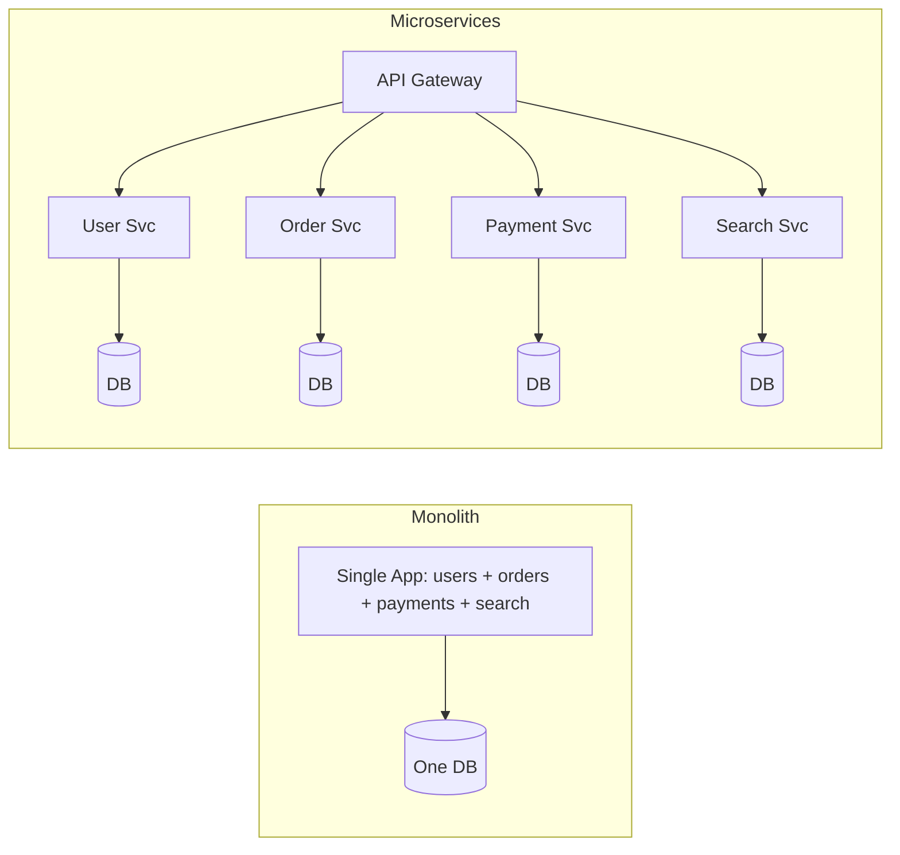

# Monolith vs Microservices

## 🧭 Overview
A **monolith** is a single deployable application containing all functionality; **microservices** split functionality into many small, independently deployable services. The choice profoundly affects team structure, scaling, deployment, and complexity. It's a frequent HLD discussion, and the mature answer is rarely "always microservices" — it depends on scale and organization.

---

## 🧠 Technical Explanation

### Monolith
One codebase, one deployment. Modules call each other via in-process function calls.
- **Pros:** simple to develop/test/deploy early; no network overhead; easy transactions; one place to debug.
- **Cons:** scales as a unit (can't scale one hot module); large codebases slow teams; one bug can crash everything; tech stack locked in.

### Microservices
Many services, each owning a bounded context and its own data, communicating over the network (REST/gRPC/events).
- **Pros:** independent deployment & scaling; team autonomy; fault isolation; polyglot tech; aligns with org structure (Conway's Law).
- **Cons:** distributed-systems complexity (network failures, latency), data consistency across services (no easy transactions → sagas), operational overhead (observability, service discovery, deployment), harder debugging.

### Modular Monolith (the underrated middle ground)
A single deployment with strong internal module boundaries. Gets much of the maintainability benefit without distributed complexity — often the right starting point.

### When to Choose
- **Monolith / modular monolith:** early-stage, small team, unclear domain boundaries, need speed and simplicity.
- **Microservices:** large org with many teams, parts needing independent scaling, clear bounded contexts, mature DevOps/observability.

### The Migration Path
Start monolith → identify bounded contexts → extract services incrementally (strangler-fig pattern) as scale/teams demand. **Don't start with microservices** unless you genuinely have the scale and operational maturity.

### Supporting Concerns for Microservices
API gateway, service discovery, distributed tracing, circuit breakers, sagas, and a CI/CD + container platform (Kubernetes) become necessary.

---

## 🍎 Simple Explanation (ELI5 / Analogy)
A monolith is one big food truck where the same crew does everything in one vehicle — easy to run when small, but if the grill is slammed you can't just add another grill without scaling the whole truck. Microservices are a food court: separate stalls (pizza, sushi, drinks), each with its own staff, hours, and ability to expand independently. The food court serves more people and one stall closing doesn't shut the others — but now you need a manager, signage, and coordination (the operational overhead) that a single truck never needed.

---

## 📊 Diagram / Flowchart

---

## ⚖️ Trade-offs

| | Monolith | Microservices |
|---|----------|---------------|
| Dev speed (early) | Fast | Slower (infra setup) |
| Deployment | One unit | Independent per service |
| Scaling | Whole app | Per service |
| Fault isolation | Low | High |
| Data consistency | Easy (transactions) | Hard (sagas) |
| Operational complexity | Low | High |
| Best for | Small teams/early stage | Large orgs/independent scaling |

---

## 🌍 Real-World Examples
- **Amazon** famously moved from a monolith to services to let teams deploy independently.
- **Netflix** runs hundreds of microservices for independent scaling and resilience.
- **Shopify** runs a large, well-structured **modular monolith** at huge scale — proof that microservices aren't mandatory.

---

## 🎯 Interview Questions

### 🔵 Conceptual (Theory)
1. What's the biggest cost of microservices? → **Answer:** Distributed-systems complexity — network failures/latency, data consistency across services (sagas), and heavy operational overhead (observability, discovery, deployment).
2. What is a modular monolith and why consider it? → **Answer:** A single deployment with strong internal module boundaries; it gives maintainability without distributed complexity — a great default before microservices.
3. How does Conway's Law relate? → **Answer:** Systems mirror the communication structure of the org; microservices align with autonomous teams owning bounded contexts.

### 🟠 Design (Practical)
1. A startup of 5 engineers asks: monolith or microservices? → **Answer:** Monolith/modular monolith — speed and simplicity matter most; extract services later if scale/teams demand.
2. How do you migrate a monolith to services safely? → **Answer:** Identify bounded contexts and extract incrementally (strangler-fig), routing traffic gradually while keeping the monolith running.

### 🔴 Company-Specific
1. [Amazon] Why did Amazon move to services, and what enabled it? *(Hint: team autonomy/independent deploys; strong tooling/ownership.)*
2. [Netflix] What supporting infrastructure do microservices require? *(Hint: gateway, discovery, circuit breakers, tracing, CI/CD.)*
3. [Meta] When would you NOT split into microservices? *(Hint: small team, unclear domains, lacking DevOps maturity.)*

---

## 📚 Further Reading
- Martin Fowler: "Monolith First" and "Microservices"
- Sam Newman, *Building Microservices*

---

## 🔗 Related Topics
- [API Gateway](../06-api-design/03-api-gateway.md)
- [Service Discovery](../07-distributed-systems/04-service-discovery.md)
- [Service Mesh](06-service-mesh.md)
- [Distributed Transactions](../07-distributed-systems/02-distributed-transactions.md)
