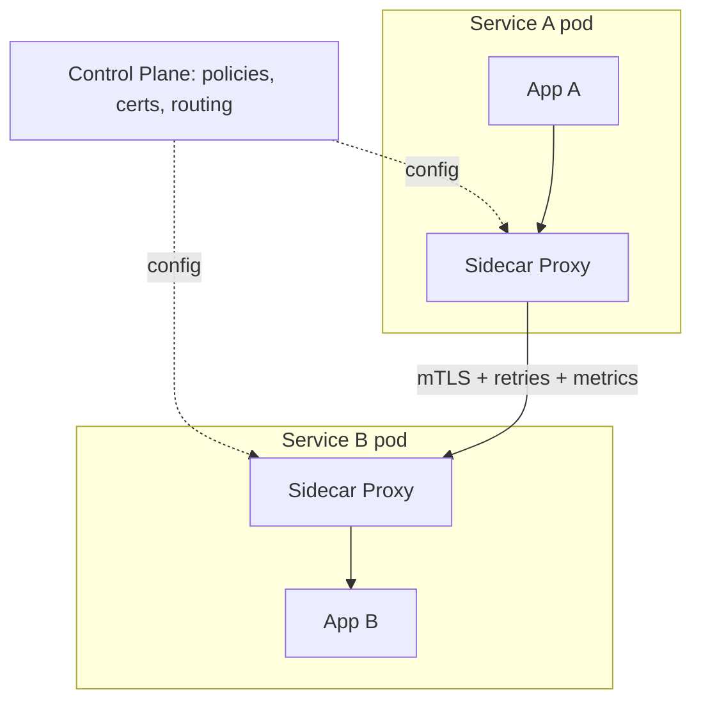

# Service Mesh

## 🧭 Overview
A service mesh is a dedicated infrastructure layer that handles **service-to-service communication** — load balancing, retries, mTLS, observability, and traffic control — transparently, without changing application code. It moves cross-cutting networking concerns out of each service and into **sidecar proxies**. Service meshes (Istio, Linkerd) are common in large microservice/Kubernetes deployments and appear in advanced HLD discussions.

---

## 🧠 Technical Explanation

### The Problem It Solves
In a microservices system, every service needs the same networking features: retries, timeouts, circuit breaking, mTLS, load balancing, metrics, tracing. Implementing these in every service (in every language) is repetitive and inconsistent. A service mesh centralizes them in infrastructure.

### Architecture: Data Plane + Control Plane
- **Data plane:** a **sidecar proxy** (e.g., Envoy) deployed next to each service instance. All inbound/outbound traffic flows through it. The sidecar does the actual work (routing, mTLS, retries, metrics).
- **Control plane:** configures and coordinates all sidecars (policies, certificates, routing rules). The brain; doesn't touch request data directly.

### What a Mesh Provides
- **Traffic management:** load balancing, canary/blue-green routing, traffic splitting, fault injection.
- **Security:** automatic **mTLS** between services, identity, authz policies.
- **Resilience:** retries, timeouts, circuit breaking — without app code.
- **Observability:** uniform metrics, distributed tracing, and logs for all traffic.

### Sidecar vs Sidecar-less
Classic meshes use a sidecar per pod (resource overhead, latency per hop). Newer approaches (ambient mesh, eBPF-based) reduce per-pod overhead.

### When to Use
- Many services, multiple languages, need consistent security/observability/traffic control.
- **Not** worth it for a handful of services — the operational complexity outweighs benefits. A library (Resilience4j) or API gateway may suffice.

---

## 🍎 Simple Explanation (ELI5 / Analogy)
Imagine every employee (service) in a huge company needing to send secure mail, verify recipients, retry failed deliveries, and log everything. Instead of teaching each employee all these rules, you give each one a **personal assistant** (the sidecar) who sits at their desk and handles all mail in and out — encrypting it, retrying, and keeping records — identically for everyone. A central mailroom manager (the control plane) sets the rules all assistants follow. Employees just hand over mail and focus on their actual jobs.

---

## 📊 Diagram / Flowchart

---

## ⚖️ Trade-offs

| Pros | Cons |
|------|------|
| Consistent security (mTLS), observability, resilience | Operational complexity to run |
| No app code changes (language-agnostic) | Sidecars add latency + resource overhead |
| Fine-grained traffic control (canary, splitting) | Steep learning curve |
| Centralized policy | Overkill for few services |

---

## 🌍 Real-World Examples
- **Istio** (with Envoy) is the most popular mesh on Kubernetes for mTLS, traffic shaping, and observability.
- **Linkerd** is a lighter-weight mesh focused on simplicity and performance.
- **Lyft** created Envoy, the proxy underlying many meshes.

---

## 🎯 Interview Questions

### 🔵 Conceptual (Theory)
1. What's the difference between the data plane and control plane in a mesh? → **Answer:** The data plane is the sidecar proxies handling actual traffic (routing, mTLS, retries); the control plane configures and coordinates those proxies (policies, certs).
2. How does a mesh provide resilience without app code changes? → **Answer:** Retries, timeouts, and circuit breaking are enforced by the sidecar proxy, transparently to the application.
3. When is a service mesh overkill? → **Answer:** With only a few services; the operational complexity and sidecar overhead outweigh benefits — a gateway or resilience library may suffice.

### 🟠 Design (Practical)
1. How would you add mTLS between 200 microservices with minimal code change? → **Answer:** Deploy a service mesh; sidecars handle mTLS automatically based on control-plane config.
2. How would you do a canary release with a mesh? → **Answer:** Use traffic-splitting rules in the control plane to route, say, 5% of traffic to the new version and ramp up.

### 🔴 Company-Specific
1. [Google] How does a mesh relate to circuit breaking and service discovery? *(Hint: sidecars do LB/discovery/outlier detection per the control plane.)*
2. [Lyft] Why was Envoy designed as a sidecar proxy? *(Hint: language-agnostic, consistent L7 features, observability.)*
3. [Amazon] What are the costs of adopting a mesh at scale? *(Hint: latency per hop, resource overhead, operational complexity.)*

---

## 📚 Further Reading
- Istio and Linkerd official docs
- "What's a service mesh?" (Buoyant/CNCF articles)

---

## 🔗 Related Topics
- [Monolith vs Microservices](05-monolith-vs-microservices.md)
- [Service Discovery](../07-distributed-systems/04-service-discovery.md)
- [Circuit Breaker Pattern](../07-distributed-systems/05-circuit-breaker-pattern.md)
- [Observability](07-observability.md)
