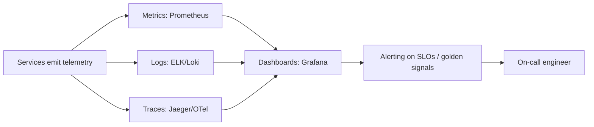

# Observability (Logs, Metrics, Traces)

## 🧭 Overview
Observability is the ability to understand a system's internal state from its external outputs — primarily **logs, metrics, and traces** (the "three pillars"). In distributed systems, where a single request touches many services, observability is essential for debugging, alerting, and meeting SLOs. It's increasingly expected in HLD answers ("how would you monitor this?").

---

## 🧠 Technical Explanation

### Monitoring vs Observability
- **Monitoring:** watching known metrics and alerting on known failure modes ("is CPU high?").
- **Observability:** being able to ask *new* questions about *unknown* problems after the fact ("why is p99 latency high only for users in region X calling endpoint Y?").

### The Three Pillars
1. **Metrics:** numeric time-series (request rate, error rate, latency percentiles, CPU). Cheap to store/aggregate; great for dashboards and alerts. Tools: Prometheus, Grafana, Datadog.
2. **Logs:** discrete, timestamped event records (structured JSON ideally). Rich detail for debugging; high volume/cost. Tools: ELK/OpenSearch, Loki, Splunk.
3. **Traces:** the path of a single request across services, with spans showing time spent in each. Essential for distributed debugging. Tools: Jaeger, Zipkin, OpenTelemetry.

### Correlation IDs & Context Propagation
A **trace/correlation ID** propagated through every service and log entry lets you stitch a single request's journey across logs, metrics, and traces. This is the backbone of debugging microservices.

### The Golden Signals (Google SRE)
Monitor these four for any service:
- **Latency** (especially p95/p99).
- **Traffic** (requests/sec).
- **Errors** (error rate).
- **Saturation** (how full resources are — CPU, memory, queue depth).

### SLI / SLO / SLA & Error Budgets
- **SLI:** a measured indicator (e.g., % of requests < 200 ms).
- **SLO:** the target (e.g., 99.9% under 200 ms).
- **SLA:** the external contract/penalty.
- **Error budget:** allowed failure (1 − SLO); spend it on velocity, halt risky changes when exhausted.

### Alerting Best Practices
Alert on **symptoms** (user-facing SLO breaches) not just causes; avoid alert fatigue; make alerts actionable.

---

## 🍎 Simple Explanation (ELI5 / Analogy)
Think of your body. **Metrics** are vital signs — heart rate, temperature — quick numbers that tell you something's off. **Logs** are a detailed diary of everything that happened ("ate lunch at 1pm, felt dizzy at 2pm") — great detail when investigating. **Traces** are like following one specific sandwich through your digestive system to see exactly where it caused trouble. A doctor uses all three together, and a patient ID (correlation ID) ties every record to the same person.

---

## 📊 Diagram / Flowchart

---

## ⚖️ Trade-offs

| Pillar | Pros | Cons |
|------|------|------|
| Metrics | Cheap, fast, great for alerts/dashboards | Low detail; pre-defined dimensions |
| Logs | Rich detail for debugging | High volume & cost; needs structure |
| Traces | Pinpoints cross-service latency | Sampling needed; instrumentation effort |

---

## 🌍 Real-World Examples
- **Google SRE** popularized SLOs, error budgets, and the golden signals.
- **Uber/Netflix** rely on distributed tracing to debug requests crossing dozens of services.
- **OpenTelemetry** is the emerging vendor-neutral standard for traces/metrics/logs.

---

## 🎯 Interview Questions

### 🔵 Conceptual (Theory)
1. What are the three pillars of observability? → **Answer:** Metrics (numeric time-series), logs (detailed events), and traces (per-request cross-service paths).
2. What are the four golden signals? → **Answer:** Latency, traffic, errors, and saturation.
3. What is an error budget? → **Answer:** The allowed unreliability (1 − SLO); teams spend it on feature velocity and slow down risky changes when it's exhausted.

### 🟠 Design (Practical)
1. How do you debug a slow request that crosses 10 services? → **Answer:** Distributed tracing with a propagated trace ID to find which span/service contributes the latency.
2. What would you alert on for a user-facing API? → **Answer:** SLO-based symptoms — latency p99, error rate, and saturation — not just raw CPU.

### 🔴 Company-Specific
1. [Google] How do SLOs and error budgets balance reliability vs velocity? *(Hint: spend budget on releases; freeze when exhausted.)*
2. [Uber] Why is distributed tracing critical in microservices? *(Hint: a request fans out; traces localize the slow/failing hop.)*
3. [Amazon] How do you avoid alert fatigue? *(Hint: alert on actionable symptoms, tune thresholds, page only on SLO breaches.)*

---

## 📚 Further Reading
- *Site Reliability Engineering* (Google SRE book) — free online
- OpenTelemetry documentation

---

## 🔗 Related Topics
- [Service Mesh](06-service-mesh.md)
- [Deployment Strategies](08-deployment-strategies.md)
- [Circuit Breaker Pattern](../07-distributed-systems/05-circuit-breaker-pattern.md)
