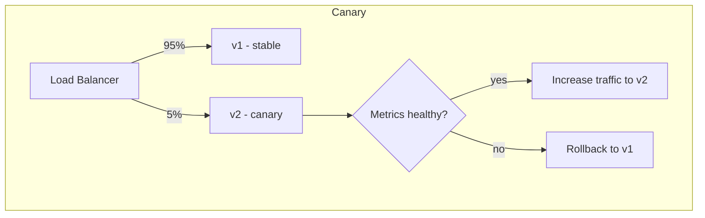

# Deployment Strategies

## 🧭 Overview
A deployment strategy defines *how* you roll out a new version of software to production while minimizing risk and downtime. The main strategies — **rolling, blue-green, canary, and feature flags** — trade off speed, safety, cost, and rollback ease. This matters for any system aiming for high availability and is a common "how do you ship safely?" follow-up in HLD interviews.

---

## 🧠 Technical Explanation

### Recreate (basic)
Stop the old version, start the new one. Simple but causes **downtime** — only acceptable for non-critical systems.

### Rolling Deployment
Gradually replace old instances with new ones, a few at a time, behind the load balancer. No downtime; uses existing capacity.
- **Risk:** both versions run simultaneously (must be backward-compatible); rollback is slower (roll back instance by instance).

### Blue-Green Deployment
Run two identical environments: **blue** (current) and **green** (new). Deploy to green, test it, then switch all traffic at the load balancer. **Instant rollback** (switch back to blue).
- **Cost:** double the infrastructure during the switch.

### Canary Deployment
Release the new version to a **small subset** of users/traffic (e.g., 1% → 5% → 25% → 100%), monitoring metrics at each step. Catches problems with minimal blast radius.
- **Needs:** good observability and automated rollback triggers.

### Feature Flags (Dark Launches)
Decouple **deploy** from **release**: ship code dark (flag off), then turn the feature on for cohorts at runtime — no redeploy. Enables A/B testing, gradual rollout, and instant kill-switch.

### Cross-Cutting Concerns
- **Backward/forward compatibility:** especially for DB schema changes — use expand/contract migrations so old and new code coexist.
- **Zero-downtime DB migrations:** add columns (expand), deploy code that writes both, backfill, then remove old (contract).
- **Health checks & automated rollback:** essential for safe automation.

---

## 🍎 Simple Explanation (ELI5 / Analogy)
Imagine reopening a restaurant with a new menu:
- **Rolling:** swap dishes one table at a time so service never stops.
- **Blue-green:** build a whole second dining room with the new menu next door; once it's ready, send everyone there at once — and if it flops, send them straight back.
- **Canary:** test the new menu on a few brave regulars first; if they love it, roll it out to everyone.
- **Feature flag:** the new dish is already in the kitchen but hidden; you flip a switch to put it on the menu for some tables, and can pull it instantly if there's a problem.

---

## 📊 Diagram / Flowchart

---

## ⚖️ Trade-offs

| Strategy | Downtime | Rollback | Cost | Risk control |
|----------|----------|----------|------|--------------|
| Recreate | Yes | Slow | Low | Poor |
| Rolling | No | Medium | Low | Medium |
| Blue-Green | No | Instant | High (2x) | Good |
| Canary | No | Fast | Medium | Best (gradual) |
| Feature flags | No | Instant (toggle) | Low | Best (decouple deploy/release) |

---

## 🌍 Real-World Examples
- **Netflix** uses canary deployments with automated analysis (Kayenta/Spinnaker).
- **Facebook/Meta** relies heavily on feature flags (Gatekeeper) to dark-launch and gradually enable features.
- **Most cloud teams** use rolling deployments via Kubernetes by default.

---

## 🎯 Interview Questions

### 🔵 Conceptual (Theory)
1. What's the difference between blue-green and canary? → **Answer:** Blue-green switches all traffic to a fully tested new environment at once (instant rollback); canary shifts a small percentage gradually while monitoring, limiting blast radius.
2. How do feature flags decouple deploy from release? → **Answer:** Code ships disabled; you toggle it on at runtime for chosen cohorts without redeploying, enabling gradual rollout and instant kill-switch.
3. How do you do a zero-downtime schema change? → **Answer:** Expand/contract: add the new column, deploy code that writes both, backfill, switch reads, then drop the old — old and new code coexist safely.

### 🟠 Design (Practical)
1. You're shipping a risky change to a payment service — which strategy? → **Answer:** Canary (and/or feature flag) with strong monitoring and automated rollback to limit blast radius.
2. Why must rolling deployments be backward-compatible? → **Answer:** Old and new versions run simultaneously during the rollout, so they must interoperate (APIs and DB schema).

### 🔴 Company-Specific
1. [Netflix] How does automated canary analysis decide to proceed or roll back? *(Hint: compare canary vs baseline metrics statistically.)*
2. [Meta] Why dark-launch features behind flags? *(Hint: decouple deploy/release, A/B test, instant kill-switch.)*
3. [Amazon] How do you achieve zero-downtime deploys for a critical API? *(Hint: rolling/blue-green + health checks + compatible migrations.)*

---

## 📚 Further Reading
- Martin Fowler: "BlueGreenDeployment" and "CanaryRelease"
- *Continuous Delivery* — Humble & Farley

---

## 🔗 Related Topics
- [Auto Scaling](../02-scalability/03-auto-scaling.md)
- [Observability](07-observability.md)
- [HLD Case Study Checklist](09-hld-case-study-checklist.md)
