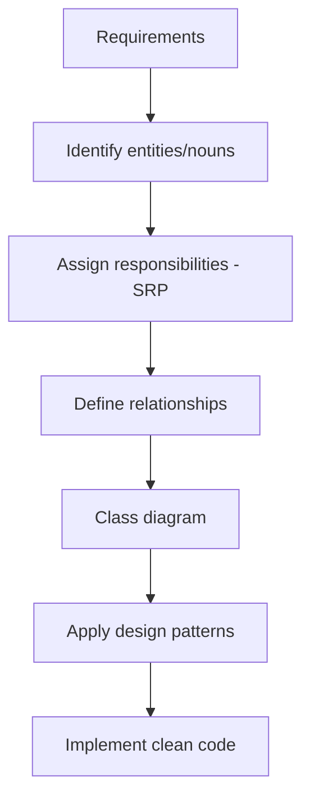

# What Is Low-Level Design (LLD)

## 🧭 Overview
Low-Level Design is the object-oriented, code-level design of a system component: the classes, their attributes and methods, relationships, and the design patterns that make the code clean, extensible, and maintainable. It's what the dedicated **LLD / Machine Coding / OOD** interview round tests. Where HLD asks "what are the big pieces?", LLD asks "how do we structure the code inside a piece well?"

---

## 🧠 Technical Explanation

### What LLD Produces
- **Class diagram:** classes, attributes, methods, and relationships (association, aggregation, composition, inheritance).
- **Interfaces/abstractions:** contracts that enable extensibility.
- **Design patterns:** applied where they genuinely fit.
- **Working code:** clean, correct, often in an OOP language (we use **Python**).

### The Foundations LLD Rests On
1. **OOP** — encapsulation, inheritance, polymorphism, abstraction.
2. **SOLID principles** — five rules for maintainable OOP.
3. **Design patterns** — reusable solutions to recurring problems.
4. **UML** — to communicate the design visually.

### The LLD Process
1. **Clarify requirements** and scope.
2. **Identify core entities** (the nouns: `Car`, `ParkingSpot`, `Ticket`).
3. **Assign responsibilities** (what each class owns — apply SRP).
4. **Define relationships** (has-a, is-a).
5. **Draw the class diagram.**
6. **Apply patterns** where they fit (Strategy for pricing, Factory for creation…).
7. **Implement key methods**, handle edge cases and concurrency.

### What Good LLD Looks Like
- Single-responsibility classes, programmed to interfaces.
- Easy to extend without modifying existing code (Open/Closed).
- No God classes; clear, intention-revealing names.
- Edge cases and concurrency considered.

---

## 🍎 Simple Explanation (ELI5 / Analogy)
If HLD is the architect's blueprint of a house (where rooms and plumbing go), LLD is the detailed carpentry plan for a single room: exactly which cabinets, how the drawers slide, how pieces fit and can be swapped later. A great carpenter builds modular furniture — if you want a new drawer style later, you slot it in without rebuilding the whole cabinet (extensible code). Bad carpentry nails everything into one giant block (a God class) that you must demolish to change anything.

---

## 📊 Diagram / Flowchart

---

## ⚖️ Trade-offs

| Pros of strong LLD | Costs/Risks |
|------|------|
| Maintainable, extensible code | Up-front modeling time |
| Easy to test (clear units) | Risk of over-abstracting |
| New requirements slot in cleanly | Patterns misused add complexity |
| Communicates intent to teammates | Can over-engineer simple problems |

---

## 🌍 Real-World Examples
- **Any well-structured codebase** (e.g., a payment SDK) uses interfaces + patterns so new providers plug in cleanly.
- **Game engines** model entities with composition for flexible behavior.
- **Frameworks** (Django, Spring) are built on heavy use of design patterns (factory, strategy, observer).

---

## 🎯 Interview Questions

### 🔵 Conceptual (Theory)
1. What does an LLD deliver that an HLD doesn't? → **Answer:** Class-level detail — classes, attributes, methods, relationships, applied patterns, and working code — versus HLD's system-wide components and data flow.
2. What are the four pillars LLD rests on? → **Answer:** OOP, SOLID principles, design patterns, and UML.
3. What's the first step after clarifying requirements in LLD? → **Answer:** Identify the core entities (nouns) and assign each a single responsibility.

### 🟠 Design (Practical)
1. How do you make LLD code extensible for future requirements? → **Answer:** Program to interfaces/abstractions and apply Open/Closed — add new implementations rather than modifying existing classes.
2. How do you avoid God classes? → **Answer:** Apply the Single Responsibility Principle — split distinct responsibilities into focused classes.

### 🔴 Company-Specific
1. [Amazon] Walk through how you'd start an LLD for a parking lot. *(Hint: entities → responsibilities → relationships → diagram → code.)*
2. [Google] How do you decide when to introduce a design pattern? *(Hint: only when it genuinely solves a recurring problem; avoid forcing.)*
3. [Meta] How does good LLD make testing easier? *(Hint: small, single-responsibility, interface-based units are easy to mock/test.)*

---

## 📚 Further Reading
- *Head First Design Patterns*
- *Clean Code* by Robert C. Martin

---

## 🔗 Related Topics
- [LLD vs HLD](02-lld-vs-hld.md)
- [OOP Fundamentals](03-oop-fundamentals/01-classes-and-objects.md)
- [SOLID Principles](04-solid-principles/01-single-responsibility.md)
- [What is HLD](../13-hld-deep-dive/01-what-is-hld.md)
