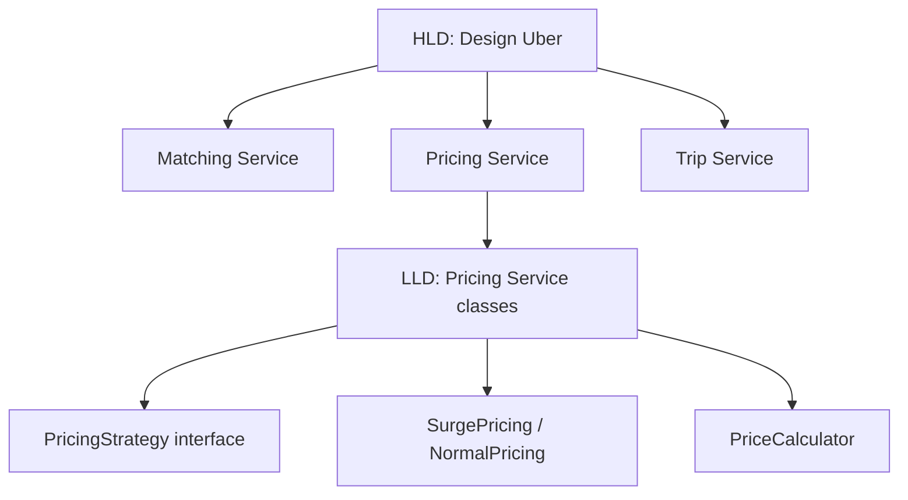

# LLD vs HLD

## 🧭 Overview
HLD and LLD are two complementary altitudes of system design. **HLD** is the macro view — components, services, and data flow at scale. **LLD** is the micro view — classes, methods, and patterns inside a component. Top companies test them in **separate interview rounds**, so understanding the distinction (and preparing for each differently) is critical. This page is the focused comparison; see also the [cheatsheet](../12-cheatsheets/lld-vs-hld-cheatsheet.md).

---

## 🧠 Technical Explanation

### Side-by-Side
| Dimension | HLD | LLD |
|-----------|-----|-----|
| Altitude | Whole system | One component |
| Output | Architecture diagram + estimates | Class diagram + code |
| Question | "Design Uber" | "Design the ride-matching classes" |
| Concerns | Scaling, DB, cache, queues, CAP | OOP, SOLID, patterns, UML |
| Skills tested | Trade-offs, capacity, bottlenecks | Clean abstractions, extensibility |
| Round name | "System Design" | "Machine Coding"/"OOD"/"LLD" |

### They Connect
A single HLD component (e.g., the "Pricing Service" box) becomes an **LLD exercise**: how do you structure its classes (Strategy pattern for surge vs normal pricing, etc.)? HLD decides *what* services exist; LLD decides *how each is coded*.

### Why Both Matter
- A system can be architecturally sound (great HLD) but a maintenance nightmare (poor LLD), or beautifully coded (great LLD) yet unable to scale (poor HLD).
- Senior roles expect competence in **both**.

### Preparing Differently
- **HLD:** building blocks (folders 01–13), estimation, the 6-step framework, real architectures.
- **LLD:** OOP + SOLID + 15 design patterns, modeling problems into classes, **timed coding** practice.

---

## 🍎 Simple Explanation (ELI5 / Analogy)
Designing a city vs designing a house. **HLD** is city planning: where neighborhoods, highways, power plants, and water systems go, so millions of people can live there (scale). **LLD** is designing one house in detail: the room layout, how doors and cabinets are built so they're sturdy and easy to renovate later (clean, extensible code). You need city planners *and* architects — and they're different skills tested in different interviews.

---

## 📊 Diagram / Flowchart

---

## ⚖️ Trade-offs

| Focus only on HLD | Focus only on LLD |
|-------------------|-------------------|
| Scalable but possibly unmaintainable code | Clean code that may not scale |
| Passes system-design round, fails coding round | Passes coding round, fails system-design round |
| Misses class-level extensibility | Misses architecture/bottlenecks |

**Balanced preparation wins.**

---

## 🌍 Real-World Examples
- **Uber interview loop:** typically includes a separate HLD round ("design Uber") and an LLD/coding round ("design a data structure / OOD problem").
- **Amazon:** runs distinct system design and object-oriented design assessments.
- **Design docs:** start with HLD architecture, then teams produce LLD for each service.

---

## 🎯 Interview Questions

### 🔵 Conceptual (Theory)
1. How do HLD and LLD connect? → **Answer:** Each HLD component box becomes an LLD exercise — HLD says what services exist; LLD designs the classes/patterns inside each.
2. Which skills does each round test? → **Answer:** HLD: scaling, trade-offs, capacity, bottlenecks. LLD: OOP, SOLID, design patterns, clean extensible code.
3. Can a system have good HLD but bad LLD? → **Answer:** Yes — it can scale architecturally yet be a maintenance nightmare due to poorly structured code (and vice versa).

### 🟠 Design (Practical)
1. Given "design YouTube," which parts are HLD vs LLD? → **Answer:** HLD: services, storage, CDN, transcoding pipeline, scaling. LLD: e.g., the class design of the upload/transcoding job model.
2. How would you prepare for each round in two weeks? → **Answer:** Split time: HLD building blocks + case studies + estimation; LLD OOP/SOLID/patterns + timed class-design coding.

### 🔴 Company-Specific
1. [Uber] What's the difference between the "design Uber" round and the OOD round? *(Hint: architecture/scale vs class design/code.)*
2. [Amazon] How do you show maturity by linking HLD to LLD? *(Hint: pick a component and detail its class design.)*
3. [Google] Why do senior roles require both? *(Hint: scalable architecture + maintainable code.)*

---

## 📚 Further Reading
- [LLD vs HLD Cheatsheet](../12-cheatsheets/lld-vs-hld-cheatsheet.md)
- *System Design Interview* (Xu) + *Head First Design Patterns*

---

## 🔗 Related Topics
- [What is LLD](01-what-is-lld.md)
- [What is HLD](../13-hld-deep-dive/01-what-is-hld.md)
- [How to Approach LLD Rounds](08-lld-interview-playbook/01-how-to-approach-lld-rounds.md)
- [LLD vs HLD Interview Cheatsheet](08-lld-interview-playbook/03-lld-vs-hld-interview-cheatsheet.md)
