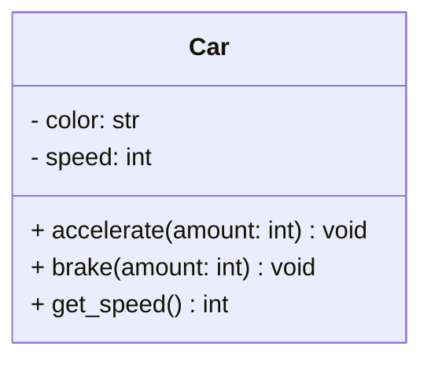

# Classes and Objects

## 🧭 Overview
Classes and objects are the foundation of object-oriented programming. A **class** is a blueprint defining attributes (data) and methods (behavior); an **object** is a concrete instance of that class. Mastering this is the entry point to all LLD — every design pattern and SOLID principle builds on it.

---

## 🧠 Technical Explanation

### Class vs Object
- **Class:** the template/blueprint (e.g., `Car`). Defines *what* attributes and behaviors instances will have.
- **Object (instance):** a specific realization (e.g., `my_red_tesla`). Each object has its own state.

### Anatomy of a Class
- **Attributes / fields:** the data each object holds (`color`, `speed`).
- **Methods:** functions defining behavior (`accelerate()`, `brake()`).
- **Constructor (`__init__` in Python):** initializes a new object's state.
- **`self`:** reference to the current instance.
- **Instance vs class attributes:** instance attributes are per-object; class attributes are shared across all instances.

### Identity, State, Behavior
Every object has:
- **Identity:** distinguishes it from others.
- **State:** current attribute values.
- **Behavior:** what it can do (methods).

### Instantiation
Creating an object from a class (`Car("red")`) calls the constructor and allocates a new instance with its own state.

---

## 🍎 Simple Explanation (ELI5 / Analogy)
A class is like a cookie cutter, and objects are the cookies. The cutter (class) defines the *shape* — but each cookie (object) is a separate, real cookie you can decorate differently (its own state). You design the cutter once and stamp out as many cookies as you like. The blueprint of a house is another analogy: one blueprint (class), many actual houses built from it (objects), each painted a different color.

---

## 📐 Class Diagram



---

## 💻 Code Example

```python
class Car:
    wheels = 4  # class attribute (shared by all cars)

    def __init__(self, color: str):
        self.color = color      # instance attribute (per object)
        self.speed = 0

    def accelerate(self, amount: int) -> None:
        self.speed += amount

    def brake(self, amount: int) -> None:
        self.speed = max(0, self.speed - amount)

    def __repr__(self) -> str:
        return f"<{self.color} Car @ {self.speed} km/h>"


# Objects (instances) — each has its own state
tesla = Car("red")
mini = Car("blue")
tesla.accelerate(50)
mini.accelerate(30)
print(tesla)  # <red Car @ 50 km/h>
print(mini)   # <blue Car @ 30 km/h>
print(Car.wheels, tesla.wheels)  # 4 4 (shared class attribute)
```

---

## ✅ When to Use
- Modeling real-world entities with data + behavior.
- Whenever you need multiple instances sharing structure but holding distinct state.

## ❌ When NOT to Use
- For pure stateless utility functions (a module/function may be simpler).
- When a simple data record suffices (use a `dataclass`/namedtuple/dict).

---

## ⚖️ Trade-offs

| Pros | Cons |
|------|------|
| Bundles data + behavior (cohesion) | Overhead vs simple functions/dicts |
| Reusable blueprint, many instances | Can be overkill for trivial data |
| Foundation for OOP & patterns | Misuse leads to God classes |

---

## 🎯 Interview Questions

### Conceptual
1. What's the difference between a class and an object? → **Answer:** A class is the blueprint defining structure/behavior; an object is a concrete instance with its own state.
2. Instance vs class attribute? → **Answer:** Instance attributes are unique per object; class attributes are shared across all instances of the class.
3. What does `self` represent? → **Answer:** A reference to the current instance, used to access its attributes/methods.

### Pattern Identification
1. You need one shared instance globally — which concept/pattern? → **Answer:** Singleton (a creational pattern) — controls instantiation to one object.

### Company-Specific
1. [Amazon] How would you model a `BankAccount` class? *(Hint: balance as private state, deposit/withdraw methods.)*
2. [Google] When is a class overkill? *(Hint: stateless utility → plain function/module.)*

---

## 🔗 Related Patterns
- [Encapsulation](02-encapsulation.md)
- [Inheritance](03-inheritance.md)
- [Singleton](../05-design-patterns/creational/01-singleton.md)
