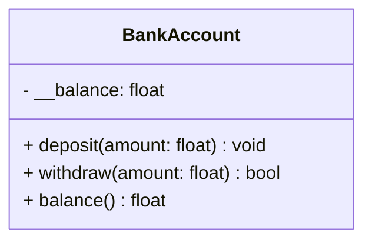

# Encapsulation

## 🧭 Overview
Encapsulation is the OOP principle of bundling data and the methods that operate on it inside a class, while **hiding internal state** and exposing a controlled interface. It protects an object's integrity by preventing external code from putting it into an invalid state. It's one of the four OOP pillars and underpins clean, maintainable LLD.

---

## 🧠 Technical Explanation

### Two Aspects
1. **Bundling:** data + behavior live together in one class.
2. **Information hiding:** internal details are private; access goes through methods (getters/setters or richer behavior).

### Access Modifiers (Python conventions)
- **Public:** normal attributes — accessible everywhere.
- **Protected (`_name`):** convention signaling "internal; subclasses may use."
- **Private (`__name`):** name-mangled to discourage external access.
Python relies on convention (no hard enforcement), unlike Java/C++ `private`/`protected`/`public`.

### Why Encapsulate
- **Invariants:** keep state valid (e.g., balance can't go negative).
- **Decoupling:** callers depend on the interface, not internals → you can change implementation freely.
- **Controlled access:** validation/logging on reads/writes.

### Getters/Setters & Properties
Expose controlled access. In Python, use `@property` to keep clean syntax while adding validation. Prefer exposing **behavior** over raw setters where possible (tell, don't ask).

---

## 🍎 Simple Explanation (ELI5 / Analogy)
Encapsulation is like a vending machine. You interact through a simple interface — insert money, press a button, get a snack. You **can't** reach inside to grab snacks for free or rewire the coin counter; the internals are sealed. The machine guards its own rules (no snack without payment). Compare that to an open table of snacks with a cash box — anyone could take items without paying or mess up the money (invalid state). The sealed machine protects its integrity.

---

## 📐 Class Diagram



---

## 💻 Code Example

```python
class BankAccount:
    def __init__(self, initial: float = 0.0):
        self.__balance = max(0.0, initial)  # private state

    def deposit(self, amount: float) -> None:
        if amount <= 0:
            raise ValueError("Deposit must be positive")
        self.__balance += amount

    def withdraw(self, amount: float) -> bool:
        if amount <= 0:
            raise ValueError("Withdrawal must be positive")
        if amount > self.__balance:      # invariant: no overdraft
            return False
        self.__balance -= amount
        return True

    @property
    def balance(self) -> float:          # read-only controlled access
        return self.__balance


acct = BankAccount(100)
acct.deposit(50)
print(acct.balance)        # 150
print(acct.withdraw(500))  # False (protected invariant)
# acct.__balance = -999    # cannot corrupt state directly (name-mangled)
```

---

## ✅ When to Use
- Always, for any class holding state with rules/invariants.
- When you want freedom to change internals without breaking callers.

## ❌ When NOT to Use
- Pure data transfer objects (DTOs) where all fields are intentionally public.
- Over-adding getters/setters that just expose everything (defeats the purpose).

---

## ⚖️ Trade-offs

| Pros | Cons |
|------|------|
| Protects invariants/state | Some boilerplate (getters/properties) |
| Decouples interface from implementation | Python doesn't strictly enforce it |
| Easier to maintain/refactor | Over-exposing setters defeats benefit |

---

## 🎯 Interview Questions

### Conceptual
1. What problem does encapsulation solve? → **Answer:** It prevents external code from corrupting an object's state by hiding internals and exposing a controlled, validated interface that protects invariants.
2. How does Python express private/protected? → **Answer:** By convention — `_name` (protected) and `__name` (private, name-mangled); not strictly enforced like Java.
3. Why prefer "tell, don't ask"? → **Answer:** Exposing behavior (methods) rather than raw data keeps logic inside the class and reduces coupling.

### Pattern Identification
1. You want validation whenever a field is set — what mechanism? → **Answer:** A property/setter (`@property`) enforcing rules.

### Company-Specific
1. [Amazon] How do you ensure a balance never goes negative? *(Hint: private field + withdraw method enforcing the invariant.)*
2. [Meta] Why is exposing public mutable fields risky? *(Hint: any caller can break invariants/state.)*

---

## 🔗 Related Patterns
- [Classes and Objects](01-classes-and-objects.md)
- [Abstraction](05-abstraction.md)
- [Single Responsibility Principle](../04-solid-principles/01-single-responsibility.md)
