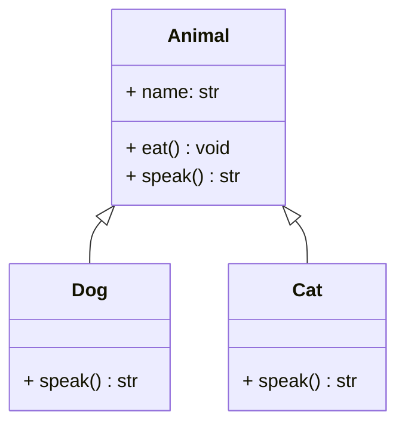

# Inheritance

## 🧭 Overview
Inheritance lets a class (subclass/child) acquire the attributes and methods of another class (superclass/parent), modeling an "is-a" relationship and enabling code reuse. It's a core OOP pillar, but also the most *over-used* one — modern design often favors **composition over inheritance**. Understanding both its power and its pitfalls is key to good LLD.

---

## 🧠 Technical Explanation

### "Is-a" Relationship
Inheritance models specialization: a `Dog` **is an** `Animal`, a `SavingsAccount` **is a** `BankAccount`. The child reuses parent behavior and can add or override behavior.

### Mechanics
- **Override:** redefine a parent method in the child.
- **`super()`:** call the parent's implementation (e.g., extend its behavior).
- **Single vs multiple inheritance:** Python supports multiple inheritance (resolved via **MRO** — Method Resolution Order); many languages allow only single inheritance (+ interfaces).

### Types
- **Single:** one parent.
- **Multilevel:** chain (A → B → C).
- **Hierarchical:** many children of one parent.
- **Multiple:** more than one parent (use carefully — diamond problem).

### Composition Over Inheritance
Deep inheritance trees are rigid and fragile (changing a base class ripples everywhere). Prefer **composition** ("has-a") — building behavior by combining smaller objects — when there's no true "is-a" relationship. Rule of thumb: inherit for *is-a*, compose for *has-a/uses-a*.

### Pitfalls
- **Fragile base class:** base changes break subclasses.
- **Tight coupling** between parent and child.
- **Misuse for code reuse** when there's no genuine "is-a" relationship.

---

## 🍎 Simple Explanation (ELI5 / Analogy)
Inheritance is like family traits. A child inherits eye color and height tendencies from parents (reused attributes) but can also develop their own habits (new/overridden behavior). "A poodle **is a** dog, a dog **is an** animal" — each level adds specifics while keeping the general traits. But if you try to force inheritance where it doesn't belong — "a car **is an** engine" — it breaks down; a car *has an* engine (composition), it isn't one.

---

## 📐 Class Diagram



---

## 💻 Code Example

```python
class Animal:
    def __init__(self, name: str):
        self.name = name

    def eat(self) -> None:
        print(f"{self.name} is eating")

    def speak(self) -> str:
        raise NotImplementedError


class Dog(Animal):
    def speak(self) -> str:        # override
        return "Woof"


class Cat(Animal):
    def __init__(self, name: str, indoor: bool):
        super().__init__(name)     # reuse parent constructor
        self.indoor = indoor

    def speak(self) -> str:
        return "Meow"


for animal in (Dog("Rex"), Cat("Tom", indoor=True)):
    animal.eat()                   # inherited behavior
    print(animal.name, animal.speak())
```

---

## ✅ When to Use
- A genuine "is-a" relationship with shared behavior.
- To create a family of types used polymorphically.

## ❌ When NOT to Use
- Just to reuse code without a real "is-a" relationship → use composition.
- Deep hierarchies that become rigid → favor composition/interfaces.

---

## ⚖️ Trade-offs

| Pros | Cons |
|------|------|
| Code reuse, models "is-a" cleanly | Tight coupling parent↔child |
| Enables polymorphism | Fragile base class problem |
| Clear hierarchy | Deep trees become rigid |

---

## 🎯 Interview Questions

### Conceptual
1. When should you prefer composition over inheritance? → **Answer:** When the relationship is "has-a/uses-a" rather than "is-a," or when inheritance would create rigid, deep hierarchies — composition is more flexible and decoupled.
2. What is the fragile base class problem? → **Answer:** Changes to a base class can unexpectedly break subclasses that depend on its behavior.
3. What does `super()` do? → **Answer:** Calls the parent class's implementation, letting a subclass extend rather than fully replace parent behavior.

### Pattern Identification
1. You want to add behavior without subclassing many combinations — which pattern? → **Answer:** Decorator (composition-based) instead of an inheritance explosion.

### Company-Specific
1. [Meta] Why is "favor composition over inheritance" common advice? *(Hint: flexibility, less coupling, avoids fragile hierarchies.)*
2. [Amazon] Model a `PremiumUser` that extends `User`. *(Hint: is-a; override/add perks via super().)*

---

## 🔗 Related Patterns
- [Polymorphism](04-polymorphism.md)
- [Decorator](../05-design-patterns/structural/02-decorator.md)
- [Liskov Substitution Principle](../04-solid-principles/03-liskov-substitution.md)
