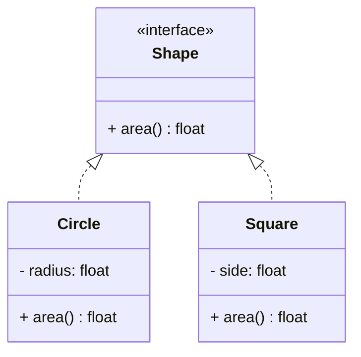

# Polymorphism

## 🧭 Overview
Polymorphism ("many forms") lets objects of different types be treated through a common interface, with each responding to the same method call in its own way. It's what makes code extensible: you can add new types without changing the code that uses them. Polymorphism is a core OOP pillar and the engine behind most design patterns (Strategy, Observer, Factory).

---

## 🧠 Technical Explanation

### Types of Polymorphism
- **Runtime (subtype) polymorphism:** the most important — a base reference invokes the correct overridden method of the actual object at runtime (dynamic dispatch). E.g., calling `.area()` on a `Shape` runs `Circle.area()` or `Square.area()` accordingly.
- **Compile-time polymorphism:** method overloading (same name, different signatures) and operator overloading. Python handles "overloading" via default/variadic args rather than true signature overloading.

### Duck Typing (Python)
"If it walks like a duck and quacks like a duck, it's a duck." Python doesn't require a shared base class — any object with the expected method works. This is polymorphism without formal inheritance.

### Why It Matters
- **Open/Closed:** add new types implementing the interface without touching existing client code.
- **Decoupling:** clients depend on an abstraction, not concrete types.
- Powers patterns like **Strategy** (swap algorithms) and **Factory** (create varied types behind one interface).

### Method Overriding
A subclass provides its own implementation of a method declared in the parent; the runtime picks the right one based on the object's actual type.

---

## 🍎 Simple Explanation (ELI5 / Analogy)
Polymorphism is like a universal "play" button. Press play on a music player, a video, or a podcast app — same button, same action name ("play"), but each does its own thing. You (the caller) don't need to know the internals; you just say "play," and each object knows how to respond. Add a new media type tomorrow — as long as it has a "play," your remote keeps working unchanged.

---

## 📐 Class Diagram



---

## 💻 Code Example

```python
from abc import ABC, abstractmethod
import math


class Shape(ABC):
    @abstractmethod
    def area(self) -> float: ...


class Circle(Shape):
    def __init__(self, radius: float):
        self.radius = radius

    def area(self) -> float:
        return math.pi * self.radius ** 2


class Square(Shape):
    def __init__(self, side: float):
        self.side = side

    def area(self) -> float:
        return self.side ** 2


def total_area(shapes: list[Shape]) -> float:
    # Works for ANY Shape — including ones added later (Open/Closed)
    return sum(shape.area() for shape in shapes)


print(round(total_area([Circle(2), Square(3)]), 2))  # 21.57
```

---

## ✅ When to Use
- Multiple types share an interface but behave differently.
- You want to add new behaviors/types without editing client code.

## ❌ When NOT to Use
- A single concrete type with no variation (abstraction adds noise).
- When behaviors are unrelated (forcing a shared interface is awkward).

---

## ⚖️ Trade-offs

| Pros | Cons |
|------|------|
| Extensible (add types without changing callers) | Indirection can reduce readability |
| Decouples clients from concrete types | Overuse → too many tiny classes |
| Powers many design patterns | Harder to trace which impl runs |

---

## 🎯 Interview Questions

### Conceptual
1. What is runtime polymorphism? → **Answer:** The correct overridden method is chosen at runtime based on the object's actual type (dynamic dispatch), letting a base reference invoke subtype behavior.
2. What is duck typing? → **Answer:** Python's approach where an object's suitability is determined by having the required methods/attributes, not by inheriting a specific type.
3. How does polymorphism support the Open/Closed Principle? → **Answer:** New types implement the shared interface, so client code extends behavior without modification.

### Pattern Identification
1. You swap interchangeable algorithms behind one interface — which pattern? → **Answer:** Strategy (built on polymorphism).

### Company-Specific
1. [Google] How does `total_area(shapes)` stay unchanged when a new shape is added? *(Hint: it depends on the `Shape` interface, not concrete types.)*
2. [Amazon] Give an example of polymorphism in a payment system. *(Hint: a `PaymentMethod.pay()` interface with Card/UPI/Wallet implementations.)*

---

## 🔗 Related Patterns
- [Inheritance](03-inheritance.md)
- [Abstraction](05-abstraction.md)
- [Strategy](../05-design-patterns/behavioral/02-strategy.md)
- [Open/Closed Principle](../04-solid-principles/02-open-closed.md)
