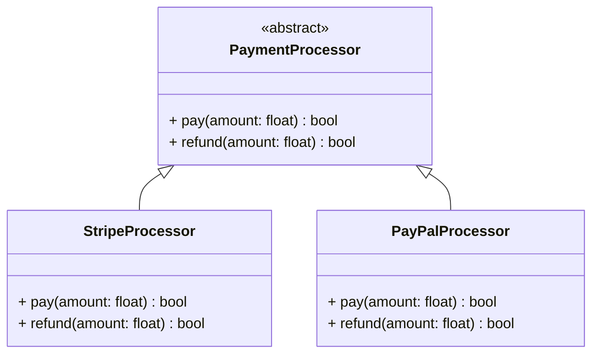

# Abstraction

## 🧭 Overview
Abstraction is the OOP principle of exposing **what** an object does while hiding **how** it does it — modeling only the essential features relevant to the problem and suppressing the irrelevant details. It reduces complexity and lets callers work with simple, stable interfaces. Abstraction is closely related to encapsulation but distinct: encapsulation hides *state*, abstraction hides *implementation complexity*.

---

## 🧠 Technical Explanation

### Abstraction vs Encapsulation
- **Abstraction:** hides complexity — *what* an object offers (the interface/contract). A design-level concern.
- **Encapsulation:** hides data/state and bundles it with behavior. An implementation-level mechanism.
They work together: you design an abstraction, then encapsulate the details that fulfill it.

### How It's Expressed
- **Abstract classes** (`ABC` in Python): define a partial template with some abstract methods subclasses must implement.
- **Interfaces / abstract methods:** pure contracts with no implementation.
- **High-level APIs:** a `Database.save()` hides connection pooling, SQL, retries.

### Levels of Abstraction
Good design layers abstractions: a caller uses `payment.charge()` without knowing whether it hits Stripe, retries, or logs. Each layer hides the one below.

### Why It Matters
- **Reduces cognitive load:** callers reason about the interface, not internals.
- **Enables change:** swap implementations behind a stable contract.
- **Foundation for polymorphism and patterns:** abstract types are the "interface" types programmed against.

---

## 🍎 Simple Explanation (ELI5 / Analogy)
Driving a car is abstraction in action. You use a steering wheel, pedals, and gear shift (the interface) without knowing how the engine combusts fuel, how the transmission shifts, or how the brakes hydraulically clamp (the hidden implementation). The car exposes *what* you can do (steer, accelerate, brake) and hides *how*. You could switch from a gas car to an electric one and still "drive" the same way — the abstraction stays stable while the implementation changes completely.

---

## 📐 Class Diagram



---

## 💻 Code Example

```python
from abc import ABC, abstractmethod


class PaymentProcessor(ABC):
    """Abstraction: callers know WHAT, not HOW."""
    @abstractmethod
    def pay(self, amount: float) -> bool: ...


class StripeProcessor(PaymentProcessor):
    def pay(self, amount: float) -> bool:
        # hidden complexity: API calls, retries, tokenization...
        print(f"Charging ${amount} via Stripe")
        return True


class PayPalProcessor(PaymentProcessor):
    def pay(self, amount: float) -> bool:
        print(f"Charging ${amount} via PayPal")
        return True


def checkout(processor: PaymentProcessor, amount: float) -> None:
    # depends only on the abstraction
    if processor.pay(amount):
        print("Order confirmed")


checkout(StripeProcessor(), 99.0)
checkout(PayPalProcessor(), 50.0)
```

---

## ✅ When to Use
- Multiple implementations should be interchangeable behind a contract.
- You want to shield callers from complex/volatile details.

## ❌ When NOT to Use
- Only one implementation that will never vary (premature abstraction).
- When it adds indirection without real benefit.

---

## ⚖️ Trade-offs

| Pros | Cons |
|------|------|
| Hides complexity; simpler callers | Premature abstraction adds indirection |
| Swap implementations freely | Too many layers obscure behavior |
| Enables polymorphism & DIP | Wrong abstraction is costly to change |

---

## 🎯 Interview Questions

### Conceptual
1. How does abstraction differ from encapsulation? → **Answer:** Abstraction hides implementation complexity behind a contract (what it does); encapsulation hides internal state and bundles it with behavior (how it's stored/protected).
2. What's the cost of a wrong abstraction? → **Answer:** It's harder to undo than duplicated code; "premature abstraction" can lock you into a poor contract — sometimes duplication is better until the pattern is clear.
3. How does abstraction enable the Dependency Inversion Principle? → **Answer:** High-level code depends on abstract interfaces, not concrete implementations, so details can change freely.

### Pattern Identification
1. You provide a simple interface over a complex subsystem — which pattern? → **Answer:** Facade.

### Company-Specific
1. [Amazon] How would you abstract multiple payment providers? *(Hint: a `PaymentProcessor` interface with provider implementations.)*
2. [Google] Why might you avoid abstracting too early? *(Hint: wrong abstraction is costly; wait for the pattern to emerge.)*

---

## 🔗 Related Patterns
- [Encapsulation](02-encapsulation.md)
- [Polymorphism](04-polymorphism.md)
- [Facade](../05-design-patterns/structural/03-facade.md)
- [Dependency Inversion Principle](../04-solid-principles/05-dependency-inversion.md)
