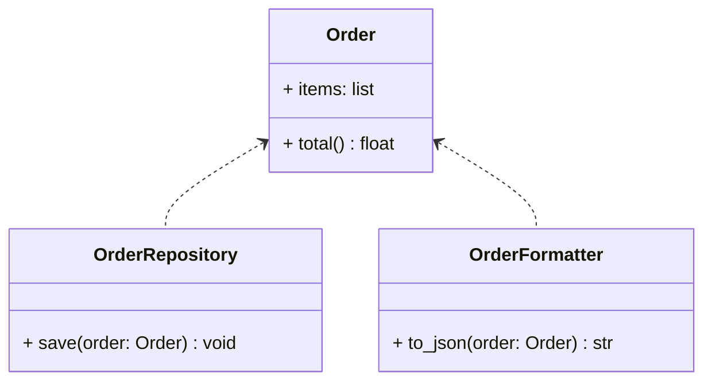

# Single Responsibility Principle (SRP)

## 🧭 Overview
The **S** in SOLID: a class should have **one reason to change** — i.e., one responsibility. When a class does too many things, changes to one concern risk breaking another, and the class becomes hard to test and reuse. SRP is the most foundational SOLID principle and the antidote to "God classes."

---

## 🧠 Technical Explanation

### The Principle
"A class should have only one reason to change." A *responsibility* is an axis of change — a single actor or concern. If a class handles business logic **and** persistence **and** formatting, it has three reasons to change and three ways to break.

### Identifying Violations
Ask: "What would cause this class to change?" If the answer lists multiple unrelated concerns (database schema changed, report format changed, business rule changed), split them.

### Cohesion
SRP increases **cohesion** — everything in a class relates to its single purpose. Low-cohesion classes mixing unrelated logic are a smell.

### How to Apply
Separate concerns into focused classes: e.g., `Order` (data/business rules), `OrderRepository` (persistence), `OrderFormatter` (presentation). Each can change and be tested independently.

### Caution
Don't over-split into anemic, fragmented classes. "One responsibility" is about cohesive concerns, not "one method per class."

---

## 🍎 Simple Explanation (ELI5 / Analogy)
Think of a restaurant. The chef cooks, the waiter serves, the cashier handles money. If you forced one person to cook, serve, *and* manage payments simultaneously, they'd be overwhelmed and a change in any one area (new menu, new payment system) would disrupt everything. Giving each person a single responsibility means each can improve or be replaced without chaos. A class that "does everything" is that one overwhelmed employee.

---

## 📐 Class Diagram



---

## 💻 Code Example

```python
# ❌ Violates SRP: one class does logic + persistence + formatting
class BadOrder:
    def total(self): ...
    def save_to_db(self): ...
    def to_json(self): ...

# ✅ Follows SRP: each class has one reason to change
class Order:
    def __init__(self, items: list[float]):
        self.items = items

    def total(self) -> float:          # business logic only
        return sum(self.items)


class OrderRepository:                  # persistence only
    def save(self, order: Order) -> None:
        print(f"Saving order totaling {order.total()} to DB")


class OrderFormatter:                   # presentation only
    def to_json(self, order: Order) -> str:
        return f'{{"total": {order.total()}}}'


order = Order([10.0, 20.0])
OrderRepository().save(order)
print(OrderFormatter().to_json(order))  # {"total": 30.0}
```

---

## ✅ When to Use
- Always — split distinct concerns (logic, persistence, presentation, notification).
- When a class grows and accumulates unrelated reasons to change.

## ❌ When NOT to Use
- Don't fragment cohesive logic into trivial classes for its own sake.
- Tiny scripts where the overhead isn't justified.

---

## ⚖️ Trade-offs

| Pros | Cons |
|------|------|
| Easier to test, reuse, maintain | More classes/files to manage |
| Changes are localized | Risk of over-fragmentation |
| Higher cohesion | Slight indirection |

---

## 🎯 Interview Questions

### Conceptual
1. What does "one reason to change" mean? → **Answer:** A class should be affected by only one concern/actor; if multiple unrelated changes (DB, format, rules) force edits, it has multiple responsibilities.
2. How does SRP relate to cohesion? → **Answer:** SRP maximizes cohesion — all members serve the class's single purpose.
3. What's the risk of over-applying SRP? → **Answer:** Fragmenting cohesive behavior into many tiny anemic classes, increasing indirection without benefit.

### Pattern Identification (scenario)
1. A `Report` class generates data, formats HTML, and emails it. What's wrong and the fix? → **Answer:** It violates SRP (three concerns); split into `ReportGenerator`, `ReportFormatter`, and `ReportMailer`.

### Company-Specific
1. [Amazon] How would you refactor a 2,000-line "Manager" God class? *(Hint: identify concerns/actors and extract focused classes.)*
2. [Meta] Why does SRP make unit testing easier? *(Hint: small, focused units with one concern are simple to test in isolation.)*

---

## 🔗 Related Patterns
- [Open/Closed Principle](02-open-closed.md)
- [Encapsulation](../03-oop-fundamentals/02-encapsulation.md)
- [Facade](../05-design-patterns/structural/03-facade.md)
