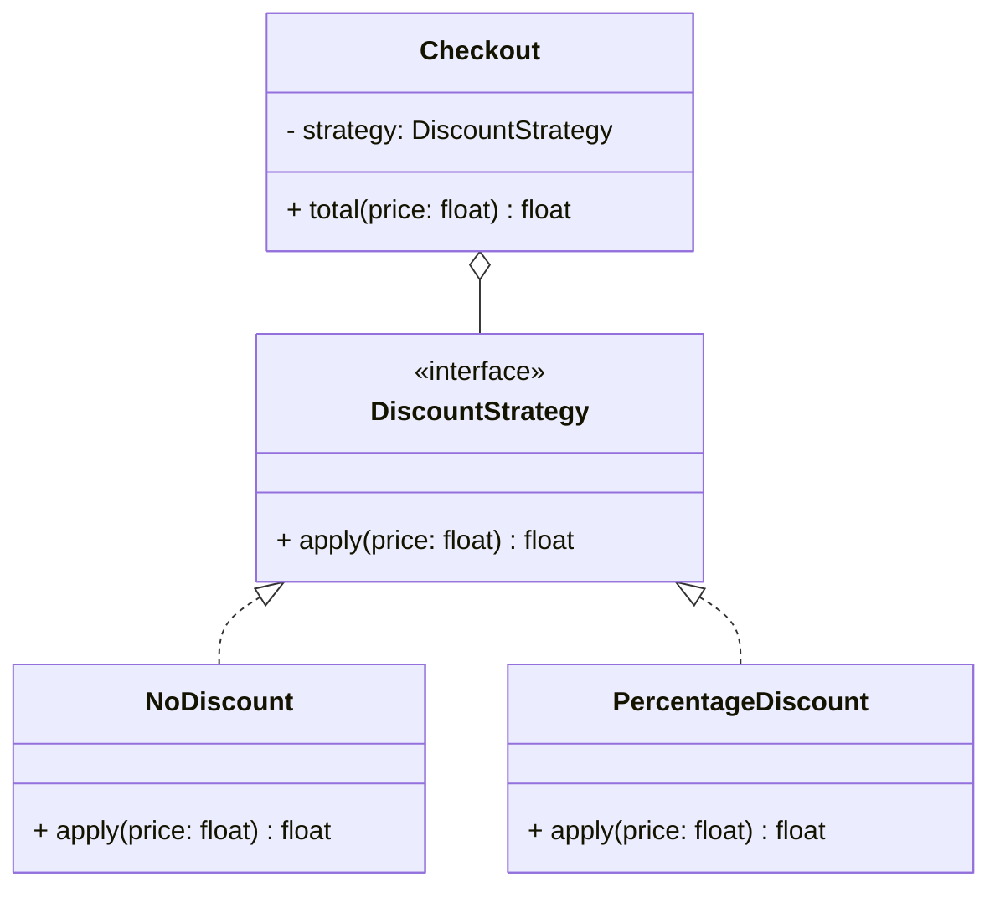

# Open/Closed Principle (OCP)

## 🧭 Overview
The **O** in SOLID: software entities should be **open for extension but closed for modification**. You should be able to add new behavior by adding new code (new classes), not by editing existing, tested code. OCP reduces the risk of breaking working features when requirements grow, and it's the principle behind extensible, plugin-style designs.

---

## 🧠 Technical Explanation

### The Principle
"Open for extension" — new behavior can be added. "Closed for modification" — without changing existing source. Achieved by depending on **abstractions** (interfaces/base classes) and adding new **implementations** rather than editing `if/elif` chains.

### The Telltale Smell
A growing `if type == "A" ... elif type == "B" ...` block that you must edit every time a new type appears violates OCP. Each edit risks regressions in tested code.

### How to Apply
1. Identify what varies.
2. Define an abstraction (interface/base class) for it.
3. Implement each variant as a separate class.
4. The client depends on the abstraction; adding a variant = adding a class, no edits to the client.

This is exactly how **Strategy**, **Factory**, and **plugin** architectures work.

### Caution
You can't make everything open to every kind of change. Apply OCP to the axes of change you reasonably anticipate; don't over-engineer for imagined future variation (YAGNI).

---

## 🍎 Simple Explanation (ELI5 / Analogy)
Think of a power strip with universal sockets. To add a new device, you just plug it in (extension) — you don't rewire the strip (modification). The strip is "closed" (you never open it up) but "open" to any new device that fits the socket (the interface). Compare that to a wall where adding a device means cutting into the plaster and rewiring each time — risky and error-prone. Good code is the power strip: new features plug in without touching what already works.

---

## 📐 Class Diagram



---

## 💻 Code Example

```python
from abc import ABC, abstractmethod


# ❌ Violates OCP: must edit this every time a new discount appears
# def total(price, kind):
#     if kind == "none": return price
#     elif kind == "percent": return price * 0.9
#     ...

# ✅ Follows OCP: add a new class, never edit existing code
class DiscountStrategy(ABC):
    @abstractmethod
    def apply(self, price: float) -> float: ...


class NoDiscount(DiscountStrategy):
    def apply(self, price: float) -> float:
        return price


class PercentageDiscount(DiscountStrategy):
    def __init__(self, percent: float):
        self.percent = percent

    def apply(self, price: float) -> float:
        return price * (1 - self.percent / 100)


class Checkout:
    def __init__(self, strategy: DiscountStrategy):
        self.strategy = strategy

    def total(self, price: float) -> float:
        return self.strategy.apply(price)


print(Checkout(PercentageDiscount(10)).total(100.0))  # 90.0
# New "BlackFridayDiscount"? Just add a class — Checkout is untouched.
```

---

## ✅ When to Use
- Behavior varies along a known axis (pricing, payment, export formats).
- You expect new variants to be added over time.

## ❌ When NOT to Use
- A single fixed behavior unlikely to change (abstraction is premature).
- When the variation is truly unpredictable — don't over-engineer.

---

## ⚖️ Trade-offs

| Pros | Cons |
|------|------|
| Add features without touching tested code | More classes/abstractions |
| Lower regression risk | Premature abstraction if misapplied |
| Plugin-style extensibility | Indirection to trace |

---

## 🎯 Interview Questions

### Conceptual
1. What does "open for extension, closed for modification" mean? → **Answer:** You add new behavior via new code (new implementations of an abstraction) without editing existing, tested classes.
2. What code smell signals an OCP violation? → **Answer:** A growing if/elif (or switch) on a type that you must edit whenever a new type is added.
3. How does OCP relate to polymorphism? → **Answer:** Clients depend on an abstraction and new subtypes plug in polymorphically, so behavior extends without modification.

### Pattern Identification (scenario)
1. You keep editing a function to add new payment types. Fix? → **Answer:** Introduce a `PaymentMethod` interface (Strategy/Factory) so each new method is a new class.

### Company-Specific
1. [Amazon] How would you design discounts to add new types without code changes? *(Hint: Strategy interface + new classes.)*
2. [Google] When is applying OCP premature? *(Hint: single fixed behavior; YAGNI.)*

---

## 🔗 Related Patterns
- [Single Responsibility](01-single-responsibility.md)
- [Strategy](../05-design-patterns/behavioral/02-strategy.md)
- [Factory](../05-design-patterns/creational/02-factory.md)
- [Polymorphism](../03-oop-fundamentals/04-polymorphism.md)
