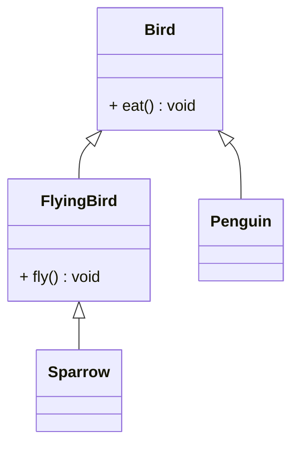

# Liskov Substitution Principle (LSP)

## 🧭 Overview
The **L** in SOLID: objects of a subclass should be **substitutable** for objects of their superclass **without breaking** the program. If code works with a base type, it must work with any subtype. LSP keeps inheritance honest — a subtype must truly behave like its parent, not just borrow its shape. Violating it produces surprising bugs and fragile hierarchies.

---

## 🧠 Technical Explanation

### The Principle
Named after Barbara Liskov: if `S` is a subtype of `T`, then objects of type `T` may be replaced with objects of type `S` without altering correctness. A subclass must honor the **contract** (expected behavior, invariants, pre/postconditions) of its parent.

### Rules a Subtype Must Respect
- **Preconditions can't be strengthened** (don't demand more than the parent).
- **Postconditions can't be weakened** (deliver at least what the parent promises).
- **Invariants must be preserved.**
- **Don't throw new unexpected exceptions** the parent's callers wouldn't handle.

### The Classic Violation: Rectangle/Square
A `Square` that inherits from `Rectangle` and forces width == height breaks code that sets width and height independently and expects them to stay independent. The square *is* a rectangle mathematically, but its behavior violates the rectangle's contract → LSP violation. Fix: don't model it via that inheritance.

### Another Smell
A subclass overriding a method to do nothing or to raise `NotSupportedError` (e.g., a `ReadOnlyList` that throws on `add()`) signals an LSP violation — callers expecting the base behavior break.

### How to Honor LSP
Model "is-a" relationships only when the subtype genuinely fulfills the base contract. Prefer composition or separate interfaces when behavior diverges (ties into ISP).

---

## 🍎 Simple Explanation (ELI5 / Analogy)
If a recipe calls for "a bird that can fly" and you substitute a penguin (also a bird), the recipe breaks — penguins can't fly. The penguin *is* a bird by classification, but it doesn't honor the expected behavior "can fly." LSP says: only substitute a subtype where it genuinely behaves as the parent promises. Don't put a non-flying bird where flying is required, even though it passes the "is-a-bird" test.

---

## 📐 Class Diagram



---

## 💻 Code Example

```python
from abc import ABC, abstractmethod


# ❌ LSP violation: Penguin can't fly but inherits fly()
# class Bird:
#     def fly(self): ...
# class Penguin(Bird):
#     def fly(self): raise NotImplementedError  # breaks substitutability

# ✅ Honor LSP: separate the flying capability
class Bird(ABC):
    @abstractmethod
    def eat(self) -> None: ...


class FlyingBird(Bird):
    @abstractmethod
    def fly(self) -> None: ...


class Sparrow(FlyingBird):
    def eat(self) -> None: print("Sparrow eats")
    def fly(self) -> None: print("Sparrow flies")


class Penguin(Bird):                 # not a FlyingBird
    def eat(self) -> None: print("Penguin eats")


def make_it_fly(bird: FlyingBird) -> None:
    bird.fly()                       # only accepts birds that truly fly


make_it_fly(Sparrow())               # ok
# make_it_fly(Penguin())  # type error — correctly disallowed
```

---

## ✅ When to Use (honoring LSP)
- Whenever you use inheritance — ensure subtypes fulfill the base contract.
- Designing class hierarchies meant for polymorphic substitution.

## ❌ When NOT to (signs to avoid that inheritance)
- A subtype that must disable/contradict parent behavior.
- Overrides that throw "not supported" or change expected semantics.

---

## ⚖️ Trade-offs

| Pros | Cons |
|------|------|
| Reliable polymorphism/substitution | Requires careful hierarchy design |
| Prevents surprising subtype bugs | May force more interfaces/composition |
| Strengthens OCP | Extra modeling effort |

---

## 🎯 Interview Questions

### Conceptual
1. State the Liskov Substitution Principle. → **Answer:** Subtypes must be substitutable for their base type without breaking correctness — honoring the parent's contract, invariants, and pre/postconditions.
2. Why is the Square-extends-Rectangle example an LSP violation? → **Answer:** Square forces width == height, breaking code that sets dimensions independently as a Rectangle's contract allows.
3. What's a common code smell for LSP violations? → **Answer:** Overrides that throw "not supported" or do nothing, breaking callers that expect base behavior.

### Pattern Identification (scenario)
1. A `ReadOnlyCollection` extends `Collection` but throws on `add()`. Problem? → **Answer:** LSP violation; separate read vs mutable interfaces (relates to ISP) instead.

### Company-Specific
1. [Amazon] How would you redesign a Penguin/Bird hierarchy to honor LSP? *(Hint: separate FlyingBird capability/interface.)*
2. [Google] How does LSP support reliable polymorphism? *(Hint: any subtype safely substitutes the base, so polymorphic code stays correct.)*

---

## 🔗 Related Patterns
- [Inheritance](../03-oop-fundamentals/03-inheritance.md)
- [Interface Segregation](04-interface-segregation.md)
- [Open/Closed Principle](02-open-closed.md)
