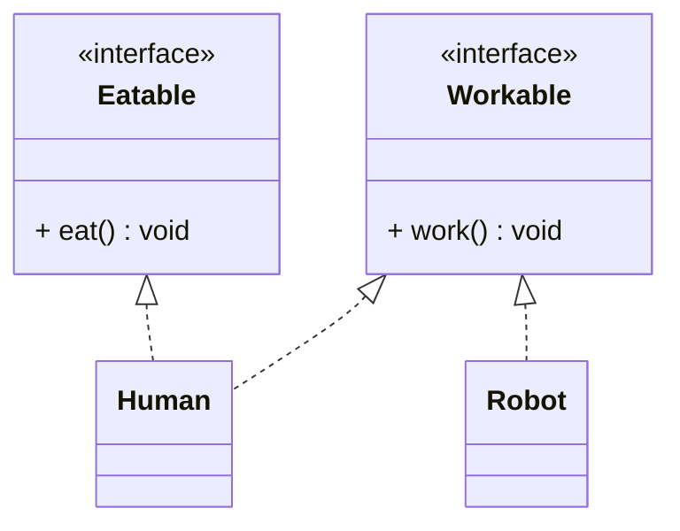

# Interface Segregation Principle (ISP)

## 🧭 Overview
The **I** in SOLID: clients should **not be forced to depend on methods they don't use**. Prefer many small, focused interfaces over one large "fat" interface. ISP prevents classes from being burdened with irrelevant methods they must implement (often as empty stubs or exceptions), keeping designs cohesive and flexible.

---

## 🧠 Technical Explanation

### The Principle
"No client should be forced to depend on interfaces it does not use." A bloated interface forces implementers to provide methods that don't apply to them, leading to empty implementations, `NotImplementedError`, and tight, unnecessary coupling.

### The Smell
A "fat" interface like `Worker { work(); eat(); sleep(); }` forces a `RobotWorker` to implement `eat()` and `sleep()` — which make no sense. The robot ends up throwing exceptions or doing nothing → ISP violation (and often LSP too).

### How to Apply
Split a fat interface into **role-specific** interfaces. A class implements only the interfaces relevant to it (Python supports this via multiple small ABCs / protocols).
- `Workable { work() }`, `Eatable { eat() }`, `Sleepable { sleep() }`.
- `Human` implements all three; `Robot` implements only `Workable`.

### Relationship to Other Principles
- ISP complements **SRP** (interfaces, like classes, should be cohesive).
- Violating ISP often forces LSP violations (stub methods that break substitutability).
- Small interfaces aid **DIP** (depend on focused abstractions).

### In Python
Use `abc.ABC` or `typing.Protocol` to define small interfaces; duck typing means clients can depend on just the methods they need.

---

## 🍎 Simple Explanation (ELI5 / Analogy)
Imagine a job application that forces *every* applicant to fill out sections for "pilot license," "scuba certification," and "forklift training" — even if you're applying to be a writer. Most fields are irrelevant and you'd leave them blank or write "N/A." It would be far better to have separate, role-specific forms so each applicant only fills out what's relevant. A fat interface is that bloated one-size-fits-all form; ISP gives each role its own tailored form.

---

## 📐 Class Diagram



---

## 💻 Code Example

```python
from abc import ABC, abstractmethod


# ❌ Fat interface forces Robot to implement eat()/sleep()
# class Worker(ABC):
#     @abstractmethod
#     def work(self): ...
#     @abstractmethod
#     def eat(self): ...   # robots don't eat → empty/raises

# ✅ Segregated, role-specific interfaces
class Workable(ABC):
    @abstractmethod
    def work(self) -> None: ...


class Eatable(ABC):
    @abstractmethod
    def eat(self) -> None: ...


class Human(Workable, Eatable):
    def work(self) -> None: print("Human working")
    def eat(self) -> None: print("Human eating")


class Robot(Workable):              # only implements what it needs
    def work(self) -> None: print("Robot working")


def run_shift(worker: Workable) -> None:
    worker.work()                   # depends only on Workable


run_shift(Human())
run_shift(Robot())                  # no irrelevant eat()/sleep() forced
```

---

## ✅ When to Use
- An interface is accumulating methods only some implementers need.
- Different clients need different subsets of behavior.

## ❌ When NOT to Use
- Over-splitting into many one-method interfaces when they're always used together (needless fragmentation).

---

## ⚖️ Trade-offs

| Pros | Cons |
|------|------|
| Implementers only depend on relevant methods | More interfaces to manage |
| Avoids empty stubs / LSP breakage | Can over-fragment if misapplied |
| More cohesive, flexible design | Slightly more upfront design |

---

## 🎯 Interview Questions

### Conceptual
1. State the Interface Segregation Principle. → **Answer:** Clients shouldn't be forced to depend on methods they don't use; prefer many small, focused interfaces over one fat interface.
2. How does an ISP violation often cause an LSP violation? → **Answer:** Implementers stub unsupported methods (empty or throwing), which breaks substitutability for callers expecting those methods to work.
3. How does Python express interfaces for ISP? → **Answer:** Small ABCs or `typing.Protocol`, with classes implementing only the relevant ones (and duck typing).

### Pattern Identification (scenario)
1. A `Machine` interface has `print()`, `scan()`, `fax()`, but a basic printer can't fax. Fix? → **Answer:** Split into `Printer`, `Scanner`, `Fax` interfaces; each device implements only what it supports.

### Company-Specific
1. [Amazon] How would you refactor a fat `Repository` interface with 20 methods? *(Hint: split into role-based interfaces clients actually use.)*
2. [Google] Why are small interfaces easier to mock in tests? *(Hint: fewer methods to stub; focused contracts.)*

---

## 🔗 Related Patterns
- [Single Responsibility](01-single-responsibility.md)
- [Liskov Substitution](03-liskov-substitution.md)
- [Dependency Inversion](05-dependency-inversion.md)
