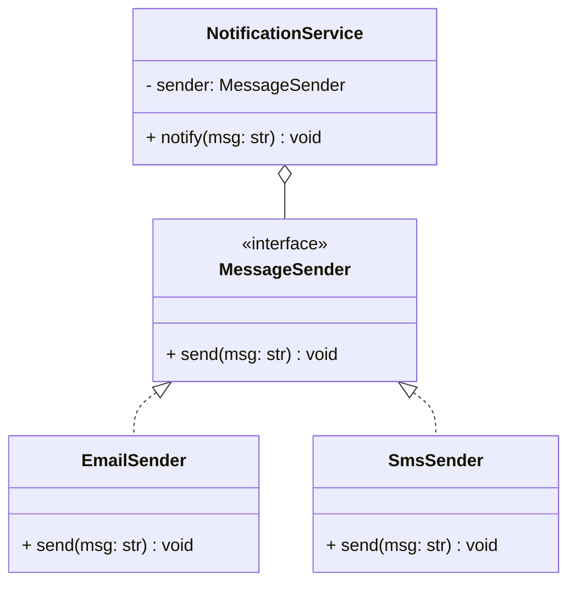

# Dependency Inversion Principle (DIP)

## 🧭 Overview
The **D** in SOLID: **high-level modules should not depend on low-level modules; both should depend on abstractions.** And abstractions should not depend on details — details depend on abstractions. DIP decouples policy from implementation, making code flexible, testable, and resistant to ripple-effect changes. It's the principle behind dependency injection and clean architecture.

---

## 🧠 Technical Explanation

### The Principle (two parts)
1. High-level modules (business logic) should depend on **abstractions**, not concrete low-level modules (database, email, API client).
2. Abstractions shouldn't depend on details; details (concrete classes) depend on abstractions.

This "inverts" the traditional dependency where high-level code directly instantiates and calls low-level code.

### Dependency Injection (DI)
The common technique to achieve DIP: instead of a class creating its dependencies (`self.db = MySQLDatabase()`), they're **passed in** (constructor/setter/parameter). The class depends on an interface; the concrete implementation is injected from outside.

### Why It Matters
- **Testability:** inject a mock/fake implementation in tests.
- **Flexibility:** swap implementations (MySQL → Postgres, SendGrid → SES) without touching business logic.
- **Decoupling:** high-level policy isn't bound to volatile low-level details.

### DIP vs DI vs IoC
- **DIP:** the *principle* (depend on abstractions).
- **DI:** a *technique* (inject dependencies).
- **IoC (Inversion of Control):** the broader idea (a framework/container wires dependencies).

### How to Apply
1. Define an interface for the dependency.
2. High-level class depends on the interface.
3. Inject a concrete implementation at runtime.

---

## 🍎 Simple Explanation (ELI5 / Analogy)
Think of a lamp and a wall socket. The lamp doesn't have wires soldered directly into the house's electrical system (a concrete, fixed dependency). Instead, it has a **plug** that fits a standard **socket** (the abstraction). You can plug the lamp into any socket, swap the lamp for a phone charger, or move it to another room — all because both depend on the standard socket interface, not on each other directly. DIP is designing your code with plugs and sockets instead of soldered wires.

---

## 📐 Class Diagram



---

## 💻 Code Example

```python
from abc import ABC, abstractmethod


# Abstraction both layers depend on
class MessageSender(ABC):
    @abstractmethod
    def send(self, msg: str) -> None: ...


# Low-level details depend on the abstraction
class EmailSender(MessageSender):
    def send(self, msg: str) -> None: print(f"Email: {msg}")


class SmsSender(MessageSender):
    def send(self, msg: str) -> None: print(f"SMS: {msg}")


# High-level module depends on the abstraction, NOT a concrete sender
class NotificationService:
    def __init__(self, sender: MessageSender):   # dependency injected
        self.sender = sender

    def notify(self, msg: str) -> None:
        self.sender.send(msg)


# Wire up concrete implementation from outside
NotificationService(EmailSender()).notify("Order shipped")
NotificationService(SmsSender()).notify("Order shipped")
# In tests: inject a FakeSender to assert behavior without real sending.
```

---

## ✅ When to Use
- High-level logic depends on volatile/external details (DB, network, email).
- You want testability and swappable implementations.

## ❌ When NOT to Use
- Trivial, stable dependencies unlikely to change (don't abstract everything).
- Tiny scripts where DI adds needless ceremony.

---

## ⚖️ Trade-offs

| Pros | Cons |
|------|------|
| Decoupled, testable, swappable | More interfaces + wiring |
| Business logic isolated from details | Indirection; harder to trace |
| Enables mocking in tests | Over-abstraction risk |

---

## 🎯 Interview Questions

### Conceptual
1. What does Dependency Inversion state? → **Answer:** High-level and low-level modules should both depend on abstractions, not on each other; details depend on abstractions, not vice versa.
2. What's the difference between DIP and Dependency Injection? → **Answer:** DIP is the principle (depend on abstractions); DI is a technique to achieve it by injecting concrete implementations from outside.
3. How does DIP improve testability? → **Answer:** You can inject mock/fake implementations of the abstraction, testing high-level logic without real databases/network.

### Pattern Identification (scenario)
1. A service hardcodes `self.db = MySQL()`. How to invert? → **Answer:** Depend on a `Database` interface and inject the concrete DB via the constructor.

### Company-Specific
1. [Amazon] How would you make business logic independent of the email provider? *(Hint: `MessageSender` interface + inject implementation.)*
2. [Google] Why is DIP central to clean/hexagonal architecture? *(Hint: core domain depends on ports/abstractions; adapters implement them.)*

---

## 🔗 Related Patterns
- [Interface Segregation](04-interface-segregation.md)
- [Abstraction](../03-oop-fundamentals/05-abstraction.md)
- [Factory](../05-design-patterns/creational/02-factory.md)
- [Strategy](../05-design-patterns/behavioral/02-strategy.md)
