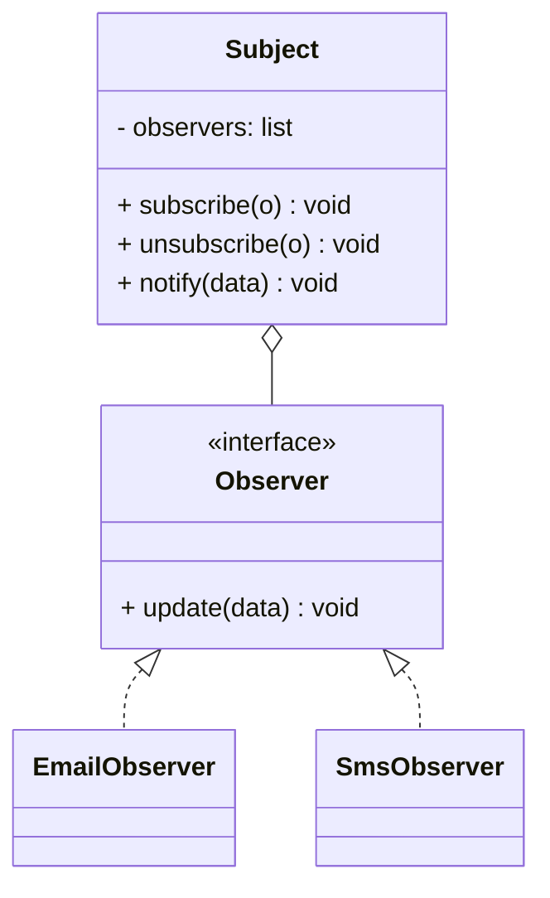

# Observer Pattern

## 🧭 Overview
**Category:** Behavioral. **Purpose:** define a one-to-many dependency so that when one object (the subject) changes state, all its dependents (observers) are notified and updated automatically. It's the foundation of event systems, pub/sub, and reactive UIs.

---

## 🧠 Technical Explanation
**Intent:** Let an object publish state changes to many subscribers without knowing who they are, enabling loose coupling between publisher and subscribers.

**How it works:** The **subject** maintains a list of **observers** and exposes `subscribe`/`unsubscribe`. When its state changes, it calls `notify()`, which invokes each observer's `update()`. Observers register/unregister at runtime.

**Push vs pull:** Push — the subject sends the changed data in `update(data)`. Pull — the subject just signals a change and observers query it for what they need.

**When to use:** One change must propagate to many interested parties — UI data binding, event listeners, notifications, the model in MVC, distributed pub/sub (at infra scale).

**Caution:** Watch for memory leaks (forgotten unsubscribes), unexpected update ordering, and cascading/recursive updates.

---

## 🍎 Simple Explanation (Analogy)
A newsletter (or YouTube channel) subscription. The publisher (subject) doesn't know each subscriber personally. When a new issue/video is released (state change), everyone subscribed automatically gets notified. New people can subscribe anytime and start receiving updates; anyone can unsubscribe and stop — all without the publisher changing anything.

---

## 📐 Class Diagram



---

## 💻 Code Example (Python)

```python
from abc import ABC, abstractmethod


class Observer(ABC):
    @abstractmethod
    def update(self, price: float) -> None: ...


class Stock:                              # subject
    def __init__(self):
        self._observers: list[Observer] = []
        self._price = 0.0

    def subscribe(self, o: Observer): self._observers.append(o)
    def unsubscribe(self, o: Observer): self._observers.remove(o)

    def set_price(self, price: float):
        self._price = price
        for o in self._observers:         # notify all
            o.update(price)


class EmailAlert(Observer):
    def update(self, price): print(f"Email: price is {price}")
class SmsAlert(Observer):
    def update(self, price): print(f"SMS: price is {price}")


stock = Stock()
stock.subscribe(EmailAlert())
stock.subscribe(SmsAlert())
stock.set_price(99.5)     # both observers notified automatically
```

---

## ✅ When to Use
- A state change must update many dependents automatically.
- Publisher and subscribers should be loosely coupled.

## ❌ When NOT to Use
- Only one dependent that always reacts (a direct call is simpler).
- When update ordering/cascades would be hard to reason about.

---

## ⚖️ Trade-offs

| Pros | Cons |
|------|------|
| Loose coupling publisher↔subscribers | Update order not guaranteed |
| Add/remove observers at runtime | Risk of memory leaks (no unsubscribe) |
| Supports broadcast/event systems | Cascading updates can be tricky |

---

## 🎯 Interview Questions

### Conceptual
1. What relationship does Observer model? → **Answer:** A one-to-many dependency: when the subject changes, all registered observers are notified automatically.
2. Push vs pull observer? → **Answer:** Push sends changed data in the notification; pull notifies of a change and lets observers query the subject for details.

### Pattern Identification
1. "Notify email, SMS, and analytics whenever an order's status changes." → **Answer:** Observer.

### Company-Specific
1. [Meta] How does Observer relate to pub/sub at infrastructure scale? *(Hint: same broadcast idea; infra adds a broker, durability, fan-out.)*
2. [Amazon] How do you avoid memory leaks with observers? *(Hint: ensure unsubscribe / weak references.)*

---

## 🔗 Related Patterns
- [Strategy](02-strategy.md)
- [Command](03-command.md)
- [Pub/Sub](../../../05-messaging-and-queues/02-pub-sub.md)
