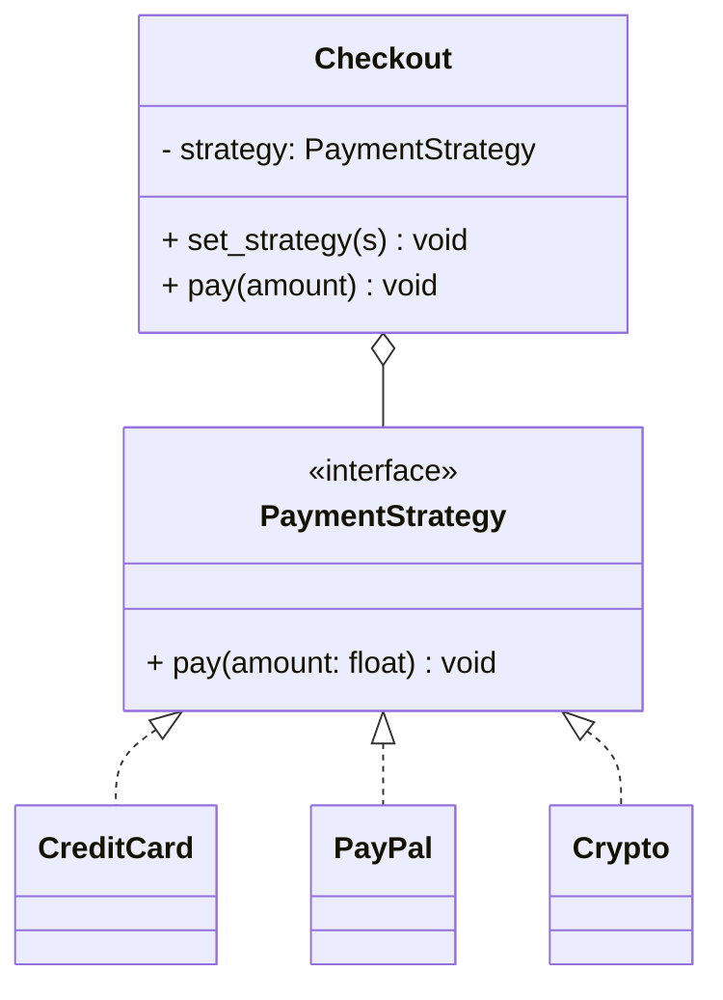

# Strategy Pattern

## 🧭 Overview
**Category:** Behavioral. **Purpose:** define a family of interchangeable algorithms, encapsulate each one, and make them swappable at runtime. The context delegates to a strategy object, so behavior can change without modifying the context. It's the go-to pattern for "I have several ways to do X."

---

## 🧠 Technical Explanation
**Intent:** Encapsulate interchangeable behaviors behind a common interface and let the client choose which to use at runtime.

**How it works:** Define a **strategy interface** with a method (e.g., `execute()`); implement each algorithm as a concrete strategy. The **context** holds a strategy reference and delegates to it. Swap strategies by injecting a different implementation — no `if/elif` in the context.

**Strategy vs State:** Both swap behavior via composition. **Strategy** is usually chosen by the client and is stateless/independent; **State** transitions itself based on internal state. Structurally similar, different intent.

**Why it matters:** It's the practical realization of **Open/Closed** and **Dependency Inversion** — add a new algorithm by adding a class, and the context depends on the abstraction.

**When to use:** Multiple variants of an algorithm (sorting, pricing, routing, compression, payment), selected at runtime.

---

## 🍎 Simple Explanation (Analogy)
A maps app choosing a route. You pick a strategy — "fastest," "shortest," "avoid tolls," "walking" — and the app computes accordingly. The app (context) doesn't hardcode one routing method; it delegates to whichever strategy you selected, and a new strategy ("scenic route") can be added without rewriting the app.

---

## 📐 Class Diagram



---

## 💻 Code Example (Python)

```python
from abc import ABC, abstractmethod


class PaymentStrategy(ABC):
    @abstractmethod
    def pay(self, amount: float) -> None: ...


class CreditCard(PaymentStrategy):
    def pay(self, amount): print(f"Paid ${amount} by credit card")
class PayPal(PaymentStrategy):
    def pay(self, amount): print(f"Paid ${amount} via PayPal")
class Crypto(PaymentStrategy):
    def pay(self, amount): print(f"Paid ${amount} in crypto")


class Checkout:                          # context
    def __init__(self, strategy: PaymentStrategy):
        self.strategy = strategy

    def set_strategy(self, strategy: PaymentStrategy):
        self.strategy = strategy         # swap at runtime

    def pay(self, amount: float):
        self.strategy.pay(amount)


cart = Checkout(CreditCard())
cart.pay(50)
cart.set_strategy(PayPal())
cart.pay(75)
# Add "ApplePay"? New class — Checkout unchanged.
```

---

## ✅ When to Use
- Multiple interchangeable algorithms selected at runtime.
- You want to eliminate big conditional blocks choosing behavior.

## ❌ When NOT to Use
- Only one fixed algorithm.
- The variants rarely change (added classes not worth it).

---

## ⚖️ Trade-offs

| Pros | Cons |
|------|------|
| Swap algorithms at runtime | More classes |
| Removes conditionals; honors OCP | Client must know the strategies |
| Easy to test each strategy | Overhead for trivial choices |

---

## 🎯 Interview Questions

### Conceptual
1. How does Strategy differ from State? → **Answer:** Both compose swappable behavior, but Strategy is typically chosen by the client and independent, while State changes itself via internal transitions.
2. How does Strategy implement Open/Closed? → **Answer:** New algorithms are added as new strategy classes without modifying the context.

### Pattern Identification
1. "Support multiple sorting algorithms chosen at runtime." → **Answer:** Strategy.

### Company-Specific
1. [Amazon] How would you design configurable shipping-cost calculation? *(Hint: ShippingStrategy interface with per-carrier implementations.)*
2. [Google] How does Strategy reduce if/elif sprawl? *(Hint: each branch becomes a class; context delegates polymorphically.)*

---

## 🔗 Related Patterns
- [State](04-state.md)
- [Observer](01-observer.md)
- [Open/Closed Principle](../../04-solid-principles/02-open-closed.md)
