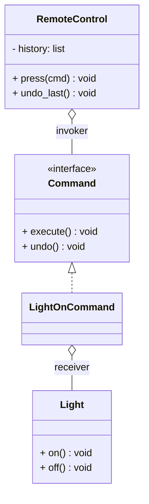

# Command Pattern

## 🧭 Overview
**Category:** Behavioral. **Purpose:** encapsulate a request as an object, letting you parameterize clients with different requests, queue or log them, and support undo/redo. It decouples the object that invokes an operation from the one that performs it.

---

## 🧠 Technical Explanation
**Intent:** Turn a request/action into a standalone object containing all information to perform it, so actions can be passed around, stored, queued, logged, and undone.

**Participants:**
- **Command:** interface with `execute()` (and often `undo()`).
- **Concrete command:** binds a receiver + parameters to an action.
- **Receiver:** the object that does the real work.
- **Invoker:** triggers commands (e.g., a button, a queue) without knowing their details.
- **Client:** creates and configures commands.

**How it works:** The invoker holds commands and calls `execute()`. Because commands are objects, you can keep a history (for **undo/redo**), queue them (for async/job processing), or log them (for replay/audit).

**When to use:** Undo/redo functionality, task queues/job scheduling, macro recording, transactional operations, decoupling UI actions from logic.

---

## 🍎 Simple Explanation (Analogy)
A restaurant order ticket. When you order, the waiter writes a ticket (a command object) capturing exactly what to make. The ticket can be queued on the rail, handed to any cook (invoker doesn't care who), re-made if needed, and kept as a record. The order is now a *thing* you can store and pass around, separate from the act of cooking it.

---

## 📐 Class Diagram



---

## 💻 Code Example (Python)

```python
from abc import ABC, abstractmethod


class Command(ABC):
    @abstractmethod
    def execute(self) -> None: ...
    @abstractmethod
    def undo(self) -> None: ...


class Light:                              # receiver
    def on(self): print("Light ON")
    def off(self): print("Light OFF")


class LightOnCommand(Command):            # concrete command
    def __init__(self, light: Light):
        self.light = light
    def execute(self): self.light.on()
    def undo(self): self.light.off()


class RemoteControl:                      # invoker
    def __init__(self):
        self.history: list[Command] = []
    def press(self, cmd: Command):
        cmd.execute()
        self.history.append(cmd)          # enables undo
    def undo_last(self):
        if self.history:
            self.history.pop().undo()


remote = RemoteControl()
remote.press(LightOnCommand(Light()))     # Light ON
remote.undo_last()                        # Light OFF
```

---

## ✅ When to Use
- Undo/redo, macros, or replayable action history.
- Queuing/scheduling operations (job/task systems).
- Decoupling invokers (UI/buttons) from receivers.

## ❌ When NOT to Use
- Simple direct method calls with no need for queuing/undo/logging.

---

## ⚖️ Trade-offs

| Pros | Cons |
|------|------|
| Decouples invoker from receiver | Many small command classes |
| Enables undo/redo, queuing, logging | Boilerplate for simple actions |
| Commands are first-class (storable) | Added indirection |

---

## 🎯 Interview Questions

### Conceptual
1. What does encapsulating a request as an object enable? → **Answer:** Queuing, logging, scheduling, macro recording, and undo/redo — because the action becomes a storable, passable object.
2. Name the key participants. → **Answer:** Command, concrete command, receiver, invoker, and client.

### Pattern Identification
1. "Implement undo/redo in a text editor." → **Answer:** Command (with a command history stack).

### Company-Specific
1. [Amazon] How would you build a job queue where tasks can be retried? *(Hint: tasks as command objects placed on a queue; re-execute on retry.)*
2. [Google] How does Command enable transaction-like undo? *(Hint: each command implements undo; reverse the history.)*

---

## 🔗 Related Patterns
- [Strategy](02-strategy.md)
- [Observer](01-observer.md)
- [Message Queues](../../../05-messaging-and-queues/01-message-queues.md)
