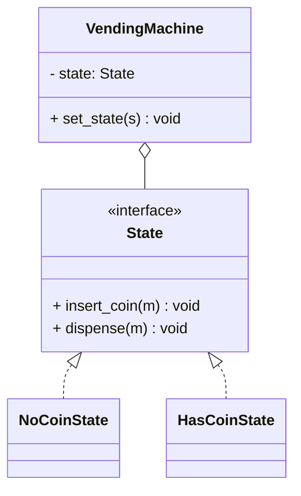

# State Pattern

## 🧭 Overview
**Category:** Behavioral. **Purpose:** allow an object to alter its behavior when its internal state changes, so it appears to change its class. It replaces sprawling `if/elif` state checks with discrete state classes, each encapsulating behavior for one state.

---

## 🧠 Technical Explanation
**Intent:** Encapsulate state-specific behavior into separate state objects and delegate to the current state, letting the object transition between states cleanly.

**How it works:** Define a **state interface** with the actions that vary by state. Implement each state as a class. The **context** holds a reference to a current state object and delegates behavior to it; states can trigger transitions by setting the context's state to another state.

**State vs Strategy:** Structurally similar (both delegate to a composed object). **Strategy**'s algorithm is usually chosen externally and is independent; **State** encapsulates states that *transition to one another* based on events, modeling a state machine.

**Why it helps:** Eliminates large conditional blocks scattered across methods; each state's rules live in one place; adding a state = adding a class.

**When to use:** An object behaves differently depending on a mode/status with well-defined transitions — vending machines, order/document lifecycles, traffic lights, TCP connections, game states.

---

## 🍎 Simple Explanation (Analogy)
A traffic light. In the "red" state it makes cars stop; in "green" it lets them go; in "yellow" it warns. The same light behaves completely differently depending on its current state, and it transitions in a fixed order (green → yellow → red → green). Each state knows its behavior *and* what comes next — no giant "if color == ..." logic.

---

## 📐 Class Diagram



---

## 💻 Code Example (Python)

```python
from abc import ABC, abstractmethod


class State(ABC):
    @abstractmethod
    def insert_coin(self, machine): ...
    @abstractmethod
    def dispense(self, machine): ...


class NoCoin(State):
    def insert_coin(self, machine):
        print("Coin accepted")
        machine.state = HasCoin()        # transition
    def dispense(self, machine):
        print("Insert a coin first")


class HasCoin(State):
    def insert_coin(self, machine):
        print("Coin already inserted")
    def dispense(self, machine):
        print("Dispensing item")
        machine.state = NoCoin()         # transition back


class VendingMachine:                    # context
    def __init__(self):
        self.state: State = NoCoin()
    def insert_coin(self): self.state.insert_coin(self)
    def dispense(self): self.state.dispense(self)


m = VendingMachine()
m.dispense()       # Insert a coin first
m.insert_coin()    # Coin accepted
m.dispense()       # Dispensing item
```

---

## ✅ When to Use
- Behavior depends on a mode/status with defined transitions.
- You want to replace big state-checking conditionals.

## ❌ When NOT to Use
- Few states with trivial differences (a simple flag is enough).
- States never change at runtime.

---

## ⚖️ Trade-offs

| Pros | Cons |
|------|------|
| Eliminates large state conditionals | More classes (one per state) |
| Each state's logic is isolated | Transitions spread across states |
| Easy to add new states | Overkill for simple cases |

---

## 🎯 Interview Questions

### Conceptual
1. How does State differ from Strategy? → **Answer:** Both delegate to a composed object; State models states that transition between each other based on events (a state machine), while Strategy's algorithm is usually externally chosen and independent.
2. What does State replace? → **Answer:** Sprawling `if/elif` checks on a status field scattered across methods.

### Pattern Identification
1. "An order goes through Placed → Paid → Shipped → Delivered, each with different allowed actions." → **Answer:** State.

### Company-Specific
1. [Amazon] Model a vending machine's behavior cleanly. *(Hint: State pattern — NoCoin/HasCoin/Sold states.)*
2. [Google] How would you implement a TCP connection's behavior per state? *(Hint: states like Listen/Established/Closed each handling events.)*

---

## 🔗 Related Patterns
- [Strategy](02-strategy.md)
- [State Machine Diagrams](../../06-uml-and-diagrams/03-state-machine-diagrams.md)
- [Circuit Breaker Pattern](../../../07-distributed-systems/05-circuit-breaker-pattern.md)
