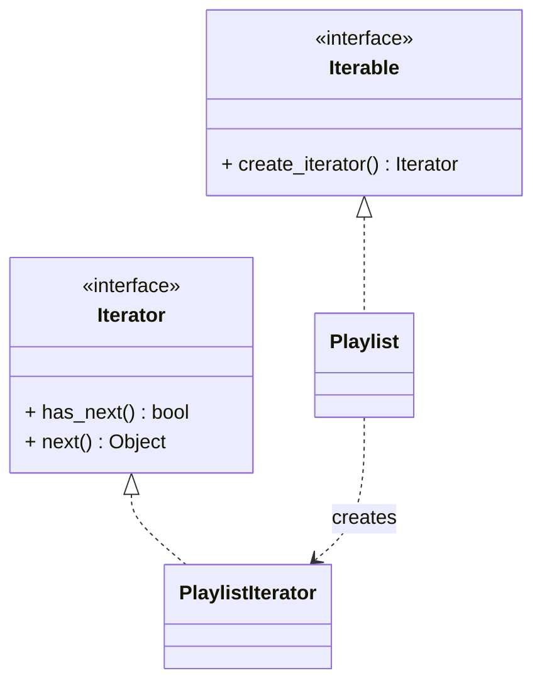

# Iterator Pattern

## 🧭 Overview
**Category:** Behavioral. **Purpose:** provide a way to access the elements of a collection sequentially without exposing its underlying representation. It decouples traversal logic from the collection, letting you iterate uniformly over different data structures.

---

## 🧠 Technical Explanation
**Intent:** Offer a standard way to traverse a collection element-by-element while hiding how the collection stores its data.

**How it works:** An **iterator** object exposes operations like `has_next()` / `next()` (or in Python, `__iter__` / `__next__`). The collection (**iterable**) produces an iterator. Clients traverse via the iterator without knowing whether the underlying structure is an array, tree, or linked list. Multiple independent iterations can run simultaneously, each with its own iterator state.

**In Python:** The pattern is built into the language: any object implementing `__iter__()` (returning an iterator) and `__next__()` works with `for` loops. **Generators** (`yield`) are a concise way to implement iterators.

**Benefits:** Uniform traversal API, hides internal representation, supports multiple simultaneous traversals, and enables lazy iteration (compute elements on demand).

**When to use:** You need to traverse a collection without exposing internals, support different traversal strategies, or iterate lazily over large/infinite sequences.

---

## 🍎 Simple Explanation (Analogy)
A TV remote's "channel up" button. You press it to move to the next channel without knowing how channels are stored internally (a list? a frequency table?). The remote (iterator) just gives you "next" and "is there a next?". Two people could even browse with two remotes independently. You traverse the channels uniformly regardless of the TV's internal wiring.

---

## 📐 Class Diagram



---

## 💻 Code Example (Python)

```python
class Playlist:
    def __init__(self):
        self._songs: list[str] = []

    def add(self, song: str):
        self._songs.append(song)

    def __iter__(self):
        # return an iterator (here, a generator) hiding internal storage
        return iter(self._songs)


class CountdownIterator:                  # custom iterator
    def __init__(self, start: int):
        self.current = start
    def __iter__(self):
        return self
    def __next__(self):
        if self.current <= 0:
            raise StopIteration
        self.current -= 1
        return self.current + 1


pl = Playlist()
pl.add("Song A"); pl.add("Song B")
for song in pl:                           # uniform traversal
    print(song)

print(list(CountdownIterator(3)))         # [3, 2, 1]
```

---

## ✅ When to Use
- Traverse a collection without exposing its internal structure.
- Support multiple/lazy traversals or different iteration orders.

## ❌ When NOT to Use
- Simple built-in collections already iterable (don't reinvent it).
- When direct indexing is clearer and sufficient.

---

## ⚖️ Trade-offs

| Pros | Cons |
|------|------|
| Hides internal representation | Extra iterator object/class |
| Uniform traversal API | Overhead for simple collections |
| Supports lazy & multiple iterations | Can be unnecessary in Python's built-ins |

---

## 🎯 Interview Questions

### Conceptual
1. What does the Iterator pattern hide? → **Answer:** The collection's internal representation — clients traverse via a uniform iterator interface regardless of underlying structure.
2. How does Python implement Iterator natively? → **Answer:** Via the `__iter__`/`__next__` protocol (and generators with `yield`), which the `for` loop uses automatically.

### Pattern Identification
1. "Traverse a custom tree in-order without exposing its node structure." → **Answer:** Iterator (often via a generator).

### Company-Specific
1. [Amazon] How would you lazily iterate over a huge/paginated dataset? *(Hint: an iterator/generator yielding pages on demand.)*
2. [Google] Why support multiple simultaneous iterators over one collection? *(Hint: each holds its own position/state independently.)*

---

## 🔗 Related Patterns
- [Composite](../structural/05-composite.md) (often iterated)
- [Observer](01-observer.md)
- [Command](03-command.md)
