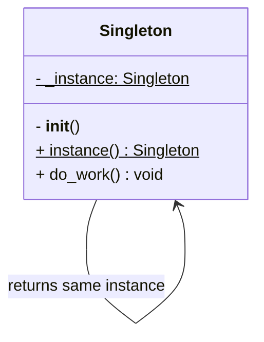

# Singleton Pattern

## 🧭 Overview
**Category:** Creational. **Purpose:** ensure a class has exactly one instance and provide a global point of access to it. Use it for shared resources that must be coordinated through a single object — configuration, logging, connection pools, caches.

---

## 🧠 Technical Explanation
**Intent:** Guarantee one and only one instance of a class exists process-wide, with controlled global access.

**How it works:** The class controls its own instantiation — the constructor is restricted, and a static accessor returns the single shared instance (creating it lazily on first use). Subsequent calls return the same object.

**When to use it:** A single shared resource (DB connection pool, config registry, logger) where multiple instances would be wasteful or cause inconsistency.

**Caution:** Singletons are often considered an anti-pattern when overused — they introduce **global state**, hidden dependencies, and make **testing harder** (hard to mock/reset). In multithreaded code, lazy initialization needs locking to be thread-safe. Prefer **dependency injection** of a single shared instance over a global singleton when possible.

---

## 🍎 Simple Explanation (Analogy)
A country has exactly one official government at a time. No matter who asks "who's in charge?", everyone is directed to the same single government — there can't be two. The Singleton is that single authority: every part of the program that needs it gets the same one instance.

---

## 📐 Class Diagram



---

## 💻 Code Example (Python)

```python
class AppConfig:
    _instance = None

    def __new__(cls):
        if cls._instance is None:          # create only once (lazy)
            cls._instance = super().__new__(cls)
            cls._instance.settings = {}    # init shared state
        return cls._instance

    def set(self, key, value):
        self.settings[key] = value

    def get(self, key):
        return self.settings.get(key)


a = AppConfig()
b = AppConfig()
a.set("env", "prod")
print(b.get("env"))   # 'prod' — same instance
print(a is b)         # True
```

A Pythonic alternative is a module-level object (modules are singletons) or a `@lru_cache`-decorated factory.

---

## ✅ When to Use
- One shared resource must be globally coordinated (config, logger, connection pool).
- Creating multiple instances would be costly or inconsistent.

## ❌ When NOT to Use
- When it just hides global state and harms testability — prefer DI.
- When multiple instances are actually fine/useful.

---

## ⚖️ Trade-offs

| Pros | Cons |
|------|------|
| Single shared instance, controlled access | Global state → hidden coupling |
| Lazy initialization saves resources | Harder to unit test / mock |
| Coordinates a shared resource | Thread-safety needs care |

---

## 🎯 Interview Questions

### Conceptual
1. Why is Singleton sometimes called an anti-pattern? → **Answer:** It introduces global mutable state and hidden dependencies, making code harder to test and reason about; DI is often preferable.
2. How do you make a lazy Singleton thread-safe? → **Answer:** Guard the creation with a lock (double-checked locking) or initialize eagerly at import time.

### Pattern Identification
1. "We need one configuration object accessible everywhere." → **Answer:** Singleton (or an injected single instance).

### Company-Specific
1. [Amazon] How would you implement a thread-safe connection pool singleton? *(Hint: lock around lazy init; or eager init.)*
2. [Google] Why prefer injecting a single instance over a global singleton? *(Hint: testability, explicit dependencies.)*

---

## 🔗 Related Patterns
- [Factory](02-factory.md) (often returns/coordinates singletons)
- [Abstract Factory](03-abstract-factory.md)
- [Dependency Inversion](../../04-solid-principles/05-dependency-inversion.md)
