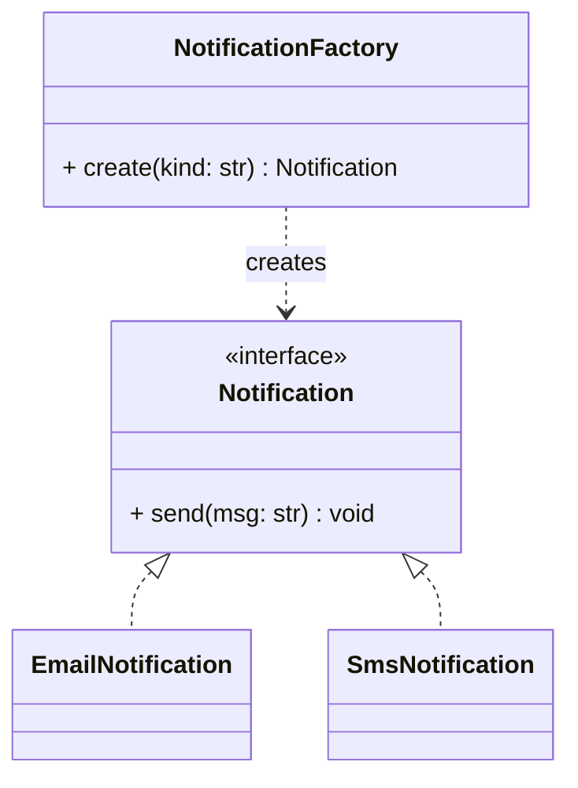

# Factory Method Pattern

## 🧭 Overview
**Category:** Creational. **Purpose:** define an interface for creating an object, but let a factory (or subclasses) decide which concrete class to instantiate. It decouples client code from concrete types, so you can add new types without changing the client.

---

## 🧠 Technical Explanation
**Intent:** Delegate object creation to a dedicated method/class so the caller depends on an abstraction, not concrete constructors.

**How it works:** Instead of `obj = ConcreteA()` scattered through code, the client calls `factory.create(type)` which returns an object of a common interface. Adding a new product = adding a class + a factory branch (or registering it), satisfying the **Open/Closed Principle**.

**Factory Method vs Simple Factory:** A "simple factory" is a single method with conditional creation. The GoF **Factory Method** uses subclassing — a base class defines the creation method, subclasses override it to produce specific products.

**When to use:** Creation logic is complex or varies by type; you want to centralize and decouple instantiation.

---

## 🍎 Simple Explanation (Analogy)
A hiring agency is a factory. You tell it "I need a plumber" or "I need an electrician," and it returns the right worker — you don't personally interview and construct each worker. If a new trade ("solar installer") appears, the agency adds it; you keep calling the agency the same way.

---

## 📐 Class Diagram



---

## 💻 Code Example (Python)

```python
from abc import ABC, abstractmethod


class Notification(ABC):
    @abstractmethod
    def send(self, msg: str) -> None: ...


class EmailNotification(Notification):
    def send(self, msg: str) -> None: print(f"Email: {msg}")


class SmsNotification(Notification):
    def send(self, msg: str) -> None: print(f"SMS: {msg}")


class NotificationFactory:
    _registry = {"email": EmailNotification, "sms": SmsNotification}

    @classmethod
    def create(cls, kind: str) -> Notification:
        try:
            return cls._registry[kind]()      # client doesn't know concrete class
        except KeyError:
            raise ValueError(f"Unknown notification: {kind}")


NotificationFactory.create("email").send("Welcome!")
NotificationFactory.create("sms").send("Your code is 1234")
# Add "push"? Register a new class — client code stays the same.
```

---

## ✅ When to Use
- The exact type to create is decided at runtime / by configuration.
- You want to centralize and decouple object creation.

## ❌ When NOT to Use
- Only one product type with simple construction (just use the constructor).
- Over-abstracting trivial creation.

---

## ⚖️ Trade-offs

| Pros | Cons |
|------|------|
| Decouples client from concrete classes | Extra indirection/classes |
| Easy to add new types (OCP) | Can be overkill for simple cases |
| Centralizes creation logic | More moving parts |

---

## 🎯 Interview Questions

### Conceptual
1. How does Factory support the Open/Closed Principle? → **Answer:** New product types are added by registering/adding a class; client code calling the factory is unchanged.
2. Difference between simple factory and factory method? → **Answer:** Simple factory uses a conditional in one method; GoF factory method uses subclasses overriding a creation method.

### Pattern Identification
1. "We create different report exporters based on a string config." → **Answer:** Factory.

### Company-Specific
1. [Amazon] Design a factory for multiple payment methods. *(Hint: PaymentMethod interface + registry/factory.)*
2. [Meta] When is a factory unnecessary? *(Hint: single concrete type, trivial construction.)*

---

## 🔗 Related Patterns
- [Abstract Factory](03-abstract-factory.md)
- [Builder](04-builder.md)
- [Open/Closed Principle](../../04-solid-principles/02-open-closed.md)
