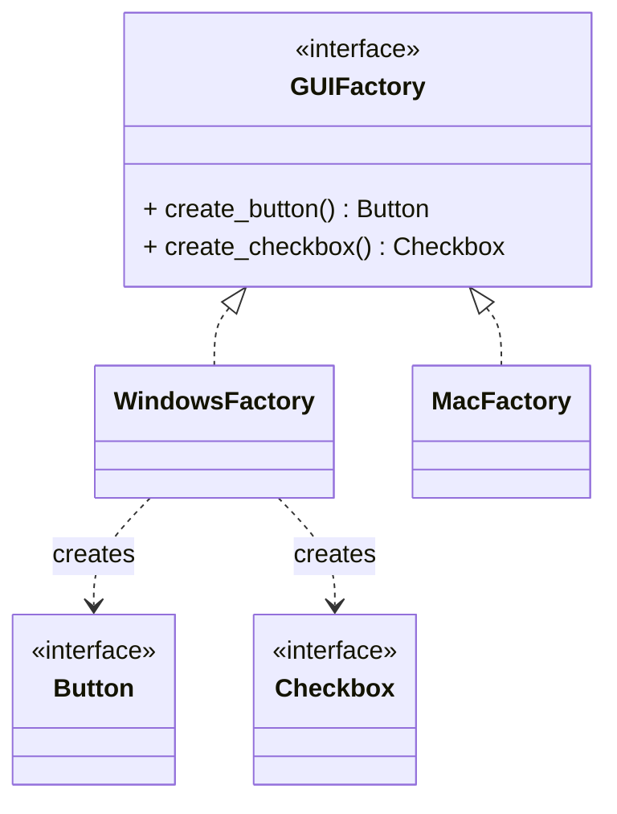

# Abstract Factory Pattern

## 🧭 Overview
**Category:** Creational. **Purpose:** provide an interface for creating **families of related objects** without specifying their concrete classes. Where Factory Method makes one product, Abstract Factory makes a whole coordinated set that's guaranteed to work together.

---

## 🧠 Technical Explanation
**Intent:** Create families of related/dependent objects through one interface, ensuring the products are compatible.

**How it works:** Define an abstract factory with methods to create each product in the family (e.g., `create_button()`, `create_checkbox()`). Concrete factories (e.g., `WindowsFactory`, `MacFactory`) produce matching variants. The client uses the abstract factory, so swapping the whole family is a one-line change.

**Factory Method vs Abstract Factory:** Factory Method creates **one** product via inheritance; Abstract Factory creates **multiple related** products (a family) via composition. Abstract Factory is often implemented using several factory methods.

**When to use:** You need consistent sets of products (UI themes, OS-specific widgets, cross-database driver families) and want to guarantee they match.

---

## 🍎 Simple Explanation (Analogy)
Buying a matching furniture set. A "Modern" factory gives you a modern sofa, modern chair, and modern table — all in the same style. A "Victorian" factory gives you the Victorian versions. You pick one factory and get a coherent set; you never accidentally mix a modern sofa with a Victorian chair.

---

## 📐 Class Diagram



---

## 💻 Code Example (Python)

```python
from abc import ABC, abstractmethod


class Button(ABC):
    @abstractmethod
    def render(self) -> str: ...


class Checkbox(ABC):
    @abstractmethod
    def render(self) -> str: ...


class WinButton(Button):
    def render(self): return "[Windows Button]"
class WinCheckbox(Checkbox):
    def render(self): return "[Windows Checkbox]"
class MacButton(Button):
    def render(self): return "(Mac Button)"
class MacCheckbox(Checkbox):
    def render(self): return "(Mac Checkbox)"


class GUIFactory(ABC):
    @abstractmethod
    def create_button(self) -> Button: ...
    @abstractmethod
    def create_checkbox(self) -> Checkbox: ...


class WindowsFactory(GUIFactory):
    def create_button(self): return WinButton()
    def create_checkbox(self): return WinCheckbox()
class MacFactory(GUIFactory):
    def create_button(self): return MacButton()
    def create_checkbox(self): return MacCheckbox()


def build_ui(factory: GUIFactory):
    print(factory.create_button().render(), factory.create_checkbox().render())


build_ui(WindowsFactory())   # [Windows Button] [Windows Checkbox]
build_ui(MacFactory())       # (Mac Button) (Mac Checkbox)
```

---

## ✅ When to Use
- You need families of products that must be used together consistently.
- You want to swap an entire product family with one change.

## ❌ When NOT to Use
- Only one product (use Factory Method).
- Product families rarely change (added complexity not worth it).

---

## ⚖️ Trade-offs

| Pros | Cons |
|------|------|
| Guarantees compatible product families | More classes/complexity |
| Swap entire family easily | Adding a new product type touches all factories |
| Isolates concrete classes | Overkill for single products |

---

## 🎯 Interview Questions

### Conceptual
1. Factory Method vs Abstract Factory? → **Answer:** Factory Method creates one product (via subclassing); Abstract Factory creates a family of related products (via composition of factory methods).
2. What does Abstract Factory guarantee? → **Answer:** That the related products it creates are compatible/consistent (same family/theme).

### Pattern Identification
1. "Render UI widgets that must all match the chosen OS theme." → **Answer:** Abstract Factory.

### Company-Specific
1. [Amazon] How would you support multiple cloud providers' resource sets? *(Hint: per-provider abstract factory producing matching resources.)*
2. [Google] Downside of Abstract Factory when adding a new product type? *(Hint: must modify every concrete factory.)*

---

## 🔗 Related Patterns
- [Factory Method](02-factory.md)
- [Builder](04-builder.md)
- [Singleton](01-singleton.md) (factories are often singletons)
