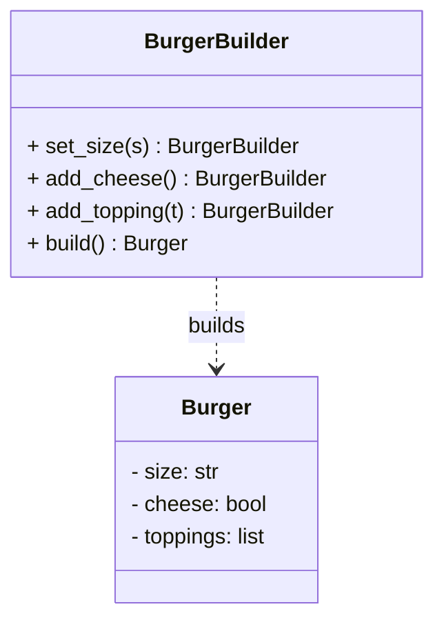

# Builder Pattern

## 🧭 Overview
**Category:** Creational. **Purpose:** construct a complex object step by step, separating the construction process from the final representation. It shines when an object has many optional parameters, avoiding "telescoping constructors" and producing readable, immutable objects.

---

## 🧠 Technical Explanation
**Intent:** Build a complex object incrementally through a fluent series of steps, then produce the final product.

**How it works:** A builder exposes methods to set each part (often returning `self` for chaining), and a `build()` method returns the finished object. The product can stay immutable because it's only constructed once at the end with validated parts.

**Problem it solves:** The **telescoping constructor** anti-pattern — constructors with many parameters (`Pizza(size, cheese, pepperoni, mushrooms, olives, ...)`) that are unreadable and error-prone. The builder names each step.

**Director (optional):** A director class can encapsulate common build recipes (e.g., `make_margherita()`), reusing the same builder.

**When to use:** Objects with many optional fields, required step-by-step construction, or when you want immutable objects with readable creation.

---

## 🍎 Simple Explanation (Analogy)
Ordering a custom burger at a build-your-own counter. You go down the line adding what you want — bun, patty, cheese, no onions, extra sauce — one choice at a time, and at the end you get your finished burger. You don't have to specify all 15 ingredients in one breath in a fixed order; you add them step by step, skipping what you don't want.

---

## 📐 Class Diagram



---

## 💻 Code Example (Python)

```python
class Burger:
    def __init__(self, size, cheese, toppings):
        self.size = size
        self.cheese = cheese
        self.toppings = toppings

    def __repr__(self):
        return f"Burger({self.size}, cheese={self.cheese}, {self.toppings})"


class BurgerBuilder:
    def __init__(self):
        self._size = "medium"
        self._cheese = False
        self._toppings = []

    def set_size(self, size):
        self._size = size
        return self                      # fluent chaining

    def add_cheese(self):
        self._cheese = True
        return self

    def add_topping(self, topping):
        self._toppings.append(topping)
        return self

    def build(self) -> Burger:
        return Burger(self._size, self._cheese, self._toppings)


burger = (BurgerBuilder()
          .set_size("large")
          .add_cheese()
          .add_topping("lettuce")
          .add_topping("tomato")
          .build())
print(burger)   # Burger(large, cheese=True, ['lettuce', 'tomato'])
```

---

## ✅ When to Use
- Objects with many optional parameters.
- You want immutable objects with readable, step-by-step construction.

## ❌ When NOT to Use
- Simple objects with few fields (a constructor or dataclass is enough).
- When all parameters are required and few.

---

## ⚖️ Trade-offs

| Pros | Cons |
|------|------|
| Readable construction of complex objects | Extra builder class/boilerplate |
| Avoids telescoping constructors | Overkill for simple objects |
| Can enforce immutability & validation | More verbose for trivial cases |

---

## 🎯 Interview Questions

### Conceptual
1. What problem does Builder solve? → **Answer:** The telescoping-constructor problem — it makes constructing objects with many optional parameters readable and avoids huge, ambiguous constructors.
2. How does Builder support immutability? → **Answer:** Parts are gathered in the builder, then the product is constructed once in `build()`, so the final object needs no setters.

### Pattern Identification
1. "An HTTP request object with dozens of optional headers/params." → **Answer:** Builder.

### Company-Specific
1. [Amazon] How would you design a query builder fluently? *(Hint: chained methods returning self, terminal build/execute.)*
2. [Google] Builder vs a dataclass with defaults — when each? *(Hint: builder for complex/validated/step-wise; dataclass for simple optional fields.)*

---

## 🔗 Related Patterns
- [Factory Method](02-factory.md)
- [Abstract Factory](03-abstract-factory.md)
- [Prototype](05-prototype.md)
