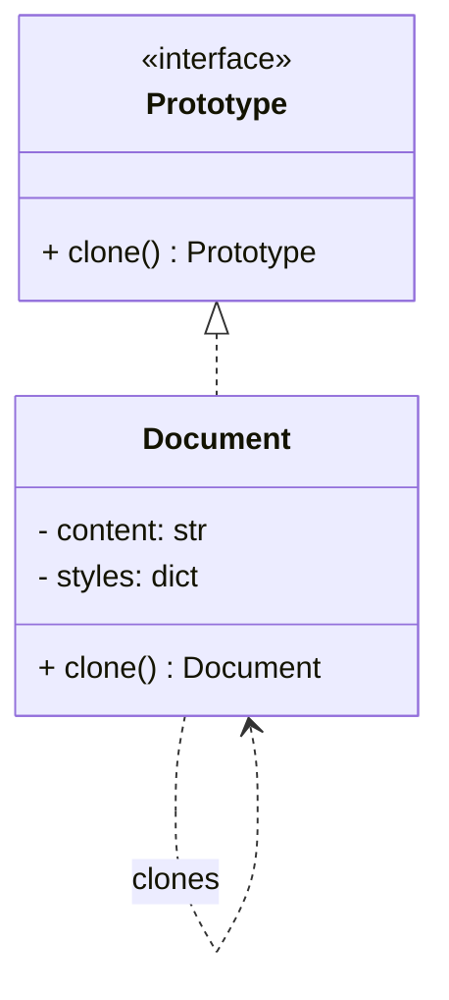

# Prototype Pattern

## 🧭 Overview
**Category:** Creational. **Purpose:** create new objects by **cloning** an existing instance (the prototype) rather than constructing from scratch. Useful when object creation is expensive, or when you want copies of a configured template.

---

## 🧠 Technical Explanation
**Intent:** Produce new objects by copying a prototypical instance, avoiding costly initialization and decoupling creation from concrete classes.

**How it works:** A prototype object implements a `clone()` method that returns a copy of itself. Clients clone the prototype and tweak the copy, instead of building a new object and re-running expensive setup.

**Shallow vs deep copy (critical):**
- **Shallow copy:** copies the object but shares references to nested objects → mutations to nested data affect both.
- **Deep copy:** recursively copies nested objects → fully independent clone.
Choose based on whether shared mutable state is acceptable. Python provides `copy.copy` (shallow) and `copy.deepcopy` (deep).

**When to use:** Expensive-to-create objects, many similar objects from a template, or when concrete classes should be hidden behind cloning. Often paired with a prototype **registry** that stores pre-configured prototypes to clone on demand.

---

## 🍎 Simple Explanation (Analogy)
Photocopying a filled-out form. Instead of typing the whole form from scratch each time (expensive construction), you take a completed master copy and photocopy it, then change just the name and date. The prototype is the master form; cloning is the photocopy.

---

## 📐 Class Diagram



---

## 💻 Code Example (Python)

```python
import copy


class Document:
    def __init__(self, content: str, styles: dict):
        self.content = content
        self.styles = styles            # nested mutable object

    def clone(self) -> "Document":
        # deep copy so the clone's styles are independent
        return copy.deepcopy(self)

    def __repr__(self):
        return f"Document({self.content!r}, {self.styles})"


# A configured template (expensive to set up once)
template = Document("Title", {"font": "Arial", "size": 12})

# Clone and customize instead of rebuilding
report = template.clone()
report.content = "Q3 Report"
report.styles["size"] = 14            # does NOT affect template (deep copy)

print(template)   # Document('Title', {'font': 'Arial', 'size': 12})
print(report)     # Document('Q3 Report', {'font': 'Arial', 'size': 14})
```

---

## ✅ When to Use
- Object creation is expensive (heavy initialization, DB/network setup).
- You need many copies of a pre-configured template.

## ❌ When NOT to Use
- Objects are cheap to construct normally.
- Deep nested structures make cloning error-prone/costly.

---

## ⚖️ Trade-offs

| Pros | Cons |
|------|------|
| Avoids costly re-initialization | Deep copy can be complex/expensive |
| Clone configured templates easily | Shallow copy bugs (shared references) |
| Decouples from concrete classes | Cloning logic must be maintained |

---

## 🎯 Interview Questions

### Conceptual
1. Shallow vs deep copy — why does it matter for Prototype? → **Answer:** Shallow copies share nested references (mutations leak between copies); deep copies are fully independent. Choosing wrong causes subtle bugs.
2. When is Prototype preferable to a Factory? → **Answer:** When creating from scratch is expensive and you can cheaply clone a pre-built, configured instance.

### Pattern Identification
1. "Spawn many enemies that start identical to a template, then tweak each." → **Answer:** Prototype.

### Company-Specific
1. [Amazon] How would you clone a complex configuration object safely? *(Hint: deepcopy or a custom clone handling nested state.)*
2. [Google] What bug arises from a shallow clone of an object with a list field? *(Hint: both share the same list; mutating one mutates the other.)*

---

## 🔗 Related Patterns
- [Builder](04-builder.md)
- [Factory Method](02-factory.md)
- [Singleton](01-singleton.md)
