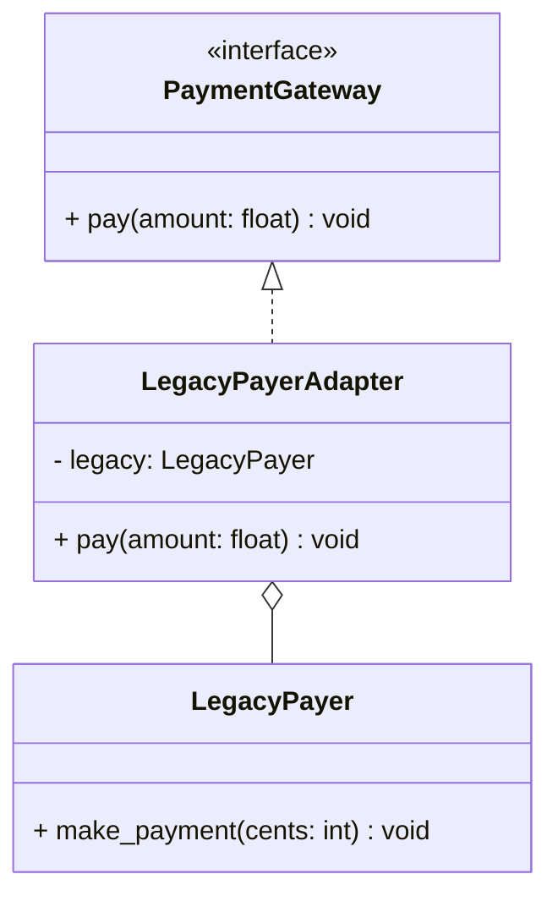

# Adapter Pattern

## 🧭 Overview
**Category:** Structural. **Purpose:** convert the interface of one class into another interface a client expects, letting incompatible classes work together. It's the "glue" that integrates legacy/third-party code without modifying it.

---

## 🧠 Technical Explanation
**Intent:** Wrap an existing class with a new interface so clients that expect interface A can use a class offering interface B.

**How it works:** The adapter implements the target interface the client expects, and internally delegates calls to the adaptee (the incompatible class), translating method names/parameters as needed.

**Object adapter vs class adapter:** Object adapter uses **composition** (holds a reference to the adaptee) — flexible, preferred in Python. Class adapter uses **multiple inheritance** — less common.

**When to use:** Integrating a third-party/legacy library whose interface you can't change, or unifying several incompatible APIs behind one consistent interface.

---

## 🍎 Simple Explanation (Analogy)
A travel power adapter. Your laptop's plug (client interface) doesn't fit a European socket (the adaptee). The adapter sits between them: it presents the shape your plug expects on one side and the shape the socket expects on the other, translating between them — without modifying your laptop or the wall.

---

## 📐 Class Diagram



---

## 💻 Code Example (Python)

```python
from abc import ABC, abstractmethod


class PaymentGateway(ABC):              # interface client expects
    @abstractmethod
    def pay(self, amount: float) -> None: ...


class LegacyPayer:                       # incompatible third-party class
    def make_payment(self, cents: int) -> None:
        print(f"Legacy paid {cents} cents")


class LegacyPayerAdapter(PaymentGateway):
    def __init__(self, legacy: LegacyPayer):
        self.legacy = legacy

    def pay(self, amount: float) -> None:
        self.legacy.make_payment(int(amount * 100))   # translate dollars→cents


def checkout(gateway: PaymentGateway, amount: float):
    gateway.pay(amount)                  # client only knows PaymentGateway


checkout(LegacyPayerAdapter(LegacyPayer()), 19.99)   # Legacy paid 1999 cents
```

---

## ✅ When to Use
- Integrating a third-party/legacy class with an incompatible interface.
- Unifying multiple different APIs behind one interface.

## ❌ When NOT to Use
- When you can simply change the original interface.
- When no real incompatibility exists.

---

## ⚖️ Trade-offs

| Pros | Cons |
|------|------|
| Reuse incompatible code without modifying it | Extra wrapper class/indirection |
| Decouples client from third-party APIs | Too many adapters = complexity |
| Honors Open/Closed | Slight overhead |

---

## 🎯 Interview Questions

### Conceptual
1. What problem does Adapter solve? → **Answer:** Incompatible interfaces — it translates one class's interface into the one a client expects, without modifying either.
2. Object adapter vs class adapter? → **Answer:** Object adapter composes the adaptee (flexible); class adapter inherits from it (multiple inheritance, less flexible).

### Pattern Identification
1. "We must use a legacy SDK whose method names differ from our interface." → **Answer:** Adapter.

### Company-Specific
1. [Amazon] How would you integrate three different SMS providers behind one interface? *(Hint: an adapter per provider implementing a common interface.)*
2. [Google] Adapter vs Facade — difference? *(Hint: Adapter changes an interface to match; Facade simplifies a complex subsystem.)*

---

## 🔗 Related Patterns
- [Facade](03-facade.md)
- [Decorator](02-decorator.md)
- [Proxy](04-proxy.md)
