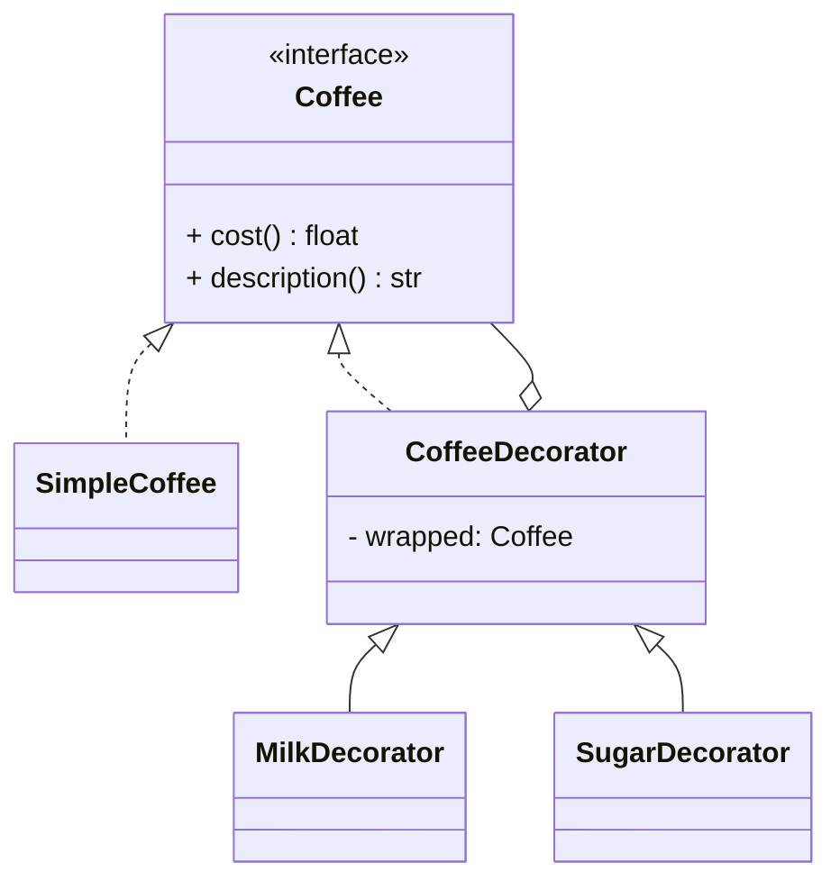

# Decorator Pattern

## 🧭 Overview
**Category:** Structural. **Purpose:** attach additional responsibilities to an object dynamically by wrapping it, without altering its class or affecting other instances. A flexible alternative to subclassing for extending behavior.

---

## 🧠 Technical Explanation
**Intent:** Wrap an object in one or more decorators that add behavior before/after delegating to the wrapped object, all sharing the same interface so wrappers are transparent and stackable.

**How it works:** A decorator implements the same interface as the component it wraps and holds a reference to it. Each decorator adds behavior, then calls the wrapped object's method. Because decorators share the interface, you can **stack** them (`Milk(Sugar(Coffee()))`).

**Decorator vs Inheritance:** Inheritance fixes behavior at compile time and causes a combinatorial explosion of subclasses (`CoffeeWithMilkAndSugar`, etc.). Decorators add behavior **at runtime** and compose freely.

**When to use:** Add optional/combinable features at runtime (I/O streams, UI components, request middleware, pricing add-ons).

---

## 🍎 Simple Explanation (Analogy)
Ordering coffee with add-ons. You start with plain coffee, then "decorate" it: add milk, add sugar, add caramel. Each add-on wraps the previous drink, adding to the price and description. You can combine them in any order and quantity — far easier than having a separate predefined product for every possible combination.

---

## 📐 Class Diagram



---

## 💻 Code Example (Python)

```python
from abc import ABC, abstractmethod


class Coffee(ABC):
    @abstractmethod
    def cost(self) -> float: ...
    @abstractmethod
    def description(self) -> str: ...


class SimpleCoffee(Coffee):
    def cost(self): return 2.0
    def description(self): return "coffee"


class CoffeeDecorator(Coffee):
    def __init__(self, wrapped: Coffee):
        self.wrapped = wrapped


class Milk(CoffeeDecorator):
    def cost(self): return self.wrapped.cost() + 0.5
    def description(self): return self.wrapped.description() + " + milk"


class Sugar(CoffeeDecorator):
    def cost(self): return self.wrapped.cost() + 0.2
    def description(self): return self.wrapped.description() + " + sugar"


drink = Sugar(Milk(SimpleCoffee()))      # stack decorators at runtime
print(drink.description(), "=>", drink.cost())   # coffee + milk + sugar => 2.7
```

---

## ✅ When to Use
- Add responsibilities to objects dynamically and combinably.
- Avoid subclass explosion for every feature combination.

## ❌ When NOT to Use
- A fixed, small set of behaviors (simple subclass/flag may suffice).
- When deep wrapping makes debugging hard.

---

## ⚖️ Trade-offs

| Pros | Cons |
|------|------|
| Add behavior at runtime, composable | Many small wrapper classes |
| Avoids subclass explosion | Hard to debug deep stacks |
| Honors Open/Closed & SRP | Order of decorators can matter |

---

## 🎯 Interview Questions

### Conceptual
1. Why prefer Decorator over inheritance for combinable features? → **Answer:** Inheritance causes a combinatorial explosion of subclasses; decorators compose behavior dynamically at runtime.
2. What must a decorator share with the component it wraps? → **Answer:** The same interface, so wrappers are transparent and stackable.

### Pattern Identification
1. "Add gzip + encryption + buffering to a data stream, in any combo." → **Answer:** Decorator (e.g., Java I/O streams).

### Company-Specific
1. [Amazon] How would you add optional features (gift wrap, insurance) to an order's price? *(Hint: wrap the order in decorators.)*
2. [Google] Decorator vs Proxy — difference? *(Hint: Decorator adds behavior; Proxy controls access.)*

---

## 🔗 Related Patterns
- [Adapter](01-adapter.md)
- [Proxy](04-proxy.md)
- [Composite](05-composite.md)
