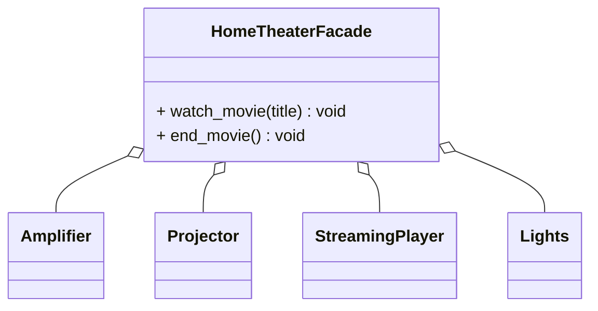

# Facade Pattern

## 🧭 Overview
**Category:** Structural. **Purpose:** provide a simplified, unified interface to a complex subsystem of classes, hiding its complexity behind one easy entry point. It reduces coupling between clients and the many parts of a subsystem.

---

## 🧠 Technical Explanation
**Intent:** Offer a high-level interface that makes a subsystem easier to use, coordinating the underlying classes on the client's behalf.

**How it works:** The facade class exposes a few simple methods. Internally, it orchestrates calls to multiple complex subsystem classes in the right order. Clients talk only to the facade, not the subsystem — though they can still access the subsystem directly if needed (facade doesn't forbid it).

**Facade vs Adapter:** Adapter changes an interface to match what a client expects (one class); Facade simplifies and unifies a **whole subsystem** of classes.

**When to use:** A subsystem is complex and clients only need common operations; you want to decouple clients from internal subsystem changes; layering an application (each layer exposes a facade).

---

## 🍎 Simple Explanation (Analogy)
A hotel concierge. Behind the scenes, booking a dinner reservation involves calling the restaurant, arranging a taxi, and confirming times (a complex subsystem). You just tell the concierge "book me dinner at 8," and they coordinate everything. You get one simple interface instead of dealing with every vendor yourself.

---

## 📐 Class Diagram



---

## 💻 Code Example (Python)

```python
class Amplifier:
    def on(self): print("Amp on")
class Projector:
    def on(self): print("Projector on")
class StreamingPlayer:
    def play(self, title): print(f"Playing {title}")
class Lights:
    def dim(self): print("Lights dimmed")


class HomeTheaterFacade:
    def __init__(self):
        self.amp = Amplifier()
        self.projector = Projector()
        self.player = StreamingPlayer()
        self.lights = Lights()

    def watch_movie(self, title: str) -> None:
        # one simple call orchestrates the complex subsystem
        self.lights.dim()
        self.amp.on()
        self.projector.on()
        self.player.play(title)


HomeTheaterFacade().watch_movie("Inception")
# Lights dimmed / Amp on / Projector on / Playing Inception
```

---

## ✅ When to Use
- A complex subsystem needs a simple entry point for common tasks.
- You want to decouple clients from internal subsystem details.

## ❌ When NOT to Use
- The subsystem is already simple.
- Clients genuinely need fine-grained control over every component.

---

## ⚖️ Trade-offs

| Pros | Cons |
|------|------|
| Simplifies client usage | Can become a "god object" if overloaded |
| Decouples clients from subsystem | May hide useful functionality |
| Easier to maintain/layer | Extra layer if subsystem is simple |

---

## 🎯 Interview Questions

### Conceptual
1. How does Facade differ from Adapter? → **Answer:** Adapter converts one class's interface to another expected one; Facade provides a simplified unified interface over a whole complex subsystem.
2. Does a Facade prevent direct subsystem access? → **Answer:** No — it offers a convenient simpler path but doesn't forbid clients from using subsystem classes directly when needed.

### Pattern Identification
1. "A single `OrderService.place_order()` that coordinates inventory, payment, and shipping classes." → **Answer:** Facade.

### Company-Specific
1. [Amazon] How would you expose a simple API over a complex internal subsystem? *(Hint: a facade orchestrating the subsystem.)*
2. [Google] What's the risk of an overloaded facade? *(Hint: it becomes a god object violating SRP.)*

---

## 🔗 Related Patterns
- [Adapter](01-adapter.md)
- [Proxy](04-proxy.md)
- [Single Responsibility](../../04-solid-principles/01-single-responsibility.md)
