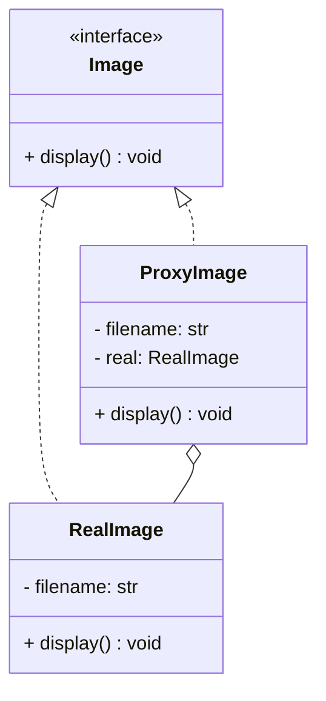

# Proxy Pattern

## 🧭 Overview
**Category:** Structural. **Purpose:** provide a surrogate or placeholder for another object to **control access** to it. The proxy shares the real object's interface but adds a layer for lazy loading, access control, caching, logging, or remote communication.

---

## 🧠 Technical Explanation
**Intent:** Stand in for a real object, intercepting calls to add behavior (control, defer, cache) while presenting the same interface.

**How it works:** The proxy implements the same interface as the real subject and holds a reference to it. It decides whether/when to forward calls to the real object, adding logic around the delegation.

**Common proxy types:**
- **Virtual proxy:** lazy-initialize an expensive object on first use.
- **Protection proxy:** enforce access control/permissions.
- **Remote proxy:** represent an object in another address space (RPC stubs).
- **Caching proxy:** cache results of expensive calls.
- **Logging/smart proxy:** add logging, reference counting, etc.

**Proxy vs Decorator:** Both wrap an object with the same interface. **Decorator** adds new *behavior/responsibility*; **Proxy** controls *access* (without changing the core responsibility).

**When to use:** Expensive object initialization, access control, remote objects, or transparent caching.

---

## 🍎 Simple Explanation (Analogy)
A security guard at a building entrance. You ask to enter (call a method), and the guard (proxy) checks your ID (access control) before letting you through to the actual office (real object). Or a personal assistant who screens calls and only forwards important ones — same "interface" (you call), but access is mediated. The caller often can't tell they're talking to a proxy rather than the real thing.

---

## 📐 Class Diagram



---

## 💻 Code Example (Python)

```python
from abc import ABC, abstractmethod


class Image(ABC):
    @abstractmethod
    def display(self) -> None: ...


class RealImage(Image):
    def __init__(self, filename: str):
        self.filename = filename
        self._load()                     # expensive

    def _load(self):
        print(f"Loading {self.filename} from disk...")

    def display(self):
        print(f"Displaying {self.filename}")


class ProxyImage(Image):                  # virtual proxy: lazy load
    def __init__(self, filename: str):
        self.filename = filename
        self._real = None

    def display(self):
        if self._real is None:            # load only on first use
            self._real = RealImage(self.filename)
        self._real.display()


img = ProxyImage("photo.png")             # not loaded yet (cheap)
print("Proxy created")
img.display()                             # loads now, then displays
img.display()                             # already loaded, just displays
```

---

## ✅ When to Use
- Defer expensive creation until needed (virtual proxy).
- Add access control, caching, logging, or remote access transparently.

## ❌ When NOT to Use
- No need to control access or defer work (direct object is simpler).
- The added indirection isn't justified.

---

## ⚖️ Trade-offs

| Pros | Cons |
|------|------|
| Controls access / defers cost | Extra indirection/latency |
| Transparent to clients (same interface) | More classes |
| Enables caching, security, remote | Can hide real cost of calls |

---

## 🎯 Interview Questions

### Conceptual
1. Proxy vs Decorator? → **Answer:** Both wrap with the same interface; Decorator adds new behavior/responsibility, Proxy controls access (lazy load, security, caching, remote) without changing core responsibility.
2. Name three proxy types. → **Answer:** Virtual (lazy load), protection (access control), remote (cross-process), and caching are common.

### Pattern Identification
1. "Lazy-load a huge object only when first accessed." → **Answer:** Virtual proxy.

### Company-Specific
1. [Amazon] How would you add caching to an expensive remote service call transparently? *(Hint: a caching proxy implementing the same interface.)*
2. [Google] How is an RPC client stub a proxy? *(Hint: remote proxy representing a server-side object.)*

---

## 🔗 Related Patterns
- [Decorator](02-decorator.md)
- [Adapter](01-adapter.md)
- [Facade](03-facade.md)
