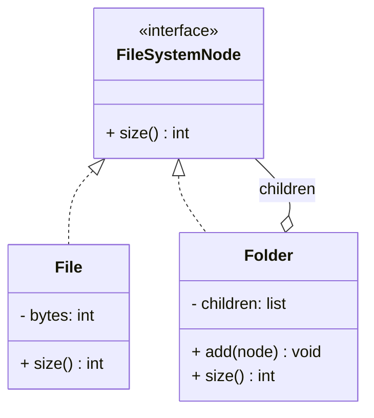

# Composite Pattern

## 🧭 Overview
**Category:** Structural. **Purpose:** compose objects into tree structures to represent part-whole hierarchies, and let clients treat individual objects (leaves) and groups of objects (composites) **uniformly** through a common interface.

---

## 🧠 Technical Explanation
**Intent:** Build tree structures where a single object and a collection of objects respond to the same operations, so client code doesn't need to distinguish between them.

**How it works:** A common **component** interface declares operations (e.g., `size()`, `render()`). A **leaf** implements it directly. A **composite** holds children (leaves and/or other composites) and implements the operation by delegating to its children (often recursively). Clients call the operation on any node uniformly.

**Key benefit:** Uniformity — `total_size()` works whether you call it on one file or a whole folder tree; the composite recurses.

**When to use:** Part-whole hierarchies — file systems (files/folders), UI component trees, organization charts, menus/submenus, graphics groups.

**Design note:** Where to put child-management methods (`add`/`remove`) — on the component (uniform but leaves must reject them) or only on composite (type-safe but less uniform) — is a known trade-off.

---

## 🍎 Simple Explanation (Analogy)
A file system. A folder can contain files *and* other folders, which can contain more files and folders. When you ask "what's the total size?", you treat a single file and an entire folder the same way — the folder just adds up everything inside it recursively. You don't care whether you're pointing at a file or a folder; both answer "what's your size?"

---

## 📐 Class Diagram



---

## 💻 Code Example (Python)

```python
from abc import ABC, abstractmethod


class FileSystemNode(ABC):
    @abstractmethod
    def size(self) -> int: ...


class File(FileSystemNode):              # leaf
    def __init__(self, bytes_: int):
        self.bytes = bytes_

    def size(self) -> int:
        return self.bytes


class Folder(FileSystemNode):            # composite
    def __init__(self, name: str):
        self.name = name
        self.children: list[FileSystemNode] = []

    def add(self, node: FileSystemNode) -> None:
        self.children.append(node)

    def size(self) -> int:               # recurse over children uniformly
        return sum(child.size() for child in self.children)


root = Folder("root")
root.add(File(100))
sub = Folder("sub")
sub.add(File(250))
sub.add(File(150))
root.add(sub)
print(root.size())    # 500 — treated uniformly across files & folders
```

---

## ✅ When to Use
- Part-whole hierarchies (trees) where nodes and groups share operations.
- You want clients to treat individual and composite objects uniformly.

## ❌ When NOT to Use
- Flat, non-hierarchical data.
- When leaf and composite behaviors differ so much that uniformity is forced/awkward.

---

## ⚖️ Trade-offs

| Pros | Cons |
|------|------|
| Uniform treatment of leaves & groups | Can over-generalize (leaf must handle group methods) |
| Easy to add new node types | Type-safety vs uniformity trade-off |
| Natural fit for tree structures | Harder to restrict allowed children |

---

## 🎯 Interview Questions

### Conceptual
1. What problem does Composite solve? → **Answer:** It lets clients treat individual objects and compositions of objects uniformly through a shared interface, simplifying work with tree structures.
2. What's the leaf/composite design trade-off for add/remove? → **Answer:** Putting child-management on the component is uniform but forces leaves to reject those calls; restricting to composite is type-safe but less uniform.

### Pattern Identification
1. "Compute the total price of an order that may contain bundles of items." → **Answer:** Composite.

### Company-Specific
1. [Amazon] How would you model nested category trees? *(Hint: Composite — categories contain products and subcategories.)*
2. [Google] How do UI frameworks use Composite? *(Hint: containers hold widgets and other containers; render recurses.)*

---

## 🔗 Related Patterns
- [Decorator](02-decorator.md)
- [Iterator](../behavioral/05-iterator.md)
- [Facade](03-facade.md)
