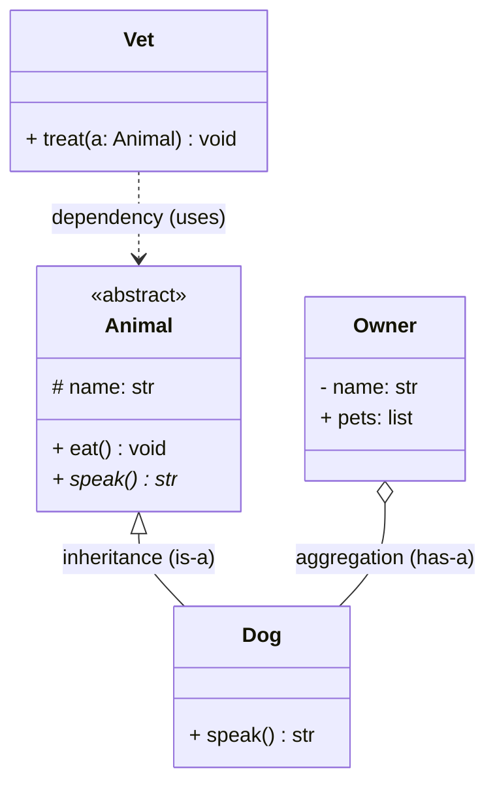

# UML Class Diagrams

## 🧭 Overview
A **class diagram** is the most important UML diagram for LLD: it shows the system's classes, their attributes and methods, and the relationships between them. It's how you communicate an object-oriented design quickly in interviews and design docs. Mastering its notation lets you sketch a clear design under time pressure.

---

## 🧠 Technical Explanation

### Class Box Notation
A class is a box with three compartments:
1. **Name** (top).
2. **Attributes** (middle): `- name: type`.
3. **Methods** (bottom): `+ method(param: type): returnType`.

### Visibility Markers
| Symbol | Meaning |
|--------|---------|
| `+` | public |
| `-` | private |
| `#` | protected |
| `~` | package |

### Relationships (the key part)
| Relationship | Meaning | Notation | Example |
|--------------|---------|----------|---------|
| **Association** | "uses-a" / general link | solid line | Driver — Car |
| **Aggregation** | "has-a", weak (parts outlive whole) | hollow diamond | Team ◇— Player |
| **Composition** | "has-a", strong (parts die with whole) | filled diamond | House ◆— Room |
| **Inheritance** | "is-a" | hollow triangle arrow | Dog ▷ Animal |
| **Realization** | implements interface | dashed triangle arrow | Circle ⊳ Shape |
| **Dependency** | "depends-on" (transient) | dashed arrow | Order ⇢ PaymentService |

### Multiplicity
Numbers on association ends show cardinality: `1`, `0..1`, `*` (many), `1..*` (one or more). E.g., an `Order` has `1..*` `OrderItem`s.

### Aggregation vs Composition (commonly tested)
- **Aggregation:** the part can exist independently of the whole (a `Player` exists even if the `Team` disbands).
- **Composition:** the part's lifecycle is bound to the whole (a `Room` ceases to exist if the `House` is destroyed).

---

## 🍎 Simple Explanation (Analogy)
A class diagram is like a family tree combined with a floor plan. The family-tree lines show "is-a" (inheritance — a child *is a* descendant). The floor-plan connections show "has-a" (a house *has* rooms — composition) and "knows/uses" links (the family *uses* a car — association). Reading it, you instantly see who's related to whom and how, without reading any code.

---

## 📐 Example Class Diagram

This shows: `Dog` **is an** `Animal` (inheritance), an `Owner` **has** `Dog`s (aggregation), and a `Vet` **depends on** `Animal` to treat it.

---

## ⚖️ Trade-offs

| Pros | Cons |
|------|------|
| Communicates structure at a glance | Can get cluttered for big systems |
| Standard, language-agnostic | Notation must be learned |
| Great for LLD interviews/design docs | Can drift from actual code |

---

## 🎯 Interview Questions
1. What's the difference between aggregation and composition? → **Answer:** Both are "has-a," but in composition the part's lifecycle is bound to the whole (Room dies with House); in aggregation the part can exist independently (Player outlives Team).
2. How do you denote an interface realization vs inheritance? → **Answer:** Realization uses a dashed line with a hollow triangle (implements an interface); inheritance uses a solid line with a hollow triangle (extends a class).
3. What does multiplicity `1..*` mean? → **Answer:** One or more — e.g., an order has at least one item.
4. How do you show a private attribute? → **Answer:** Prefix with `-`, e.g., `- balance: float`.
5. [Amazon] Draw the class relationships for a `Library` with `Book` and `Member`. → **Answer:** Library composes Books (or aggregates), Member borrows Books (association with multiplicity).

---

## 🔗 Related Topics
- [Sequence Diagrams](02-sequence-diagrams.md)
- [State Machine Diagrams](03-state-machine-diagrams.md)
- [Inheritance](../03-oop-fundamentals/03-inheritance.md)
- [LLD Case Studies](../07-lld-case-studies/01-parking-lot.md)
