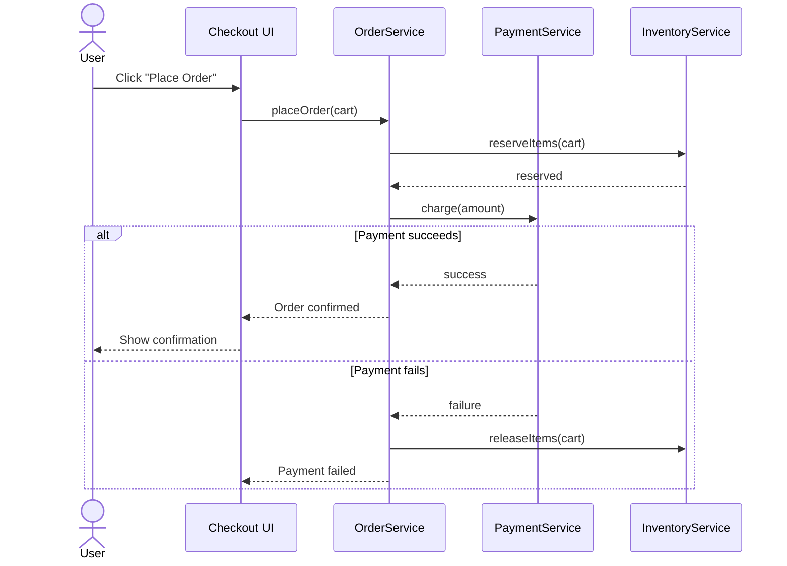

# UML Sequence Diagrams

## 🧭 Overview
A **sequence diagram** shows how objects interact **over time** — the order of messages exchanged to accomplish a use case. Where a class diagram shows static structure, a sequence diagram shows dynamic behavior. It's invaluable for explaining a flow (e.g., "what happens when a user places an order") in LLD interviews and design discussions.

---

## 🧠 Technical Explanation

### Core Elements
- **Participants/lifelines:** objects/actors across the top, each with a vertical dashed **lifeline** going down (time flows downward).
- **Activation bar:** a thin rectangle on a lifeline showing when an object is active/processing.
- **Messages:** horizontal arrows between lifelines.

### Message Types
| Arrow | Meaning |
|-------|---------|
| Solid arrow (→) | Synchronous call (caller waits) |
| Dashed arrow (⤙) | Return / response |
| Open arrowhead | Asynchronous message (caller doesn't wait) |
| Self-arrow | Object calls its own method |

### Control Structures (fragments)
- **alt:** alternative paths (if/else).
- **opt:** optional step (if condition).
- **loop:** repetition.
- **par:** parallel execution.

### When to Use
- Clarifying a use-case flow across multiple objects.
- Showing the order of operations (who calls whom, and when).
- Documenting API/interaction protocols.

It complements the class diagram: class diagram = *what exists*; sequence diagram = *how they collaborate over time*.

---

## 🍎 Simple Explanation (Analogy)
A sequence diagram is like a screenplay for a phone-call scene. Each character (object) has their own column. Reading top to bottom is time passing. Each line of dialogue is a message ("Alice asks Bob...", "Bob replies..."). You can see exactly who speaks to whom and in what order, including "if X, then this conversation happens instead" (alt fragments). It captures the *conversation*, not just the cast list.

---

## 📐 Example Sequence Diagram

This shows the order placement flow, including the **alt** fragment for payment success vs failure (with inventory rollback).

---

## ⚖️ Trade-offs

| Pros | Cons |
|------|------|
| Clearly shows interaction order over time | Gets unwieldy for many participants |
| Reveals control flow (alt/loop/par) | Only captures one scenario at a time |
| Great for explaining use cases | Maintenance burden if kept in sync |

---

## 🎯 Interview Questions
1. What does a sequence diagram show that a class diagram doesn't? → **Answer:** Dynamic behavior — the time-ordered sequence of messages between objects for a use case, versus static structure.
2. How do you represent an if/else in a sequence diagram? → **Answer:** An `alt` fragment with separate sections for each branch.
3. What's the difference between a synchronous and asynchronous message? → **Answer:** Synchronous (solid arrow) — caller waits for a return; asynchronous (open arrowhead) — caller continues without waiting.
4. What does an activation bar represent? → **Answer:** The period during which an object is actively processing a call.
5. [Amazon] Sketch the sequence for a user withdrawing cash from an ATM. → **Answer:** User → ATM → BankService: authenticate, checkBalance, dispense; with alt for insufficient funds.

---

## 🔗 Related Topics
- [Class Diagrams](01-class-diagrams.md)
- [State Machine Diagrams](03-state-machine-diagrams.md)
- [LLD Case Studies](../07-lld-case-studies/01-parking-lot.md)
