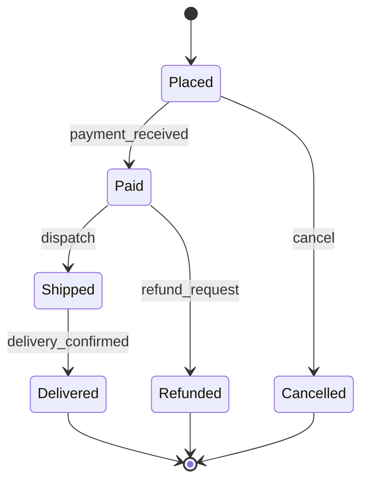
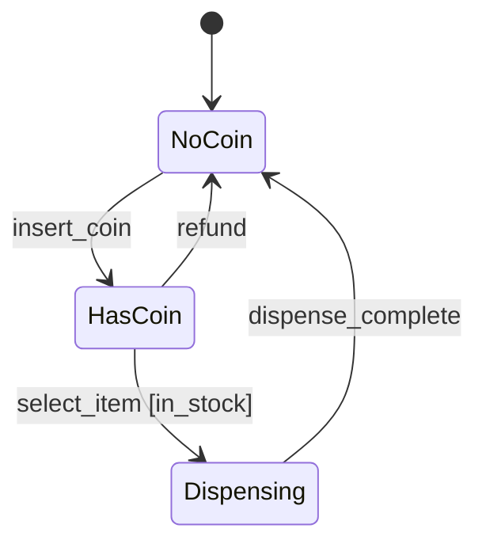

# UML State Machine Diagrams

## 🧭 Overview
A **state machine diagram** (statechart) models the different **states** an object can be in and the **transitions** between them triggered by events. It's the natural way to design and communicate objects whose behavior depends on their current status — orders, documents, vending machines, traffic lights, connections. It pairs directly with the [State design pattern](../05-design-patterns/behavioral/04-state.md).

---

## 🧠 Technical Explanation

### Core Elements
- **State:** a condition the object is in (e.g., `Idle`, `Processing`, `Shipped`).
- **Transition:** an arrow from one state to another, labeled with the **event/trigger** (and optional `[guard]` condition and `/action`).
- **Initial state:** a filled circle marking where the object starts.
- **Final state:** a circle with a ring, marking termination.
- **Self-transition:** an event that keeps the same state.

### Transition Syntax
`event [guard] / action` — e.g., `pay [funds ok] / chargeCard`.

### Guards & Actions
- **Guard:** a boolean condition that must hold for the transition to fire.
- **Action:** something executed during the transition.

### Composite/Nested States
A state can contain sub-states (e.g., `Active` contains `Running` and `Paused`) for complex behavior.

### When to Use
- Objects with a well-defined lifecycle/status and event-driven transitions.
- Designing the [State pattern](../05-design-patterns/behavioral/04-state.md), the [Circuit Breaker](../../07-distributed-systems/05-circuit-breaker-pattern.md), workflow engines, and protocols.

---

## 🍎 Simple Explanation (Analogy)
A state machine diagram is like a board game's rules map. You're always on one square (state). Rolling certain numbers or drawing certain cards (events) move you to specific other squares, sometimes only if a condition is met ("advance to Go only if you pass it"). The diagram shows every square and every legal move between them — so you can never end up in an undefined situation.

---

## 📐 Example State Machine Diagram

### Order Lifecycle

### Vending Machine (pairs with the State pattern)

---

## ⚖️ Trade-offs

| Pros | Cons |
|------|------|
| Makes complex lifecycles explicit | Can explode with many states/transitions |
| Prevents invalid state combinations | Composite states add notation complexity |
| Maps directly to State pattern code | Overkill for objects with one/two states |

---

## 🎯 Interview Questions
1. What are the core elements of a state machine diagram? → **Answer:** States, transitions (triggered by events, with optional guards/actions), an initial state, and final state(s).
2. What is a guard condition? → **Answer:** A boolean condition on a transition that must be true for the transition to fire (e.g., `[in_stock]`).
3. How does a state diagram relate to the State design pattern? → **Answer:** Each state becomes a state class; transitions become the logic that swaps the context's current state.
4. When is a state machine diagram the right tool? → **Answer:** When an object's behavior depends on a well-defined status with event-driven transitions (orders, connections, vending machines).
5. [Amazon] Model the states of a circuit breaker. → **Answer:** Closed → Open (on failure threshold) → Half-Open (after cooldown) → Closed/Open based on trial results.

---

## 🔗 Related Topics
- [Class Diagrams](01-class-diagrams.md)
- [Sequence Diagrams](02-sequence-diagrams.md)
- [State Pattern](../05-design-patterns/behavioral/04-state.md)
- [Circuit Breaker Pattern](../../07-distributed-systems/05-circuit-breaker-pattern.md)
