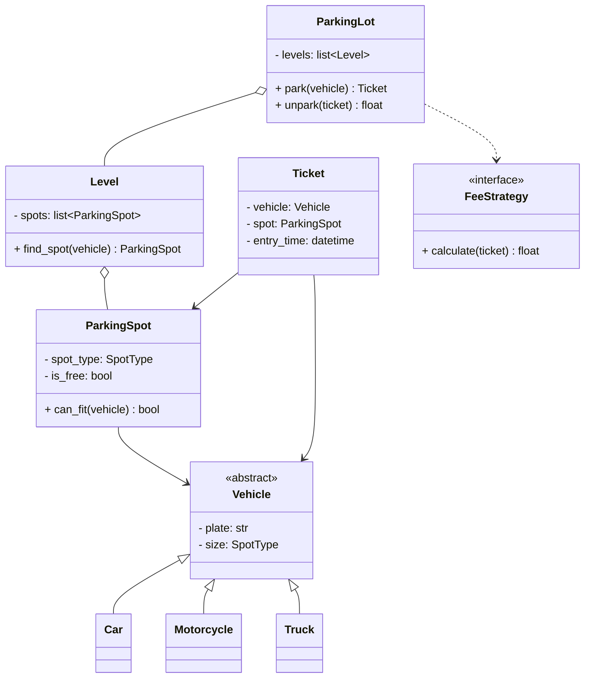
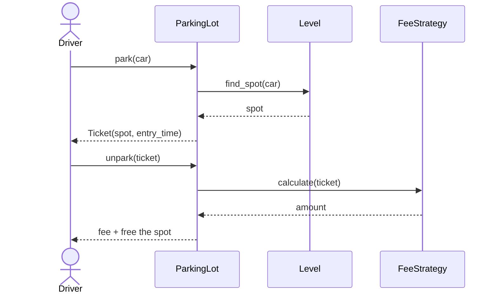

# LLD: Design a Parking Lot

## 📋 Problem Statement
Design the classes for a parking lot system that manages multiple levels and spot types, issues tickets on entry, assigns spots to vehicles, and computes fees on exit. This is the single most common LLD interview question.

## ✅ Requirements

### Must-have features
- Multiple **levels**, each with multiple **spots** of types: motorcycle, compact, large.
- Vehicles (motorcycle, car, truck) park in compatible spots.
- Issue a **ticket** on entry; record entry time.
- Find and assign an available spot; mark occupied/free.
- Compute **fee** on exit based on duration; process payment.

### Out of scope
- Reservations, real-time displays, license-plate recognition, multi-lot networks.

## 🧩 Core Entities
- **ParkingLot** — top-level; owns levels; entry/exit orchestration.
- **Level** — holds spots; finds available spot.
- **ParkingSpot** — a spot with a type and occupancy state.
- **Vehicle** (abstract) — Motorcycle / Car / Truck with a size.
- **Ticket** — links a vehicle to a spot + entry time.
- **FeeStrategy** — pluggable fee calculation.
- **ParkingLot** uses a spot-finding strategy.

## 📐 Class Diagram



## 🔄 Sequence Diagram (car entering & exiting)



## 💻 Core Classes (Python)

```python
from __future__ import annotations  # allows `X | None` hints on older Python
from abc import ABC, abstractmethod
from datetime import datetime
from enum import Enum
import math


class SpotType(Enum):
    MOTORCYCLE = 1
    COMPACT = 2
    LARGE = 3


class Vehicle(ABC):
    def __init__(self, plate: str, size: SpotType):
        self.plate = plate
        self.size = size


class Car(Vehicle):
    def __init__(self, plate): super().__init__(plate, SpotType.COMPACT)


class ParkingSpot:
    def __init__(self, spot_id: int, spot_type: SpotType):
        self.spot_id = spot_id
        self.spot_type = spot_type
        self.is_free = True

    def can_fit(self, vehicle: Vehicle) -> bool:
        return self.is_free and vehicle.size.value <= self.spot_type.value


class Ticket:
    def __init__(self, vehicle: Vehicle, spot: ParkingSpot):
        self.vehicle = vehicle
        self.spot = spot
        self.entry_time = datetime.now()


class FeeStrategy(ABC):
    @abstractmethod
    def calculate(self, ticket: Ticket) -> float: ...


class HourlyFee(FeeStrategy):
    RATE = 2.0
    def calculate(self, ticket: Ticket) -> float:
        hours = math.ceil((datetime.now() - ticket.entry_time).seconds / 3600) or 1
        return hours * self.RATE


class Level:
    def __init__(self, spots: list[ParkingSpot]):
        self.spots = spots

    def find_spot(self, vehicle: Vehicle) -> ParkingSpot | None:
        return next((s for s in self.spots if s.can_fit(vehicle)), None)


class ParkingLot:
    def __init__(self, levels: list[Level], fee: FeeStrategy):
        self.levels = levels
        self.fee = fee

    def park(self, vehicle: Vehicle) -> Ticket:
        for level in self.levels:
            spot = level.find_spot(vehicle)
            if spot:
                spot.is_free = False           # fully implemented method
                return Ticket(vehicle, spot)
        raise RuntimeError("Parking full")

    def unpark(self, ticket: Ticket) -> float:  # fully implemented method
        ticket.spot.is_free = True
        return self.fee.calculate(ticket)


lot = ParkingLot([Level([ParkingSpot(1, SpotType.COMPACT)])], HourlyFee())
t = lot.park(Car("KA-01"))
print("Fee:", lot.unpark(t))
```

## 🎨 Design Patterns Used
- **Strategy** — `FeeStrategy` allows swapping pricing rules (hourly, flat, tiered) without changing `ParkingLot`.
- **Factory** (optional) — to create vehicles/spots by type.
- **Singleton** (optional) — a single `ParkingLot` instance.

## ❓ Follow-up Interview Questions
1. [Amazon] How do you handle concurrency when two cars compete for the last spot? *(Hint: lock per spot / atomic compare-and-set on `is_free`.)*
2. [Google] How would you support different fee models (weekend, EV charging)? *(Hint: more `FeeStrategy` implementations.)*
3. [Amazon] How do you efficiently find the nearest available spot? *(Hint: maintain a free-spot index/heap per type.)*
4. How would you add reserved/handicapped spots? *(Hint: new SpotType + matching rule.)*
5. How do you scale to a multi-lot system? *(Hint: each lot independent; central directory; this becomes HLD.)*

## 🔗 Related Topics
- [Strategy Pattern](../05-design-patterns/behavioral/02-strategy.md)
- [Class Diagrams](../06-uml-and-diagrams/01-class-diagrams.md)
- [SOLID Principles](../04-solid-principles/01-single-responsibility.md)
