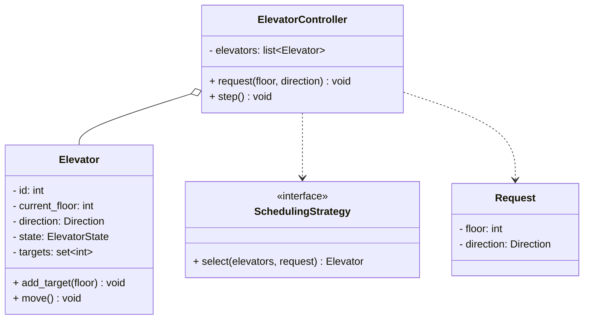
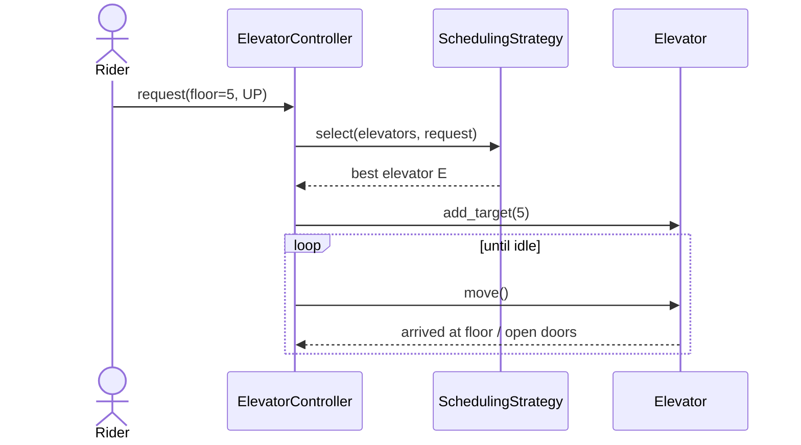

# LLD: Design an Elevator System

## 📋 Problem Statement
Design the classes for an elevator system in a building with multiple elevators and floors. The system must handle external requests (hall calls) and internal requests (cabin buttons), schedule elevators efficiently, and manage each elevator's movement and state.

## ✅ Requirements

### Must-have features
- Multiple elevators serving N floors.
- **External requests** (up/down hall buttons) and **internal requests** (floor buttons inside).
- A **scheduler/dispatcher** assigns requests to the best elevator.
- Each elevator tracks direction, current floor, and door/movement state.
- Process requests efficiently (don't reverse needlessly).

### Out of scope
- Weight sensors, emergency/fire modes, maintenance scheduling.

## 🧩 Core Entities
- **Building** — holds elevators and the controller.
- **ElevatorController (Dispatcher)** — assigns requests to elevators (strategy).
- **Elevator** (Car) — moves, tracks state, holds its request queue.
- **Request** — origin floor, destination, direction.
- **Direction / ElevatorState** — enums.

## 📐 Class Diagram



## 🔄 Sequence Diagram (hall call handled)



## 💻 Core Classes (Python)

```python
from abc import ABC, abstractmethod
from enum import Enum


class Direction(Enum):
    UP = 1
    DOWN = -1
    IDLE = 0


class Elevator:
    def __init__(self, eid: int):
        self.id = eid
        self.current_floor = 0
        self.direction = Direction.IDLE
        self.targets: set[int] = set()

    def add_target(self, floor: int) -> None:
        self.targets.add(floor)
        self._update_direction()

    def _update_direction(self) -> None:
        if not self.targets:
            self.direction = Direction.IDLE
        elif max(self.targets) > self.current_floor:
            self.direction = Direction.UP
        else:
            self.direction = Direction.DOWN

    def move(self) -> None:                       # fully implemented
        if not self.targets:
            self.direction = Direction.IDLE
            return
        self.current_floor += self.direction.value
        if self.current_floor in self.targets:
            self.targets.remove(self.current_floor)   # "open doors"
        self._update_direction()


class SchedulingStrategy(ABC):
    @abstractmethod
    def select(self, elevators: list[Elevator], floor: int) -> Elevator: ...


class NearestElevator(SchedulingStrategy):
    def select(self, elevators, floor):           # fully implemented
        # pick the elevator with the smallest distance to the request
        return min(elevators, key=lambda e: abs(e.current_floor - floor))


class ElevatorController:
    def __init__(self, elevators: list[Elevator], strategy: SchedulingStrategy):
        self.elevators = elevators
        self.strategy = strategy

    def request(self, floor: int) -> Elevator:
        elevator = self.strategy.select(self.elevators, floor)
        elevator.add_target(floor)
        return elevator


ctrl = ElevatorController([Elevator(0), Elevator(1)], NearestElevator())
e = ctrl.request(5)
while e.targets:
    e.move()
print("Elevator", e.id, "at floor", e.current_floor)
```

## 🎨 Design Patterns Used
- **Strategy** — `SchedulingStrategy` (nearest, SCAN/elevator algorithm, look) is swappable.
- **State** — each `Elevator` could model door/moving states with the State pattern.
- **Observer** (optional) — displays subscribe to elevator position updates.

## ❓ Follow-up Interview Questions
1. [Amazon] What scheduling algorithm minimizes average wait? *(Hint: SCAN/LOOK — serve requests in current direction before reversing.)*
2. [Google] How do you handle internal vs external requests differently? *(Hint: internal commits a destination; external is a pickup that needs direction matching.)*
3. How would you model door open/close and movement states cleanly? *(Hint: State pattern.)*
4. [Amazon] How do you handle simultaneous requests across many elevators fairly? *(Hint: dispatcher scoring by distance + direction + load.)*
5. How do you make the controller thread-safe? *(Hint: lock around assignment, or a request queue processed by one scheduler.)*

## 🔗 Related Topics
- [Strategy Pattern](../05-design-patterns/behavioral/02-strategy.md)
- [State Pattern](../05-design-patterns/behavioral/04-state.md)
- [State Machine Diagrams](../06-uml-and-diagrams/03-state-machine-diagrams.md)
