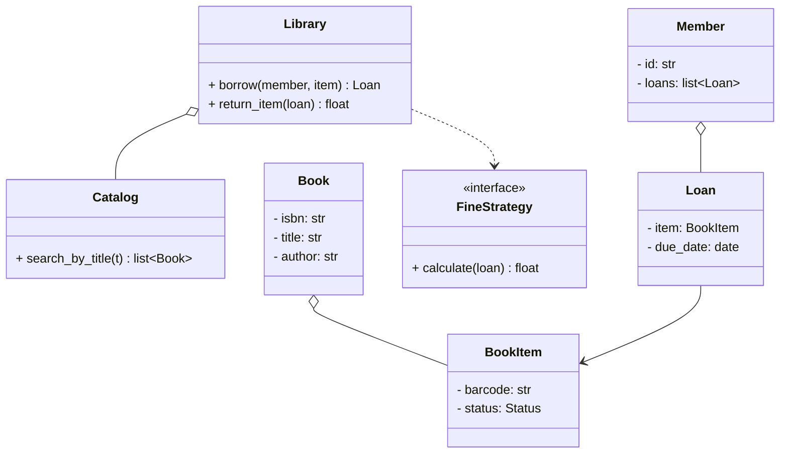
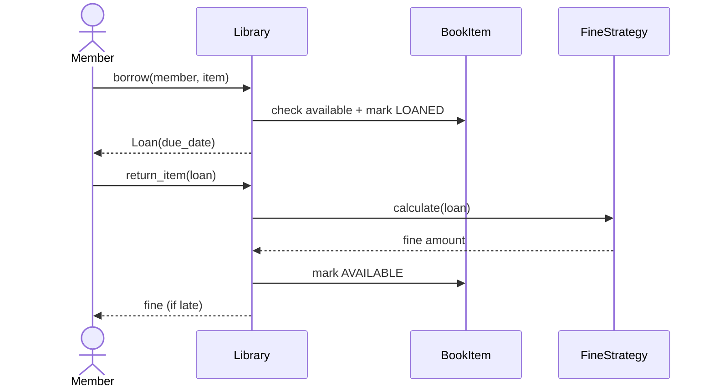

# LLD: Design a Library Management System

## 📋 Problem Statement
Design classes for a library system that catalogs books, manages multiple physical copies, lets members search and borrow/return books, tracks due dates, and computes late fines.

## ✅ Requirements

### Must-have features
- Catalog of **books** (title, author, ISBN) with multiple physical **copies**.
- **Members** can search, borrow, and return copies.
- Enforce borrowing limits and loan periods.
- Track **due dates** and compute **fines** for late returns.
- Reserve a book that's currently out (optional hold).

### Out of scope
- Payments integration, e-books/DRM, multi-branch networks, recommendations.

## 🧩 Core Entities
- **Library** — orchestrates catalog, members, lending.
- **Book** — bibliographic info (the title).
- **BookItem (Copy)** — a physical copy with a barcode and status.
- **Member** — borrower with active loans.
- **Loan** — links a member to a BookItem with issue/due dates.
- **Catalog** — search index by title/author/ISBN.
- **FineStrategy** — pluggable fine calculation.

## 📐 Class Diagram



## 🔄 Sequence Diagram (borrow & return)



## 💻 Core Classes (Python)

```python
from abc import ABC, abstractmethod
from datetime import date, timedelta
from enum import Enum


class Status(Enum):
    AVAILABLE = 1
    LOANED = 2
    RESERVED = 3


class Book:
    def __init__(self, isbn, title, author):
        self.isbn, self.title, self.author = isbn, title, author


class BookItem:
    def __init__(self, barcode: str, book: Book):
        self.barcode = barcode
        self.book = book
        self.status = Status.AVAILABLE


class Loan:
    LOAN_DAYS = 14
    def __init__(self, item: BookItem):
        self.item = item
        self.issue_date = date.today()
        self.due_date = self.issue_date + timedelta(days=self.LOAN_DAYS)


class Member:
    MAX_LOANS = 5
    def __init__(self, member_id: str):
        self.id = member_id
        self.loans: list[Loan] = []


class FineStrategy(ABC):
    @abstractmethod
    def calculate(self, loan: Loan) -> float: ...


class PerDayFine(FineStrategy):
    RATE = 1.0
    def calculate(self, loan: Loan) -> float:        # fully implemented
        overdue = (date.today() - loan.due_date).days
        return max(0, overdue) * self.RATE


class Library:
    def __init__(self, fine: FineStrategy):
        self.fine = fine

    def borrow(self, member: Member, item: BookItem) -> Loan:   # fully implemented
        if len(member.loans) >= Member.MAX_LOANS:
            raise RuntimeError("Borrow limit reached")
        if item.status != Status.AVAILABLE:
            raise RuntimeError("Item not available")
        item.status = Status.LOANED
        loan = Loan(item)
        member.loans.append(loan)
        return loan

    def return_item(self, member: Member, loan: Loan) -> float:
        loan.item.status = Status.AVAILABLE
        member.loans.remove(loan)
        return self.fine.calculate(loan)


lib = Library(PerDayFine())
book = Book("978-1", "DDIA", "Kleppmann")
item = BookItem("BC-1", book)
m = Member("M1")
loan = lib.borrow(m, item)
print("Fine on time:", lib.return_item(m, loan))   # 0.0
```

## 🎨 Design Patterns Used
- **Strategy** — `FineStrategy` for swappable fine rules.
- **Observer** (optional) — notify members when a reserved book becomes available.
- **Factory** (optional) — create catalog search by criteria.

## ❓ Follow-up Interview Questions
1. [Amazon] How do you handle reservations/holds and notify when available? *(Hint: a reservation queue + Observer notification.)*
2. [Google] How would you support searching by multiple criteria efficiently? *(Hint: indexes/maps by title/author/ISBN.)*
3. How do you prevent two members borrowing the same copy concurrently? *(Hint: atomic status check + lock.)*
4. How would you model different member types with different limits? *(Hint: subclass/strategy for limits.)*
5. [Amazon] How would you extend to multiple branches? *(Hint: copies belong to a branch; this grows toward HLD.)*

## 🔗 Related Topics
- [Strategy Pattern](../05-design-patterns/behavioral/02-strategy.md)
- [Observer Pattern](../05-design-patterns/behavioral/01-observer.md)
- [Single Responsibility](../04-solid-principles/01-single-responsibility.md)
