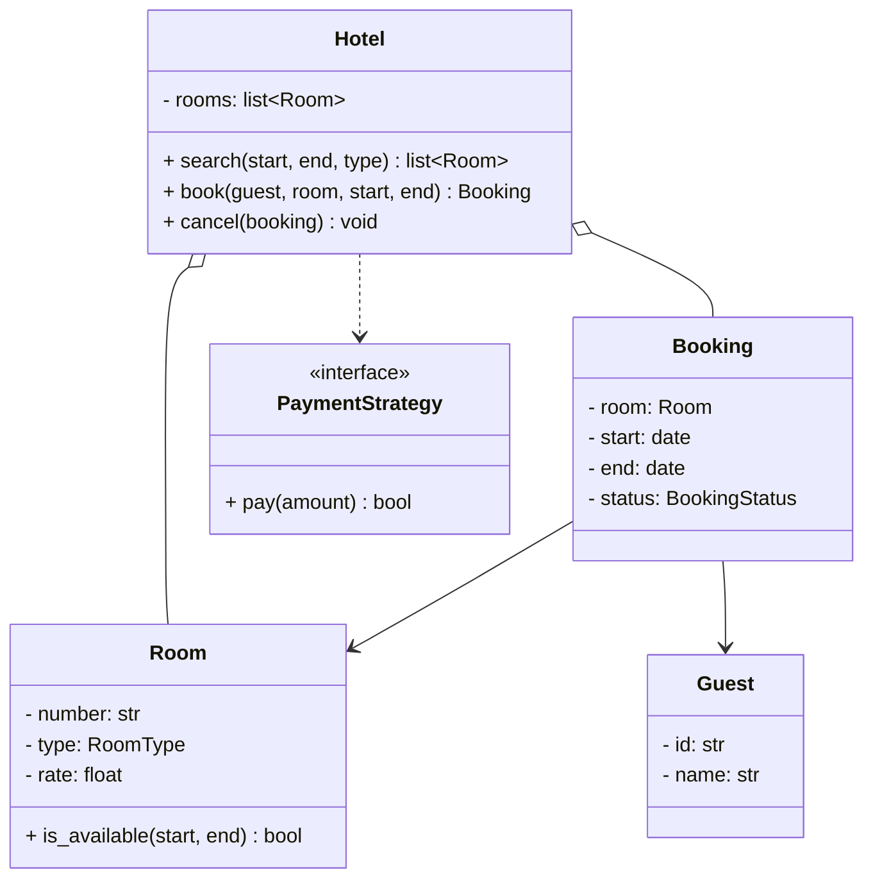
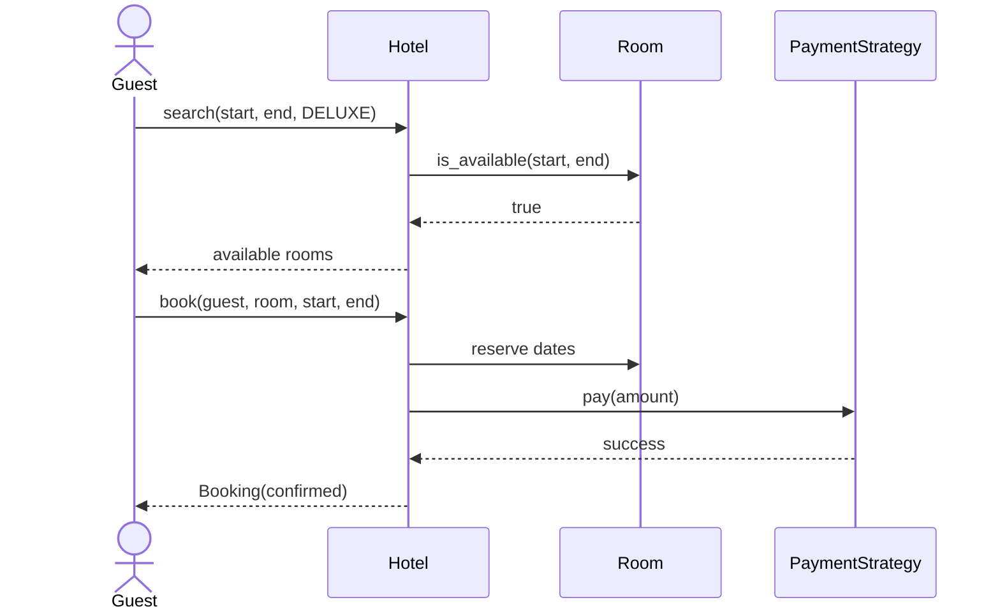

# LLD: Design a Hotel Booking System

## 📋 Problem Statement
Design classes for a hotel reservation system that manages room inventory across room types, searches availability for a date range, books rooms, handles check-in/check-out, and processes payment — preventing double-booking.

## ✅ Requirements

### Must-have features
- Hotel with **rooms** of different **types** (standard, deluxe, suite) and rates.
- **Search** available rooms for a date range.
- **Book** a room for a date range; prevent double-booking.
- **Check-in / check-out**; compute and process payment.
- Cancel a booking.

### Out of scope
- Multi-hotel chains, dynamic pricing engines, loyalty programs, reviews.

## 🧩 Core Entities
- **Hotel** — owns rooms and bookings.
- **Room** — number, type, rate, and its bookings.
- **RoomType** — enum with base rate.
- **Booking** — guest + room + date range + status.
- **Guest** — customer info.
- **PaymentStrategy** — pluggable payment.
- **SearchService** — finds available rooms.

## 📐 Class Diagram



## 🔄 Sequence Diagram (search → book → pay)



## 💻 Core Classes (Python)

```python
from abc import ABC, abstractmethod
from datetime import date
from enum import Enum


class RoomType(Enum):
    STANDARD = 100.0
    DELUXE = 200.0
    SUITE = 400.0


class BookingStatus(Enum):
    CONFIRMED = 1
    CANCELLED = 2
    CHECKED_OUT = 3


class Room:
    def __init__(self, number: str, room_type: RoomType):
        self.number = number
        self.type = room_type
        self.rate = room_type.value
        self.bookings: list["Booking"] = []

    def is_available(self, start: date, end: date) -> bool:   # fully implemented
        for b in self.bookings:
            if b.status == BookingStatus.CONFIRMED and start < b.end and b.start < end:
                return False                                  # date ranges overlap
        return True


class Booking:
    def __init__(self, guest, room: Room, start: date, end: date):
        self.guest = guest
        self.room = room
        self.start = start
        self.end = end
        self.status = BookingStatus.CONFIRMED

    def nights(self) -> int:
        return (self.end - self.start).days


class PaymentStrategy(ABC):
    @abstractmethod
    def pay(self, amount: float) -> bool: ...


class CardPayment(PaymentStrategy):
    def pay(self, amount): print(f"Charged ${amount}"); return True


class Hotel:
    def __init__(self, rooms: list[Room], payment: PaymentStrategy):
        self.rooms = rooms
        self.payment = payment

    def search(self, start, end, room_type) -> list[Room]:
        return [r for r in self.rooms
                if r.type == room_type and r.is_available(start, end)]

    def book(self, guest, room: Room, start, end) -> Booking:  # fully implemented
        if not room.is_available(start, end):
            raise RuntimeError("Room not available")           # prevents double-booking
        booking = Booking(guest, room, start, end)
        if not self.payment.pay(room.rate * booking.nights()):
            raise RuntimeError("Payment failed")
        room.bookings.append(booking)
        return booking


hotel = Hotel([Room("101", RoomType.DELUXE)], CardPayment())
avail = hotel.search(date(2026, 7, 1), date(2026, 7, 3), RoomType.DELUXE)
b = hotel.book("G1", avail[0], date(2026, 7, 1), date(2026, 7, 3))
print(b.status)   # BookingStatus.CONFIRMED
```

## 🎨 Design Patterns Used
- **Strategy** — `PaymentStrategy` (and could add a pricing strategy for seasonal rates).
- **Factory** (optional) — create rooms by type.
- **Observer** (optional) — notify on booking confirmation/cancellation.

## ❓ Follow-up Interview Questions
1. [Amazon] How do you prevent double-booking under concurrent requests? *(Hint: atomic availability check + lock or DB unique constraint on (room, date range).)*
2. [Google] How would you implement seasonal/dynamic pricing? *(Hint: a PricingStrategy keyed on dates/demand.)*
3. How do you efficiently search availability across thousands of rooms? *(Hint: per-room booking intervals / interval tree; index by date.)*
4. How do you handle cancellations and refunds? *(Hint: status transition + refund via payment strategy.)*
5. [Amazon] How would you model overbooking policies? *(Hint: allow N% over capacity with a waitlist.)*

## 🔗 Related Topics
- [Strategy Pattern](../05-design-patterns/behavioral/02-strategy.md)
- [Movie Ticket Booking](09-movie-ticket-booking.md)
- [Class Diagrams](../06-uml-and-diagrams/01-class-diagrams.md)
