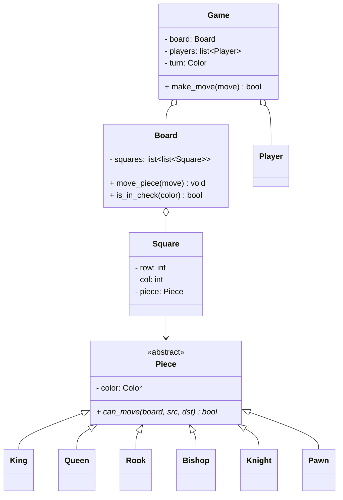
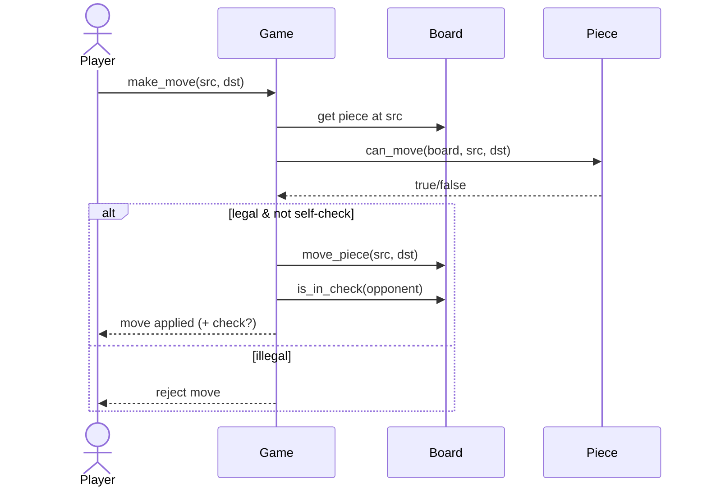

# LLD: Design a Chess Game

## 📋 Problem Statement
Design the classes for a two-player chess game: the board, the pieces with their movement rules, turn management, move validation, and detection of check/checkmate. This tests modeling polymorphic behavior (each piece moves differently) cleanly.

## ✅ Requirements

### Must-have features
- 8×8 **board** of **squares**.
- Six **piece** types, each with its own movement rules.
- Two **players** alternating turns by color.
- **Validate** moves (legal for the piece, not blocked, doesn't leave king in check).
- Detect **check, checkmate, stalemate**; capture pieces.

### Out of scope
- AI opponent, timers/clocks, en passant/castling edge cases (mention as extensions), networked play.

## 🧩 Core Entities
- **Game** — orchestrates play, turns, status.
- **Board** — 8×8 grid of squares; move execution.
- **Square** — position + occupying piece.
- **Piece** (abstract) — color; abstract `can_move()`; subclasses King, Queen, Rook, Bishop, Knight, Pawn.
- **Player** — color, makes moves.
- **Move** — from/to squares.

## 📐 Class Diagram



## 🔄 Sequence Diagram (a move)



## 💻 Core Classes (Python)

```python
from __future__ import annotations  # allows `X | None` hints on older Python
from abc import ABC, abstractmethod
from enum import Enum


class Color(Enum):
    WHITE = 1
    BLACK = 2


class Piece(ABC):
    def __init__(self, color: Color):
        self.color = color

    @abstractmethod
    def can_move(self, src: tuple, dst: tuple, board) -> bool: ...


class Rook(Piece):
    def can_move(self, src, dst, board) -> bool:      # fully implemented (path not blocked check simplified)
        sr, sc = src; dr, dc = dst
        if sr != dr and sc != dc:
            return False                              # rook moves straight only
        # ensure path is clear
        step_r = (dr - sr and (dr - sr) // abs(dr - sr))
        step_c = (dc - sc and (dc - sc) // abs(dc - sc))
        r, c = sr + step_r, sc + step_c
        while (r, c) != (dr, dc):
            if board.piece_at((r, c)) is not None:
                return False
            r += step_r; c += step_c
        target = board.piece_at(dst)
        return target is None or target.color != self.color


class Knight(Piece):
    def can_move(self, src, dst, board) -> bool:      # fully implemented
        dr, dc = abs(dst[0] - src[0]), abs(dst[1] - src[1])
        if sorted((dr, dc)) != [1, 2]:
            return False                              # L-shape only
        target = board.piece_at(dst)
        return target is None or target.color != self.color


class Board:
    def __init__(self):
        self.grid: dict[tuple, Piece] = {}

    def piece_at(self, pos: tuple) -> Piece | None:
        return self.grid.get(pos)

    def place(self, pos: tuple, piece: Piece) -> None:
        self.grid[pos] = piece


class Game:
    def __init__(self):
        self.board = Board()
        self.turn = Color.WHITE

    def make_move(self, src: tuple, dst: tuple) -> bool:
        piece = self.board.piece_at(src)
        if piece is None or piece.color != self.turn:
            return False
        if not piece.can_move(src, dst, self.board):
            return False
        self.board.grid.pop(src)
        self.board.place(dst, piece)              # capture handled by overwrite
        self.turn = Color.BLACK if self.turn == Color.WHITE else Color.WHITE
        return True


g = Game()
g.board.place((0, 0), Rook(Color.WHITE))
print(g.make_move((0, 0), (0, 5)))   # True (clear path)
```

## 🎨 Design Patterns Used
- **Polymorphism / Template** — each `Piece` subclass implements `can_move()`; the game treats all pieces uniformly.
- **Strategy** (alternative) — movement rules as strategies instead of subclasses.
- **Factory** — create the initial piece layout.
- **Memento** (optional) — for undo/move history.

## ❓ Follow-up Interview Questions
1. [Google] How do you detect checkmate? *(Hint: king in check AND no legal move removes the check.)*
2. [Amazon] How would you implement undo/move history? *(Hint: Memento or a move stack you can replay/reverse.)*
3. How would you support castling and en passant? *(Hint: special move rules with extra state — king/rook moved flags.)*
4. [Google] Why model pieces with polymorphism rather than a giant switch? *(Hint: open/closed — add a piece by adding a class.)*
5. How do you validate that a move doesn't leave your own king in check? *(Hint: simulate the move, then check king safety.)*

## 🔗 Related Topics
- [Polymorphism](../03-oop-fundamentals/04-polymorphism.md)
- [Strategy Pattern](../05-design-patterns/behavioral/02-strategy.md)
- [Open/Closed Principle](../04-solid-principles/02-open-closed.md)
