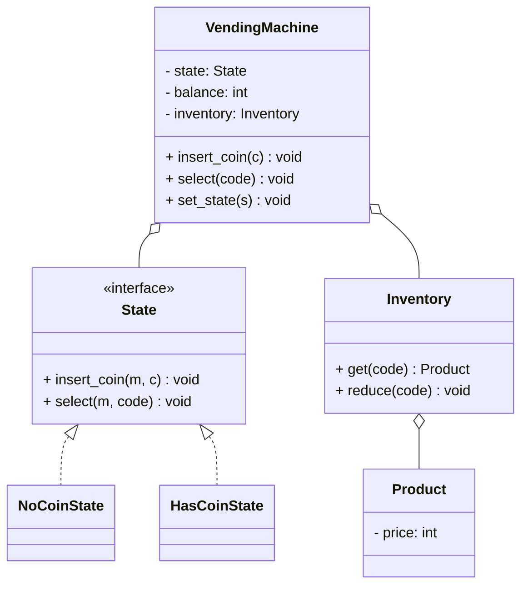
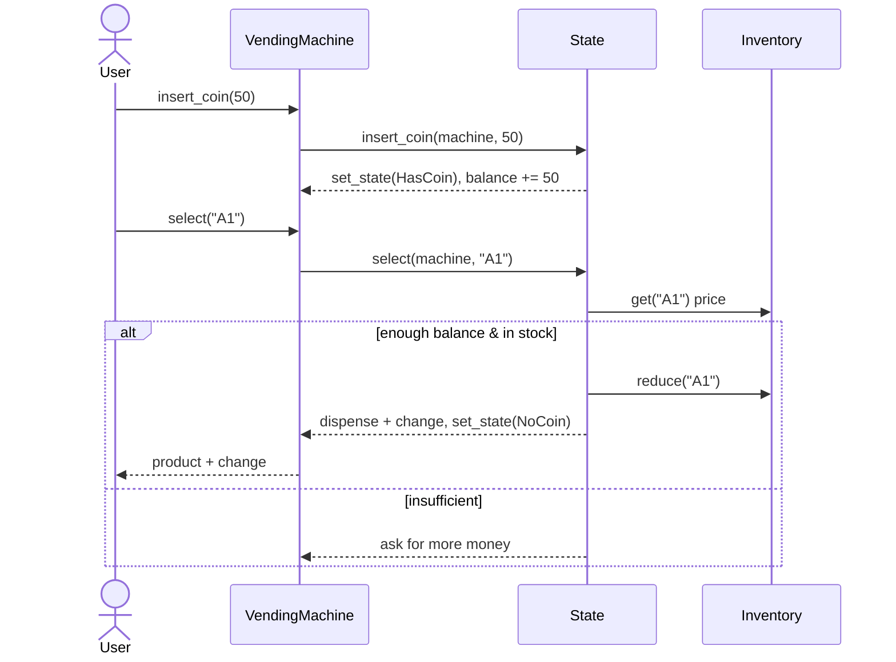

# LLD: Design a Vending Machine

## 📋 Problem Statement
Design the classes for a vending machine that holds inventory, accepts coins/notes, lets a user select a product, dispenses it with change, and handles insufficient funds or out-of-stock. This is the canonical **State pattern** interview problem.

## ✅ Requirements

### Must-have features
- Hold **inventory** of products with prices and quantities.
- Accept money (coins/notes), track inserted amount.
- Select a product; dispense if paid and in stock; return **change**.
- Handle insufficient funds, out-of-stock, and refund/cancel.
- Behave correctly per **state** (no coin, has coin, dispensing).

### Out of scope
- Card payments, remote restocking telemetry, multi-currency.

## 🧩 Core Entities
- **VendingMachine** — context; holds current state, inventory, balance.
- **State** (interface) — NoCoinState, HasCoinState, DispensingState.
- **Inventory** — products and quantities.
- **Product** — name, price.
- **Coin/Note** — denominations.

## 📐 Class Diagram



## 🔄 Sequence Diagram (buy a product)



## 💻 Core Classes (Python)

```python
from abc import ABC, abstractmethod


class Product:
    def __init__(self, name: str, price: int):
        self.name = name
        self.price = price


class Inventory:
    def __init__(self):
        self.items: dict[str, tuple[Product, int]] = {}

    def add(self, code, product, qty):
        self.items[code] = (product, qty)

    def available(self, code) -> bool:
        return code in self.items and self.items[code][1] > 0

    def reduce(self, code):
        p, q = self.items[code]
        self.items[code] = (p, q - 1)


class State(ABC):
    @abstractmethod
    def insert_coin(self, machine, amount): ...
    @abstractmethod
    def select(self, machine, code): ...


class NoCoinState(State):
    def insert_coin(self, machine, amount):       # fully implemented
        machine.balance += amount
        machine.set_state(HasCoinState())
    def select(self, machine, code):
        print("Insert coins first")


class HasCoinState(State):
    def insert_coin(self, machine, amount):
        machine.balance += amount
    def select(self, machine, code):              # fully implemented
        if not machine.inventory.available(code):
            print("Out of stock"); return
        product = machine.inventory.items[code][0]
        if machine.balance < product.price:
            print(f"Insufficient: need {product.price - machine.balance} more"); return
        machine.inventory.reduce(code)
        change = machine.balance - product.price
        machine.balance = 0
        machine.set_state(NoCoinState())
        print(f"Dispensed {product.name}, change {change}")


class VendingMachine:
    def __init__(self, inventory: Inventory):
        self.inventory = inventory
        self.balance = 0
        self.state: State = NoCoinState()

    def set_state(self, state: State): self.state = state
    def insert_coin(self, amount): self.state.insert_coin(self, amount)
    def select(self, code): self.state.select(self, code)


inv = Inventory(); inv.add("A1", Product("Cola", 50), 2)
vm = VendingMachine(inv)
vm.select("A1")       # Insert coins first
vm.insert_coin(50)
vm.select("A1")       # Dispensed Cola, change 0
```

## 🎨 Design Patterns Used
- **State** — behavior depends on machine state (NoCoin/HasCoin/Dispensing); transitions live in the states.
- **Strategy** (optional) — change-making algorithm.
- **Singleton** (optional) — one machine instance.

## ❓ Follow-up Interview Questions
1. [Amazon] Why is the State pattern ideal here vs `if/elif`? *(Hint: each state's behavior + transitions are isolated; easy to extend.)*
2. [Google] How do you compute optimal change with limited coin denominations? *(Hint: greedy / DP change-making; track coin inventory.)*
3. How do you handle a refund/cancel mid-transaction? *(Hint: a state action returning the balance and reverting to NoCoin.)*
4. How do you make it thread-safe for concurrent operations? *(Hint: lock per machine, or serialize requests.)*
5. [Amazon] How would you add card payments? *(Hint: a payment strategy + new states or balance source.)*

## 🔗 Related Topics
- [State Pattern](../05-design-patterns/behavioral/04-state.md)
- [State Machine Diagrams](../06-uml-and-diagrams/03-state-machine-diagrams.md)
- [Strategy Pattern](../05-design-patterns/behavioral/02-strategy.md)
