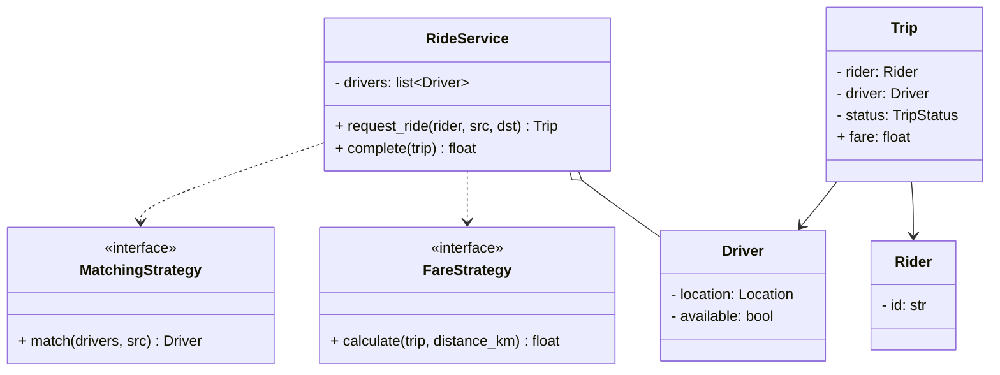
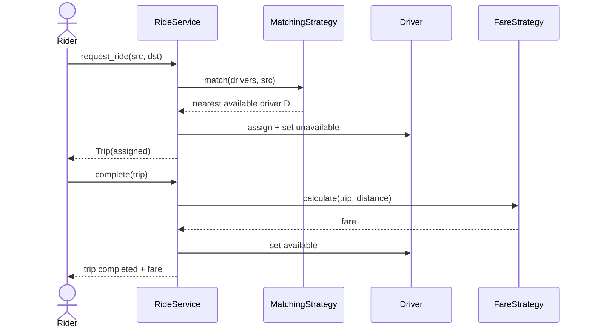

# LLD: Design a Ride-Sharing System (Uber/Lyft) — Class Design

## 📋 Problem Statement
Design the **classes** for a ride-sharing service: model riders, drivers, trips, the matching of a rider to a nearby driver, fare calculation, and trip lifecycle. (This is the LLD/OOD counterpart to the [HLD Uber case study](../../10-real-world-case-studies/04-design-uber.md), which focuses on scale/architecture.)

## ✅ Requirements

### Must-have features
- **Riders** request rides; **drivers** accept.
- **Matching**: find a suitable nearby available driver (pluggable strategy).
- **Trip** lifecycle: requested → assigned → started → completed/cancelled.
- **Fare** calculation (base + distance + time, plus surge — pluggable).
- Track driver availability and location.

### Out of scope
- Real-time geospatial scaling, payments infra, maps/ETA service internals (that's HLD).

## 🧩 Core Entities
- **RideService** — orchestrates requests, matching, trips.
- **Rider / Driver** — users; driver has location + availability.
- **Trip** — rider, driver, route, status, fare.
- **Location** — lat/lon.
- **MatchingStrategy** — selects a driver (nearest, highest-rated).
- **FareStrategy** — computes fare (normal, surge).

## 📐 Class Diagram



## 🔄 Sequence Diagram (request → match → complete)



## 💻 Core Classes (Python)

```python
from __future__ import annotations  # allows `X | None` hints on older Python
from abc import ABC, abstractmethod
from enum import Enum
from dataclasses import dataclass


@dataclass
class Location:
    lat: float
    lon: float
    def distance(self, other) -> float:           # simple Euclidean proxy
        return ((self.lat - other.lat) ** 2 + (self.lon - other.lon) ** 2) ** 0.5


class TripStatus(Enum):
    REQUESTED = 1; ASSIGNED = 2; STARTED = 3; COMPLETED = 4; CANCELLED = 5


class Driver:
    def __init__(self, did: str, location: Location):
        self.id = did
        self.location = location
        self.available = True


class Rider:
    def __init__(self, rid: str): self.id = rid


class Trip:
    def __init__(self, rider, driver, src, dst):
        self.rider, self.driver = rider, driver
        self.src, self.dst = src, dst
        self.status = TripStatus.ASSIGNED
        self.fare = 0.0


class MatchingStrategy(ABC):
    @abstractmethod
    def match(self, drivers, src) -> Driver | None: ...


class NearestDriver(MatchingStrategy):
    def match(self, drivers, src):                # fully implemented
        free = [d for d in drivers if d.available]
        return min(free, key=lambda d: d.location.distance(src), default=None)


class FareStrategy(ABC):
    @abstractmethod
    def calculate(self, trip, distance_km: float) -> float: ...


class StandardFare(FareStrategy):
    BASE, PER_KM = 2.5, 1.2
    def calculate(self, trip, distance_km):       # fully implemented
        return round(self.BASE + self.PER_KM * distance_km, 2)


class RideService:
    def __init__(self, drivers, matcher: MatchingStrategy, fare: FareStrategy):
        self.drivers = drivers
        self.matcher = matcher
        self.fare = fare

    def request_ride(self, rider, src, dst) -> Trip:
        driver = self.matcher.match(self.drivers, src)
        if not driver:
            raise RuntimeError("No drivers available")
        driver.available = False
        return Trip(rider, driver, src, dst)

    def complete(self, trip: Trip, distance_km: float) -> float:
        trip.fare = self.fare.calculate(trip, distance_km)
        trip.status = TripStatus.COMPLETED
        trip.driver.available = True
        return trip.fare


svc = RideService([Driver("D1", Location(0, 0)), Driver("D2", Location(5, 5))],
                  NearestDriver(), StandardFare())
trip = svc.request_ride(Rider("R1"), Location(0.1, 0.1), Location(3, 3))
print("Driver:", trip.driver.id, "Fare:", svc.complete(trip, 4.0))
```

## 🎨 Design Patterns Used
- **Strategy** — `MatchingStrategy` and `FareStrategy` (surge vs normal) are swappable.
- **State** — `Trip` lifecycle can be modeled with the State pattern.
- **Observer** — notify rider/driver on status changes.

## ❓ Follow-up Interview Questions
1. [Uber] How would you swap to surge pricing? *(Hint: a `SurgeFare` strategy keyed on demand.)*
2. [Uber] How do you model the trip lifecycle robustly? *(Hint: State pattern with allowed transitions.)*
3. How do you handle a driver declining a match? *(Hint: re-match, exclude decliner, timeout.)*
4. [Google] How would you efficiently find nearby drivers at scale? *(Hint: geospatial index — leads into HLD with geohash/H3.)*
5. How do you keep driver availability consistent under concurrency? *(Hint: atomic assignment / lock.)*

## 🔗 Related Topics
- [HLD: Design Uber](../../10-real-world-case-studies/04-design-uber.md)
- [Strategy Pattern](../05-design-patterns/behavioral/02-strategy.md)
- [State Pattern](../05-design-patterns/behavioral/04-state.md)
