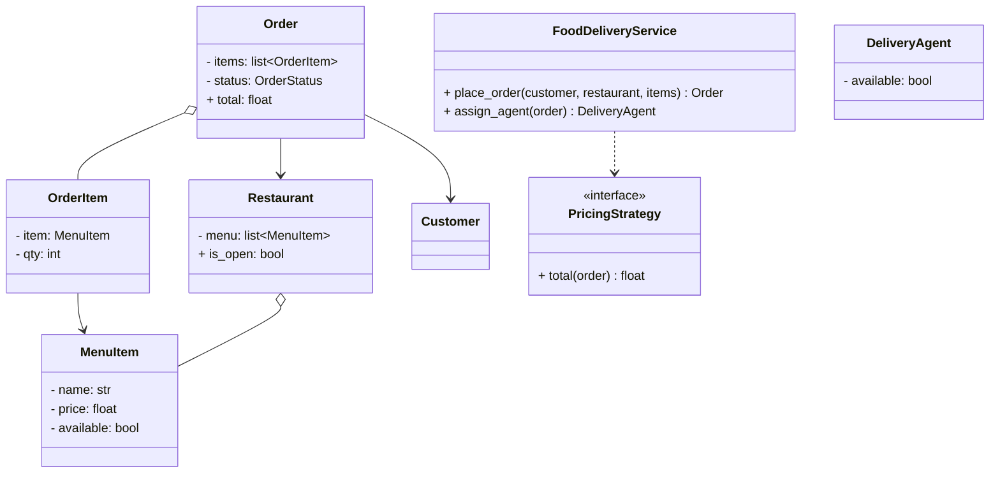
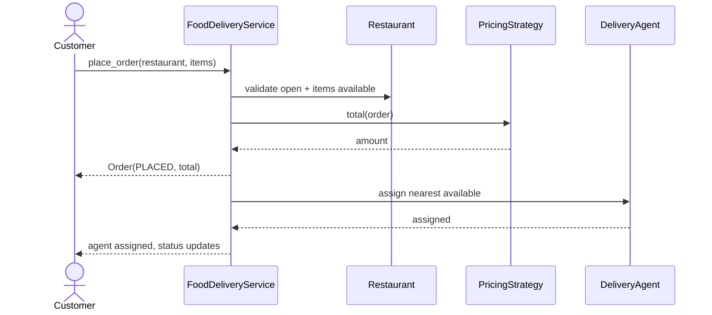

# LLD: Design a Food Delivery System (DoorDash/Swiggy) — Class Design

## 📋 Problem Statement
Design the **classes** for a food delivery platform: restaurants with menus, customers placing orders, order lifecycle, and assigning a delivery agent. Focus on clean OOP modeling of the domain.

## ✅ Requirements

### Must-have features
- **Restaurants** with **menus** (items + prices, availability).
- **Customers** browse restaurants and place **orders** with multiple items.
- **Order** lifecycle: placed → confirmed → preparing → out-for-delivery → delivered.
- Assign a **delivery agent**; track order status.
- Compute order total (items + delivery fee + taxes) via pluggable pricing.

### Out of scope
- Geospatial routing at scale, payments infra, real-time tracking maps (HLD concerns).

## 🧩 Core Entities
- **FoodDeliveryService** — orchestrates ordering and assignment.
- **Restaurant** — menu, availability.
- **MenuItem** — name, price, available.
- **Customer** — places orders.
- **Order / OrderItem** — items + quantities + status + total.
- **DeliveryAgent** — availability.
- **PricingStrategy** — total calculation.

## 📐 Class Diagram



## 🔄 Sequence Diagram (place order → assign agent)



## 💻 Core Classes (Python)

```python
from abc import ABC, abstractmethod
from enum import Enum


class OrderStatus(Enum):
    PLACED = 1; CONFIRMED = 2; PREPARING = 3; OUT_FOR_DELIVERY = 4; DELIVERED = 5


class MenuItem:
    def __init__(self, name: str, price: float, available: bool = True):
        self.name = name
        self.price = price
        self.available = available


class Restaurant:
    def __init__(self, name: str, menu: list[MenuItem]):
        self.name = name
        self.menu = {m.name: m for m in menu}
        self.is_open = True


class OrderItem:
    def __init__(self, item: MenuItem, qty: int):
        self.item = item
        self.qty = qty


class Order:
    def __init__(self, customer, restaurant: Restaurant, items: list[OrderItem]):
        self.customer = customer
        self.restaurant = restaurant
        self.items = items
        self.status = OrderStatus.PLACED
        self.total = 0.0

    def advance(self):                            # simple lifecycle transition
        nxt = self.status.value + 1
        if nxt <= OrderStatus.DELIVERED.value:
            self.status = OrderStatus(nxt)


class PricingStrategy(ABC):
    @abstractmethod
    def total(self, order: Order) -> float: ...


class StandardPricing(PricingStrategy):
    DELIVERY_FEE, TAX_RATE = 3.0, 0.08
    def total(self, order: Order) -> float:       # fully implemented
        subtotal = sum(oi.item.price * oi.qty for oi in order.items)
        return round(subtotal * (1 + self.TAX_RATE) + self.DELIVERY_FEE, 2)


class FoodDeliveryService:
    def __init__(self, pricing: PricingStrategy):
        self.pricing = pricing

    def place_order(self, customer, restaurant, items) -> Order:   # fully implemented
        if not restaurant.is_open:
            raise RuntimeError("Restaurant closed")
        for oi in items:
            if not oi.item.available:
                raise RuntimeError(f"{oi.item.name} unavailable")
        order = Order(customer, restaurant, items)
        order.total = self.pricing.total(order)
        order.status = OrderStatus.CONFIRMED
        return order


menu = [MenuItem("Pizza", 12.0), MenuItem("Coke", 2.0)]
r = Restaurant("Pizza Place", menu)
svc = FoodDeliveryService(StandardPricing())
order = svc.place_order("C1", r, [OrderItem(menu[0], 2), OrderItem(menu[1], 3)])
print(order.status, order.total)   # OrderStatus.CONFIRMED 35.64
```

## 🎨 Design Patterns Used
- **Strategy** — `PricingStrategy` (standard, promo, surge delivery fee).
- **State** — `Order` lifecycle via State pattern.
- **Observer** — push status updates to the customer.
- **Factory** (optional) — build orders/items.

## ❓ Follow-up Interview Questions
1. [Amazon] How would you apply coupons/promotions cleanly? *(Hint: a discount/pricing strategy or decorator on total.)*
2. [Uber Eats] How do you model the order status flow safely? *(Hint: State pattern with valid transitions only.)*
3. How would you assign the best delivery agent? *(Hint: matching strategy by proximity/load — ties into HLD.)*
4. [Google] How do you notify the customer of each status change? *(Hint: Observer pattern.)*
5. How do you handle an item going out of stock mid-order? *(Hint: validate at confirm; allow substitution/cancel.)*

## 🔗 Related Topics
- [Strategy Pattern](../05-design-patterns/behavioral/02-strategy.md)
- [Observer Pattern](../05-design-patterns/behavioral/01-observer.md)
- [Ride-Sharing LLD](07-ride-sharing-lld.md)
