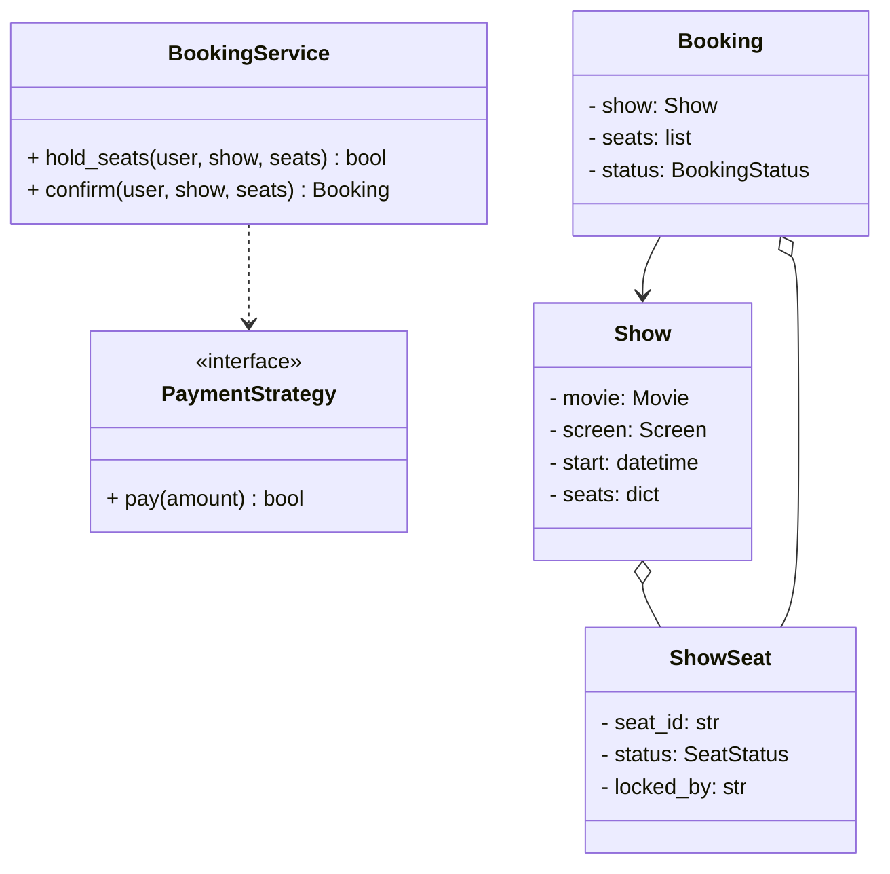
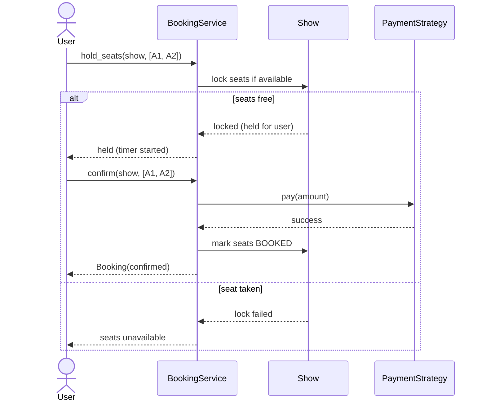

# LLD: Design a Movie Ticket Booking System (BookMyShow)

## 📋 Problem Statement
Design the classes for a movie ticket booking system: cinemas with screens and shows, seat selection for a show, booking with payment, and — critically — preventing two users from booking the same seat (concurrency).

## ✅ Requirements

### Must-have features
- **Cinemas** with multiple **screens**; **movies** with **shows** (screen + time).
- Each show has **seats** with status (available/held/booked).
- Users **search** shows, **select seats**, and **book** with payment.
- **Prevent double-booking** of the same seat (seat locking).
- Cancel a booking (release seats).

### Out of scope
- Recommendations, dynamic pricing engines, multi-city scaling internals.

## 🧩 Core Entities
- **BookingService** — orchestrates seat hold, booking, payment.
- **Cinema / Screen** — venue and its screens.
- **Movie / Show** — a movie playing on a screen at a time.
- **Seat / ShowSeat** — physical seat; per-show seat with status.
- **Booking** — user + show + seats + status.
- **PaymentStrategy** — pluggable payment.
- **SeatLock** — temporary hold to prevent double-booking.

## 📐 Class Diagram



## 🔄 Sequence Diagram (book with seat lock)



## 💻 Core Classes (Python)

```python
from abc import ABC, abstractmethod
from enum import Enum
import threading


class SeatStatus(Enum):
    AVAILABLE = 1; HELD = 2; BOOKED = 3


class ShowSeat:
    def __init__(self, seat_id: str, price: float):
        self.seat_id = seat_id
        self.price = price
        self.status = SeatStatus.AVAILABLE
        self.locked_by: str | None = None


class Show:
    def __init__(self, show_id: str, seats: list[ShowSeat]):
        self.show_id = show_id
        self.seats = {s.seat_id: s for s in seats}
        self._lock = threading.Lock()

    def hold(self, user: str, seat_ids: list[str]) -> bool:    # fully implemented
        with self._lock:                                       # critical section
            chosen = [self.seats[s] for s in seat_ids]
            if any(s.status != SeatStatus.AVAILABLE for s in chosen):
                return False                                   # prevents double-booking
            for s in chosen:
                s.status = SeatStatus.HELD
                s.locked_by = user
            return True

    def book(self, user: str, seat_ids: list[str]) -> None:
        with self._lock:
            for sid in seat_ids:
                s = self.seats[sid]
                if s.locked_by == user and s.status == SeatStatus.HELD:
                    s.status = SeatStatus.BOOKED


class PaymentStrategy(ABC):
    @abstractmethod
    def pay(self, amount: float) -> bool: ...


class CardPayment(PaymentStrategy):
    def pay(self, amount): print(f"Charged ${amount}"); return True


class BookingService:
    def __init__(self, payment: PaymentStrategy):
        self.payment = payment

    def confirm(self, user: str, show: Show, seat_ids: list[str]) -> bool:
        if not show.hold(user, seat_ids):
            print("Seats unavailable"); return False
        amount = sum(show.seats[s].price for s in seat_ids)
        if not self.payment.pay(amount):
            return False
        show.book(user, seat_ids)
        return True


show = Show("S1", [ShowSeat("A1", 12.0), ShowSeat("A2", 12.0)])
svc = BookingService(CardPayment())
print(svc.confirm("U1", show, ["A1", "A2"]))   # True (charged $24)
print(svc.confirm("U2", show, ["A1"]))         # Seats unavailable -> False
```

## 🎨 Design Patterns Used
- **Strategy** — `PaymentStrategy` (and could add pricing strategy).
- **State** — seat status (Available/Held/Booked) and booking lifecycle.
- **Singleton** (optional) — a central booking service/locking registry.

## ❓ Follow-up Interview Questions
1. [Amazon] How do you prevent two users booking the same seat? *(Hint: lock the seat (mutex / DB row lock / atomic compare-and-set) during hold.)*
2. [BookMyShow] How do you expire held seats if the user doesn't pay? *(Hint: hold timer / TTL that reverts to AVAILABLE.)*
3. How would you scale seat locking across many servers? *(Hint: distributed lock — Redis — leads into HLD.)*
4. [Google] How do you model pricing by seat tier (premium/regular)? *(Hint: price per ShowSeat or pricing strategy.)*
5. How do you handle payment failure after holding seats? *(Hint: release the hold; idempotent retries.)*

## 🔗 Related Topics
- [Strategy Pattern](../05-design-patterns/behavioral/02-strategy.md)
- [Hotel Booking LLD](04-hotel-booking.md)
- [Concurrency / locking](../08-lld-interview-playbook/02-common-mistakes.md)
