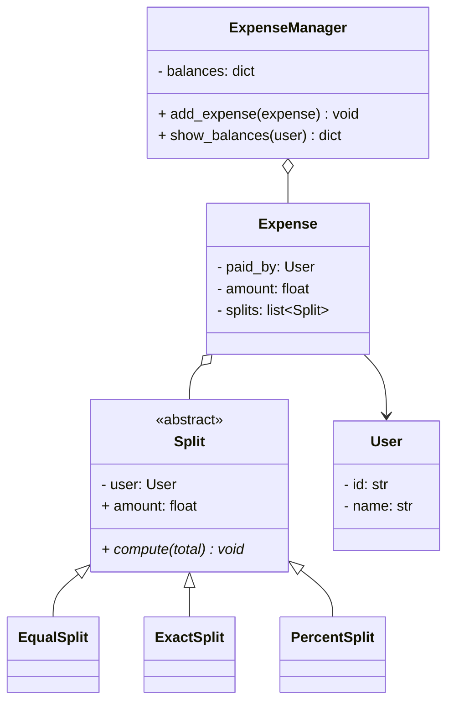
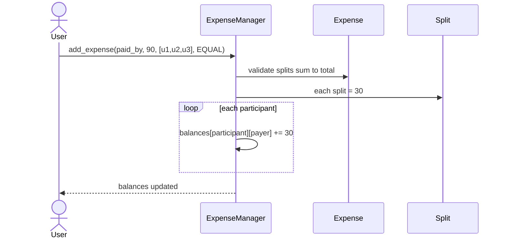

# LLD: Design Splitwise (Expense Sharing)

## 📋 Problem Statement
Design the classes for an expense-sharing app like Splitwise: users create groups, add shared expenses split among members (equally, by exact amount, or by percentage), and the system tracks who owes whom and simplifies balances.

## ✅ Requirements

### Must-have features
- **Users** and **groups**.
- Add an **expense** paid by one user, split among participants via a **split type**: EQUAL, EXACT, PERCENT.
- Maintain a **balance sheet** (net amount each pair owes).
- Show balances per user; settle up.
- Validate splits (exact sums to total; percentages sum to 100).

### Out of scope
- Currencies/FX, payment processing, notifications, debt-simplification graph optimization (mention as extension).

## 🧩 Core Entities
- **ExpenseManager** — orchestrates adding expenses, updates balances.
- **User** — a person.
- **Group** — set of users.
- **Expense** — amount, payer, splits.
- **Split** (abstract) — EqualSplit, ExactSplit, PercentSplit.
- **BalanceSheet** — net balances between users.

## 📐 Class Diagram



## 🔄 Sequence Diagram (add an equal-split expense)



## 💻 Core Classes (Python)

```python
from abc import ABC, abstractmethod
from collections import defaultdict


class User:
    def __init__(self, uid: str, name: str):
        self.id = uid
        self.name = name


class Split(ABC):
    def __init__(self, user: User):
        self.user = user
        self.amount = 0.0
    @abstractmethod
    def compute(self, total: float, n: int) -> None: ...


class EqualSplit(Split):
    def compute(self, total, n): self.amount = round(total / n, 2)


class ExactSplit(Split):
    def __init__(self, user, amount): super().__init__(user); self.amount = amount
    def compute(self, total, n): pass            # already exact


class PercentSplit(Split):
    def __init__(self, user, percent): super().__init__(user); self.percent = percent
    def compute(self, total, n): self.amount = round(total * self.percent / 100, 2)


class Expense:
    def __init__(self, paid_by: User, amount: float, splits: list[Split]):
        self.paid_by = paid_by
        self.amount = amount
        self.splits = splits


class ExpenseManager:
    def __init__(self):
        # balances[a][b] = how much a owes b
        self.balances: dict = defaultdict(lambda: defaultdict(float))

    def add_expense(self, expense: Expense) -> None:    # fully implemented
        n = len(expense.splits)
        for split in expense.splits:
            split.compute(expense.amount, n)
        if round(sum(s.amount for s in expense.splits), 2) != round(expense.amount, 2):
            raise ValueError("Splits must sum to total")     # validation
        payer = expense.paid_by
        for split in expense.splits:
            if split.user.id == payer.id:
                continue
            # participant owes the payer their share
            self.balances[split.user.id][payer.id] += split.amount
            self.balances[payer.id][split.user.id] -= split.amount

    def show_balances(self, user_id: str) -> dict:      # fully implemented
        return {other: amt for other, amt in self.balances[user_id].items() if amt > 0}


u1, u2, u3 = User("1", "A"), User("2", "B"), User("3", "C")
mgr = ExpenseManager()
mgr.add_expense(Expense(u1, 90.0, [EqualSplit(u1), EqualSplit(u2), EqualSplit(u3)]))
print(mgr.show_balances("2"))   # {'1': 30.0}  (B owes A 30)
print(mgr.show_balances("3"))   # {'1': 30.0}  (C owes A 30)
```

## 🎨 Design Patterns Used
- **Strategy / Polymorphism** — `Split` subclasses (Equal/Exact/Percent) compute shares differently behind one interface.
- **Factory** (optional) — create the right Split type from input.
- **Observer** (optional) — notify users when added to an expense.

## ❓ Follow-up Interview Questions
1. [Amazon] How would you simplify debts (minimize number of transactions)? *(Hint: net everyone's balance, then a greedy settle-up / min-cash-flow algorithm.)*
2. [Splitwise] How do you validate exact and percent splits? *(Hint: exact sums to total; percentages sum to 100.)*
3. How would you support multiple currencies? *(Hint: store currency per expense + conversion at display.)*
4. [Google] Why model splits polymorphically? *(Hint: open/closed — add a new split type as a class.)*
5. How do you handle concurrent expense additions consistently? *(Hint: lock per group/balance update or transactional store.)*

## 🔗 Related Topics
- [Strategy Pattern](../05-design-patterns/behavioral/02-strategy.md)
- [Polymorphism](../03-oop-fundamentals/04-polymorphism.md)
- [Open/Closed Principle](../04-solid-principles/02-open-closed.md)
